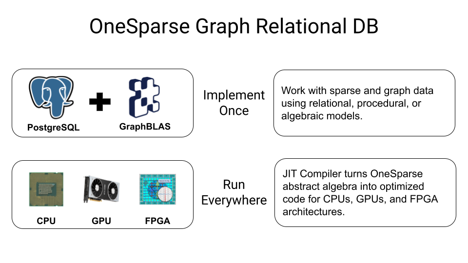
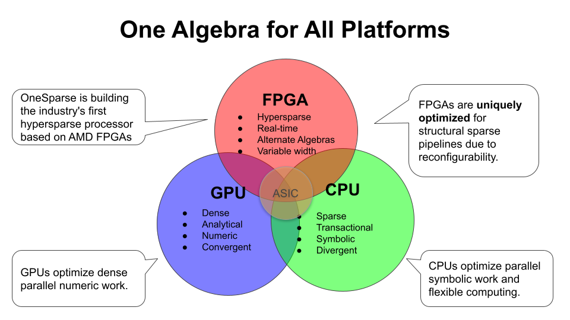

# Summary

OneSparse Postgres extends the [PostgreSQL](https://postgresql.org)
object relational database with the state-of-the-art
[SuiteSparse:GraphBLAS](http://faculty.cse.tamu.edu/davis/GraphBLAS.html)
high performance dense/sparse linear algebra library.  SuiteSparse
contains thousands of algorithms optimizing tasks for algebraic graph
traversal, machine learning, AI, science, and engineering.
SuiteSparse's powerful built-in JIT compiler can target multiple
hardware architectures, including GPUs, with no changes to your code.

GraphBLAS is a sparse linear algebra API optimized for processing
dense and sparse matrices and in particular graphs encoded as sparse
matrices and vectors.  In addition to common real/integer matrix
algebra operations "plus" and "times", GraphBLAS supports many
different "semiring" algebra operations, that can be used as basic
building blocks to implement a wide variety of algebraic and graph
solutions.

OneSparse Postgres aims to unify the three algebraic paradigms of
relational, procedural, and algebraic style approaches.  In the image
below, all three visualization are presenting the same information:
the tabular form shows rows a relational indicating edge
relationships, the graphical form shows the procedural approach, and
the sparse matrix form shows the algebraic approach.

The algebraic approach offers a powerful abstraction over the
underlying compute architecture used to do the actual work.  Using
SuiteSparse's powerful built-in JIT compiler, any hardware
architecture can be targeted with no code changes to the algorithm.
This cannot be said for the common procedural approach taken by most
graph libraries and frameworks.

OneSparse's goal is to enable and encourage the multi-architecture
future, where the right hardware is used for the right phase of any
particularly complex algorithm or data pipeine. By abstracting away
the specific and highly optimzation sensitive hardware details,
problem solvers can focus on the problems, and allow hardware
specialists to optimize for any given architecture:

# Why Linear Algebra?

OneSparse brings the power of [Linear
Algebra](https://en.wikipedia.org/wiki/Linear_algebra) to Postgres.
In languages like Python, similar roles are fulfilled with packages
like numpy and scipy.  OneSparse goes beyond dense matrix
multiplication and is highly optimized not only for dense and sparse
matrices, but also optimizes for an unlimited number of powerful and
and useful algebras by supporting JIT compilation of both built-in and
user defined [Semirings](https://en.wikipedia.org/wiki/Semiring).

Semirings can be thought of as an abstraction of the "additive" and
"multiplicative" operations typically used in [Matrix
Multiplication](https://en.wikipedia.org/wiki/Matrix_multiplication).

For example, to compute the shortest path between rows and columns of
a sparse matrix, instead of multiplying elements they are added, and
instead of adding to reduce to the final value, the minimum is taken.
This form of [Tropical
Algebra](https://en.wikipedia.org/wiki/Tropical_geometry) is a very
powerful mathematical technique used in solving optimization and other
minimization and maximization problems.

Another exotic form of Semiring is the [Log
Semiring](https://en.wikipedia.org/wiki/Log_semiring) which is a
powerful tool for traversing graphs whose edges represent
probabilities by leveraging [Log
probability](https://en.wikipedia.org/wiki/Log_probability) algebra
for speed and better numeric stability.

Other GraphBLAS Semirings are used to optimize algebraic operations to
minimize data movement.  For example, the "any_pair" semiring is used
instead of "plus_times" in many Breadth-First Search Algorithms to
avoid any mathematical operations and unnecessary data movement
Instead of adding results, "any" value is used, thus allowing the JIT
compiler to optimize as it sees fit.  Instead of loading element
values and multiplying them, the "pair" operator is used to simply
proceed only if both edges in a multiplication are present, without
ever loading or multiplying their values.

OneSparse leverages the expertise in the field of sparse matrix
programming by [The GraphBLAS Forum](http://graphblas.org) and uses
the
[SuiteSparse:GraphBLAS](http://faculty.cse.tamu.edu/davis/GraphBLAS.html)
API implementation. SuiteSparse:GraphBLAS is brought to us by the work
of [Dr. Tim Davis](http://faculty.cse.tamu.edu/davis/welcome.html),
professor in the Department of Computer Science and Engineering at
Texas A&M University.  [News and
information](http://faculty.cse.tamu.edu/davis/news.html) can provide
you with a lot more background information, in addition to the
references below.

# Intro

Linear algebra is the foundational language of many areas of science,
mathematics, information theory, quantum mechanics, and computer
science.  Other programming environments like Python and Julia have
powerful libraries and other tools to work in the language of linear
algebra, but until now Postgres has lacked access to these powerful
constructs, other than those provided by external store procedural
languages like pl/python.

For a long time, mathematicians have known that matrices are powerful
representations of graphs, as described [in this mathmatical
introduction to
GraphBLAS](http://www.mit.edu/~kepner/GraphBLAS/GraphBLAS-Math-release.pdf)
by [Dr. Jeremy Kepner](http://www.mit.edu/~kepner/) head and founder
of [MIT Lincoln Laboratory Supercomputing
Center](http://news.mit.edu/2016/lincoln-laboratory-establishes-supercomputing-center-0511).

As Kepner's paper describes, there are two useful matrix
representations of graphs: [Adjacency
Matrices](https://en.wikipedia.org/wiki/Adjacency_matrix) and
[Incidence Matrices](https://en.wikipedia.org/wiki/Incidence_matrix).
For this introduction we will focus on the adjacency type as they are
simpler, but the same ideas apply to both, and it is easy to switch
back and forth between them.

(Image Credit: [Dr. Jeremy Kepner](http://www.mit.edu/~kepner/))

On the left is a *directed* graph, and on the right, the adjacency
matrix that represents it. The matrix has a row and column for every
vertex.  If there is an going from node A to B, then there will be a
value present in the intersection of As row with Bs column.  For
example, vertex 1 connects to 4, so there is a value (dot) at the
intersction of the first row and the fourth column.  4 also connects
*back* to 1 so there are two values in the matrix to represent these
two edges, the one at the (1, 4) position and the other at the (4,1)
position.

One practical problem with matrix-encoding graphs is that most
real-world graphs tend to be sparse, as above, only 12 of 49 possible
elements have a value. Those that have values tend to be scattered
uniformally across the matrix (for "typical" graphs), so dense linear
algebra libraries like BLAS or numpy do not encode or operate on them
efficiently, as the relevant data is mostly empty memory with actual
data elements spaced far apart.  This wastes memory and cpu resources,
and defeats CPU caching mechanisms.

For example, suppose a fictional social network has 1 billion users,
and each user has about 100 friends, which means there are about 100
billion (1e+11) connections in the graph.  A dense matrix large enough
to hold this graph would need (1 billion)^2 or
(1,000,000,000,000,000,000), a "quintillion" elements, but only 1e+11
of them would have meaningful values, leaving only 0.0000001 of the
matrix being utilized.

By using a sparse matrix instead of dense, only the elements used are
actually stored in the matrix. The parts of the matrix with no value
are interpreted as an "algebraic zero" value, which might not be the
actual number zero, but other values like positive or negative
infinity depending on the particular semiring operations applied to
the matrix.  The math used with sparse matrices is exactly the same as
dense, the sparsity of the data doesn't matter to the math, but it
does matter to how efficiently the matrix is implemented internally.

OneSparse is a postgres extension that provides access to two new
types: `matrix` and `vector`, as well as the GraphBLAS api to
manipulate these types.  Aggregate functions are provided to build
matrices from SQL queries, and set-returning functions are also
provided to turn graphs back into relational sets.  From a PostgreSQL
point of view, matrices look a little bit like arrays, being stored as
variable length column values.

# Matrix Multplication

They key operation of GraphBLAS is the matrix multiply as provided by
the `mxm` (matrix times matrix), `mxv` (matrix times vector), and
`vxm` (vector times matrix) functions.  Matrix multplication has a
remarkable property of being useful for finding the neighbors of any
node in a graph algorithm.  By using different combinations of
operations (semiring) different graph algorithms can step and
accumulate different results, interpreting the data in unique ways,
even over the same graphs.

Iterating this multiplication process produces the most common graph
operation: [breadth-first
search](https://en.wikipedia.org/wiki/Breadth-first_search).

    create function bfs(A matrix, source bigint) returns vector as $$
    declare
        n bigint := nrows(A);                          -- The number of result rows.
        v vector := vector_integer(n);                 -- int32 result vector of vertex levels.
        q vector := assign(vector_bool(n), false);     -- bool mask of completed vertices.
        level integer := 0;                            -- Start at level 1.
        not_done bool := true;                         -- Flag to indicate still work to do.
    begin
        q := set_element(q, source, true);             -- Set the source element to done.

        while not_done and level <= n loop             -- While still work to do.
            v := assign(v, level, mask=>q);            -- Assign the current level to all
            q := mxv(A, q, q,                          -- Multiply q<mask> = T(A)q,
                semiring=>'any_pair_bool',             -- using LOR_LAND_BOOL semiring
                mask=>v,                               -- only those *not* masked
                descriptor=>'rsct0');                  -- by complementing the mask and clearing q first
            not_done := reduce_bool(q);                -- are there more neighbors?
            level := level + 1;                        -- increment the level
        end loop;
        return v;
    end;
    $$ language plpgsql;

 The above code is written in `plpgsql` which is postgres' procedural
 query language.  This language works well with OneSparse's
 algorithmic approach.

# references

[One page poster summary of GraphBLAS](https://resources.sei.cmu.edu/asset_files/Poster/2016_020_001_484268.pdf)

[GraphBLAS: A Programming Specification for Graph Analysis](https://resources.sei.cmu.edu/asset_files/Presentation/2016_017_001_474272.pdf)

[Lower Latency Graph Queries in Cypher with Redis GraphRoi Lipman, Redis LabsTim Davis, Texas A&M U](https://www.youtube.com/watch?v=xnez6tloNSQ)

[A good introduction to semirings Part I](https://www.youtube.com/watch?v=Gd_VT_Nj8Xw) [Part II](https://www.youtube.com/watch?v=dluPFbuq6zs)

[A good introduction to abstract algebra](https://www.youtube.com/playlist?list=PLi01XoE8jYoi3SgnnGorR_XOW3IcK-TP6)

[Graph algorithms via SuiteSparse:GraphBLAS: triangle counting and K-truss](http://faculty.cse.tamu.edu/davis/GraphBLAS_files/Davis_HPEC18.pdf)

