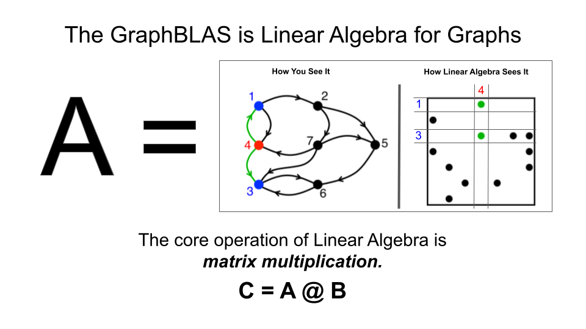

# Welcome to OneSparse Postgres

OneSparse is a Postgres extension that bind the powerful
[SuiteSparse:GraphBLAS](http://faculty.cse.tamu.edu/davis/GraphBLAS.html)
Linear Algebra library, exposing it's functionality and new types,
functions and operators in Postgres.

Join us in the [OneSparse Discussions
Board](https://github.com/OneSparse/OneSparse/discussions) and say
hi!.

# TLDR; Docker Demo

Start the onesparse demo docker container, substitute suitable
password and container name:

```
docker run -d -e POSTGRES_PASSWORD=password -it --name onesparse-demo-container onesparse/onesparse:0.1.0
```

The container will start detached in the background, verify it's
running with 'docker ps'.  Now exec a psql process to interact with
the container:

```
$ docker exec -u postgres -it onesparse-demo-container psql
psql (17.0 (Debian 17.0-1.pgdg120+1))
Type "help" for help.

postgres=# select 'i4'::matrix;
 matrix 
--------
 i4[]
(1 row)

postgres=# 
```

See the [Documentation](https://onesparse.github.io/OneSparse/) for
some examples for creating matrices and vectors.  You can verify the
doctests with docker using:

```
$ docker exec -u postgres -it onesparse-demo-container make installcheck
```

# Summary

OneSparse Postgres extends the [PostgreSQL](https://postgresql.org)
object relational database with the state-of-the-art
[SuiteSparse:GraphBLAS](http://faculty.cse.tamu.edu/davis/GraphBLAS.html)
high performance dense/sparse linear algebra library.  SuiteSparse
contains thousands of algorithms optimizing tasks for algebraic graph
traversal, machine learning, AI, science, and engineering.
SuiteSparse's powerful built-in JIT compiler can target multiple
hardware architectures, including GPUs, with no changes to your code.

Join us in the [OneSparse Discussions
Board](https://github.com/OneSparse/OneSparse/discussions) and say
hi!.

Like the JSON/JSONB types did for unstructured data, OneSparse makes
dense and sparse matrices and vectors fully native Postgres
types. OneSparse supports optimized, parallel matrix multiplication
and other operations like reduction, selection, assignment,
extraction, elementwise union, and intersection.  These methods can be
used for both traditional numeric algebraic computing, or sparse graph
analytics over adjacency and incidence matrices.

Like numpy and scipy did for Python, OneSparse transforms Postgres
into a powerful framework for linear algebra and its infinite industry
application: mathematics, engineering, economics, machine learning,
bioinformatics and graph science. Matrix multiplication is as simple
as 'A @ B', just as in Python.  Leverage SQL for it's power of
filtering, viewing and aggregating, and use linear algebra for its
power of abstract reasoning, numeric analytical power, and parallel
graph analytics.

GraphBLAS is a sparse linear algebra API optimized for processing
dense and sparse matrices and in particular graphs encoded as sparse
matrices and vectors.  In addition to common real/integer matrix
algebra operations "plus" and "times", GraphBLAS supports many
different "semiring" algebra operations, that can be used as basic
building blocks to implement a wide variety of algebraic and graph
solutions.

OneSparse Postgres aims to unify the three algebraic paradigms of
relational, procedural, and algebraic style approaches.  In the image
below, all three visualization are presenting the same information:
the tabular form shows rows a relational indicating edge
relationships, the graphical form shows the procedural approach, and
the sparse matrix form shows the algebraic approach.

The diagram below shows the three paradigms of sparse graph
computation, relational, procedural and algebraic.  Each approach
contains the exact same information, each edge is represented as an
element of a table, graph, or matrix.  With OneSparse, programmers can
choose which approach best fits their needs, and move seamlessly
between them:


The algebraic approach offers a powerful abstraction over the
underlying compute architecture used to do the actual work.  Using
SuiteSparse's powerful built-in JIT compiler, any hardware
architecture can be targeted with no code changes to the algorithm.
This cannot be said for the common procedural approach taken by most
graph libraries and frameworks.


OneSparse's goal is to enable and encourage the multi-architecture
future, where the right hardware is used for the right phase of any
particularly complex algorithm or data pipeine. By abstracting away
the specific and highly optimzation sensitive hardware details,
problem solvers can focus on the problems, and allow hardware
specialists to optimize for any given architecture:


# Why Linear Algebra?

OneSparse brings the power of [Linear
Algebra](https://en.wikipedia.org/wiki/Linear_algebra) to Postgres.
In languages like Python, similar roles are fulfilled with packages
like numpy and scipy.  OneSparse goes beyond dense matrix
multiplication and is highly optimized not only for dense and sparse
matrices, but also optimizes for an unlimited number of powerful and
and useful algebras by supporting JIT compilation of both built-in and
user defined [Semirings](https://en.wikipedia.org/wiki/Semiring).

Semirings can be thought of as an abstraction of the "additive" and
"multiplicative" operations typically used in [Matrix
Multiplication](https://en.wikipedia.org/wiki/Matrix_multiplication).
They are particularly useful when implementing graph algorithms across
an adjacency matrix:



For example, to compute the shortest path between rows and columns of
a sparse matrix, instead of multiplying elements they are added, and
instead of adding to reduce to the final value, the minimum is taken.
This form of [Tropical
Algebra](https://en.wikipedia.org/wiki/Tropical_geometry) is a very
powerful mathematical technique used in solving optimization and other
minimization and maximization problems.

Another exotic form of Semiring is the [Log
Semiring](https://en.wikipedia.org/wiki/Log_semiring) which is a
powerful tool for traversing graphs whose edges represent
probabilities by leveraging [Log
probability](https://en.wikipedia.org/wiki/Log_probability) algebra
for speed and better numeric stability.

Other GraphBLAS Semirings are used to optimize algebraic operations to
minimize data movement.  For example, the "any_pair" semiring is used
instead of "plus_times" in many Breadth-First Search Algorithms to
avoid any mathematical operations and unnecessary data movement
Instead of adding results, "any" value is used, thus allowing the JIT
compiler to optimize as it sees fit.  Instead of loading element
values and multiplying them, the "pair" operator is used to simply
proceed only if both edges in a multiplication are present, without
ever loading or multiplying their values.

OneSparse leverages the expertise in the field of sparse matrix
programming by [The GraphBLAS Forum](http://graphblas.org) and uses
the
[SuiteSparse:GraphBLAS](http://faculty.cse.tamu.edu/davis/GraphBLAS.html)
API implementation. SuiteSparse:GraphBLAS is brought to us by the work
of [Dr. Tim Davis](http://faculty.cse.tamu.edu/davis/welcome.html),
professor in the Department of Computer Science and Engineering at
Texas A&M University.  [News and
information](http://faculty.cse.tamu.edu/davis/news.html) can provide
you with a lot more background information, in addition to the
references below.

# TODO

- Test harness matrix for all supported pg versions

- A few missing ops, concat/split

- Large Object support up to 4TB

- subscripting syntax support

- add type[] array casting to vectors and matrices

- add type[] operators for extract, containment, etc.

- add type[] constructors and tuple iterators

- lookup semirings with base name and object "lookup('any_pair', A)" for type specific semiring

- semiring functions? "plus_times(A, B)"

- Zero-copy into python-graphblas objects in plpythonu

- psycopg2 packed binary adapters to python-graphblas


