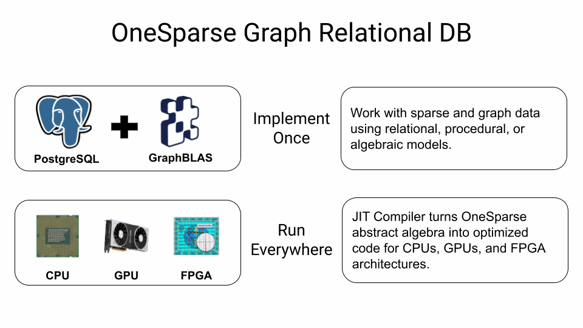

# OneSparse

OneSparse is a Postgres extension that bind the powerful
[SuiteSparse:GraphBLAS](http://faculty.cse.tamu.edu/davis/GraphBLAS.html)
Linear Algebra library, exposing it's functionality and new types,
functions and operators in Postgres.

Join us in the [OneSparse Discussions
Board](https://github.com/OneSparse/OneSparse/discussions) and say
hi!.

