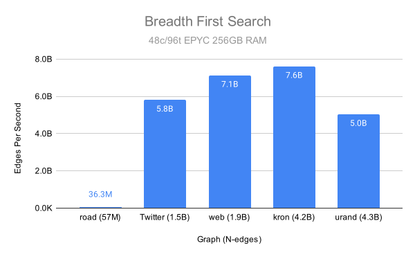
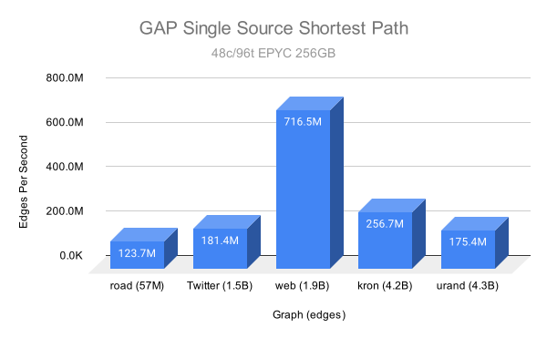
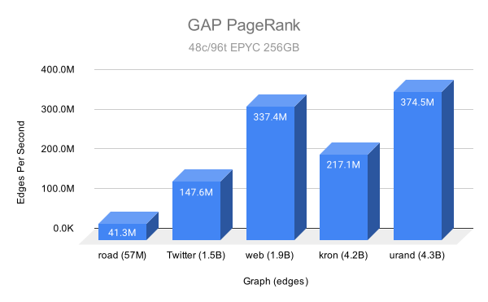
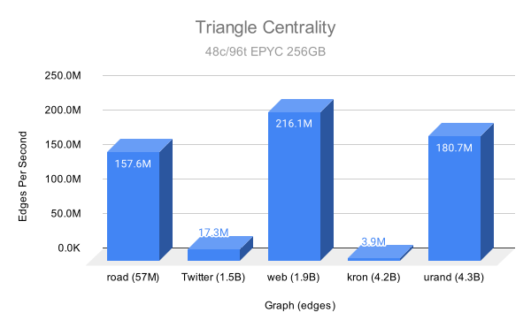
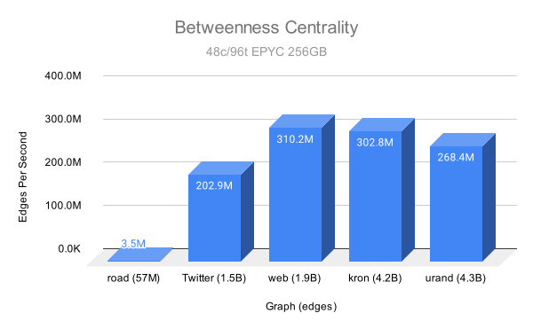

# Algorithms

OneSparse leverages the SuiteSparse GraphBLAS library and the
LAGraph suite of graph algorithms and integrates them with
Postgres.  Using SuiteSparse's state of the art Sparse Linear
Algebra Just-In-Time (JIT) compiled kernels, OneSparse can leverage
CPUs, GPUs, and any future architectures without you having to
re-target your code.

The algorithms shown here come from the LAGraph library, they are
already complete and well tested implementations of common graph
algorithms.  The algorithms shown here are just the beginning,
there are many more to come, including versions that leverage CUDA
GPUs.

## Example Graphs

To show off the algorithms we will need some sample graphs.  There
are multiple ways to construct graphs in OneSparse.

### From a Matrix Market file

The [SuiteSparse Matrix Collection](https://sparse.tamu.edu/)
contains many graphs of all different shapes and sizes and
publishes them in the Matrix Market format.  The "karate" graph
shown here is a common test graph for documentation purposes.
Let's load the graph into a materialized view to make its use from
SQL very easy:
``` postgres-console
create materialized view if not exists karate
    as select mmread('/home/postgres/onesparse/demo/karate.mtx') as graph;
NOTICE:  relation "karate" already exists, skipping
```
The karate graph is now loaded into the view and looks like this,
here it's drawn with colors to indicate the "out-degree" of each
node:
``` postgres-console
select draw(triu(graph), reduce_cols(cast_to(graph, 'int32')), false, false, true, 0.5, 'The Karate Graph') as draw_source from karate \gset
```
<div>
<!-- Title: %3 Pages: 1 -->
<svg width="1013pt" height="503pt"
 viewBox="0.00 0.00 1012.68 502.97" xmlns="http://www.w3.org/2000/svg" xmlns:xlink="http://www.w3.org/1999/xlink">
<g id="graph0" class="graph" transform="scale(1 1) rotate(0) translate(4 498.97)">
<title>%3</title>
<polygon fill="white" stroke="transparent" points="-4,4 -4,-498.97 1008.68,-498.97 1008.68,4 -4,4"/>
<text text-anchor="middle" x="502.34" y="-7.4" font-family="Times,serif" font-size="12.00">The Karate Graph</text>
<!-- 0 -->
<g id="node1" class="node">
<title>0</title>
<ellipse fill="#bf0000" fill-opacity="0.498039" stroke="black" cx="589.01" cy="-266.61" rx="28.07" ry="28.07"/>
<text text-anchor="middle" x="589.01" y="-264.71" font-family="Times,serif" font-size="8.00">0 : 16</text>
</g>
<!-- 1 -->
<g id="node2" class="node">
<title>1</title>
<ellipse fill="#7fff7f" fill-opacity="0.498039" stroke="black" cx="513.6" cy="-258.35" rx="25" ry="25"/>
<text text-anchor="middle" x="513.6" y="-256.45" font-family="Times,serif" font-size="8.00">1 : 9</text>
</g>
<!-- 0&#45;&#45;1 -->
<g id="edge1" class="edge">
<title>0&#45;&#45;1</title>
<path fill="none" stroke="black" d="M560.5,-263.49C553.33,-262.7 545.68,-261.86 538.69,-261.1"/>
</g>
<!-- 2 -->
<g id="node3" class="node">
<title>2</title>
<ellipse fill="#bfff3f" fill-opacity="0.498039" stroke="black" cx="386.3" cy="-213.95" rx="28.07" ry="28.07"/>
<text text-anchor="middle" x="386.3" y="-212.05" font-family="Times,serif" font-size="8.00">2 : 10</text>
</g>
<!-- 0&#45;&#45;2 -->
<g id="edge2" class="edge">
<title>0&#45;&#45;2</title>
<path fill="none" stroke="black" d="M561.25,-259.4C522.43,-249.31 452.36,-231.11 413.72,-221.08"/>
</g>
<!-- 3 -->
<g id="node4" class="node">
<title>3</title>
<ellipse fill="#00bfff" fill-opacity="0.498039" stroke="black" cx="542.56" cy="-174.39" rx="25" ry="25"/>
<text text-anchor="middle" x="542.56" y="-172.49" font-family="Times,serif" font-size="8.00">3 : 6</text>
</g>
<!-- 0&#45;&#45;3 -->
<g id="edge3" class="edge">
<title>0&#45;&#45;3</title>
<path fill="none" stroke="black" d="M576.07,-240.92C569.04,-226.96 560.43,-209.86 553.7,-196.5"/>
</g>
<!-- 4 -->
<g id="node5" class="node">
<title>4</title>
<ellipse fill="#0000ff" fill-opacity="0.498039" stroke="black" cx="761.21" cy="-338.17" rx="25" ry="25"/>
<text text-anchor="middle" x="761.21" y="-336.27" font-family="Times,serif" font-size="8.00">4 : 3</text>
</g>
<!-- 0&#45;&#45;4 -->
<g id="edge4" class="edge">
<title>0&#45;&#45;4</title>
<path fill="none" stroke="black" d="M615.17,-277.48C648.66,-291.4 706.18,-315.3 738.13,-328.58"/>
</g>
<!-- 5 -->
<g id="node6" class="node">
<title>5</title>
<ellipse fill="#003fff" fill-opacity="0.498039" stroke="black" cx="831.14" cy="-327.45" rx="25" ry="25"/>
<text text-anchor="middle" x="831.14" y="-325.55" font-family="Times,serif" font-size="8.00">5 : 4</text>
</g>
<!-- 0&#45;&#45;5 -->
<g id="edge5" class="edge">
<title>0&#45;&#45;5</title>
<path fill="none" stroke="black" d="M616.79,-273.59C664.61,-285.6 761.71,-310 806.94,-321.37"/>
</g>
<!-- 6 -->
<g id="node7" class="node">
<title>6</title>
<ellipse fill="#003fff" fill-opacity="0.498039" stroke="black" cx="837.39" cy="-278.35" rx="25" ry="25"/>
<text text-anchor="middle" x="837.39" y="-276.45" font-family="Times,serif" font-size="8.00">6 : 4</text>
</g>
<!-- 0&#45;&#45;6 -->
<g id="edge6" class="edge">
<title>0&#45;&#45;6</title>
<path fill="none" stroke="black" d="M617.5,-267.96C666.56,-270.27 766.17,-274.98 812.57,-277.17"/>
</g>
<!-- 7 -->
<g id="node8" class="node">
<title>7</title>
<ellipse fill="#003fff" fill-opacity="0.498039" stroke="black" cx="511.36" cy="-141.07" rx="25" ry="25"/>
<text text-anchor="middle" x="511.36" y="-139.17" font-family="Times,serif" font-size="8.00">7 : 4</text>
</g>
<!-- 0&#45;&#45;7 -->
<g id="edge7" class="edge">
<title>0&#45;&#45;7</title>
<path fill="none" stroke="black" d="M574.04,-242.41C559.67,-219.18 538.19,-184.45 524.48,-162.28"/>
</g>
<!-- 8 -->
<g id="node9" class="node">
<title>8</title>
<ellipse fill="#007fff" fill-opacity="0.498039" stroke="black" cx="367.04" cy="-314.95" rx="25" ry="25"/>
<text text-anchor="middle" x="367.04" y="-313.05" font-family="Times,serif" font-size="8.00">8 : 5</text>
</g>
<!-- 0&#45;&#45;8 -->
<g id="edge8" class="edge">
<title>0&#45;&#45;8</title>
<path fill="none" stroke="black" d="M561.35,-272.64C517.53,-282.18 432.89,-300.61 391.3,-309.67"/>
</g>
<!-- 10 -->
<g id="node11" class="node">
<title>10</title>
<ellipse fill="#0000ff" fill-opacity="0.498039" stroke="black" cx="772.65" cy="-263.68" rx="28.07" ry="28.07"/>
<text text-anchor="middle" x="772.65" y="-261.78" font-family="Times,serif" font-size="8.00">10 : 3</text>
</g>
<!-- 0&#45;&#45;10 -->
<g id="edge9" class="edge">
<title>0&#45;&#45;10</title>
<path fill="none" stroke="black" d="M617.3,-266.16C651.81,-265.61 709.8,-264.68 744.32,-264.13"/>
</g>
<!-- 11 -->
<g id="node12" class="node">
<title>11</title>
<ellipse fill="#00007f" fill-opacity="0.498039" stroke="black" cx="684.96" cy="-443.24" rx="28.07" ry="28.07"/>
<text text-anchor="middle" x="684.96" y="-441.34" font-family="Times,serif" font-size="8.00">11 : 1</text>
</g>
<!-- 0&#45;&#45;11 -->
<g id="edge10" class="edge">
<title>0&#45;&#45;11</title>
<path fill="none" stroke="black" d="M602.56,-291.54C620.79,-325.11 653.05,-384.5 671.33,-418.15"/>
</g>
<!-- 12 -->
<g id="node13" class="node">
<title>12</title>
<ellipse fill="#0000bf" fill-opacity="0.498039" stroke="black" cx="657.36" cy="-99.8" rx="28.07" ry="28.07"/>
<text text-anchor="middle" x="657.36" y="-97.9" font-family="Times,serif" font-size="8.00">12 : 2</text>
</g>
<!-- 0&#45;&#45;12 -->
<g id="edge11" class="edge">
<title>0&#45;&#45;12</title>
<path fill="none" stroke="black" d="M599.84,-240.18C612.64,-208.94 633.81,-157.29 646.58,-126.11"/>
</g>
<!-- 13 -->
<g id="node14" class="node">
<title>13</title>
<ellipse fill="#007fff" fill-opacity="0.498039" stroke="black" cx="435.93" cy="-251.88" rx="28.07" ry="28.07"/>
<text text-anchor="middle" x="435.93" y="-249.98" font-family="Times,serif" font-size="8.00">13 : 5</text>
</g>
<!-- 0&#45;&#45;13 -->
<g id="edge12" class="edge">
<title>0&#45;&#45;13</title>
<path fill="none" stroke="black" d="M560.58,-263.87C533.08,-261.23 491.66,-257.24 464.21,-254.6"/>
</g>
<!-- 17 -->
<g id="node18" class="node">
<title>17</title>
<ellipse fill="#0000bf" fill-opacity="0.498039" stroke="black" cx="664.4" cy="-275.52" rx="28.07" ry="28.07"/>
<text text-anchor="middle" x="664.4" y="-273.62" font-family="Times,serif" font-size="8.00">17 : 2</text>
</g>
<!-- 0&#45;&#45;17 -->
<g id="edge13" class="edge">
<title>0&#45;&#45;17</title>
<path fill="none" stroke="black" d="M617.51,-269.98C623.52,-270.69 629.85,-271.43 635.86,-272.14"/>
</g>
<!-- 19 -->
<g id="node20" class="node">
<title>19</title>
<ellipse fill="#0000ff" fill-opacity="0.498039" stroke="black" cx="435.94" cy="-348.14" rx="28.07" ry="28.07"/>
<text text-anchor="middle" x="435.94" y="-346.24" font-family="Times,serif" font-size="8.00">19 : 3</text>
</g>
<!-- 0&#45;&#45;19 -->
<g id="edge14" class="edge">
<title>0&#45;&#45;19</title>
<path fill="none" stroke="black" d="M563.73,-280.07C535.29,-295.23 489.35,-319.69 461,-334.8"/>
</g>
<!-- 21 -->
<g id="node22" class="node">
<title>21</title>
<ellipse fill="#0000bf" fill-opacity="0.498039" stroke="black" cx="659.03" cy="-183.25" rx="28.07" ry="28.07"/>
<text text-anchor="middle" x="659.03" y="-181.35" font-family="Times,serif" font-size="8.00">21 : 2</text>
</g>
<!-- 0&#45;&#45;21 -->
<g id="edge15" class="edge">
<title>0&#45;&#45;21</title>
<path fill="none" stroke="black" d="M607.41,-244.71C617.7,-232.46 630.49,-217.23 640.76,-205.01"/>
</g>
<!-- 31 -->
<g id="node32" class="node">
<title>31</title>
<ellipse fill="#00bfff" fill-opacity="0.498039" stroke="black" cx="292.53" cy="-195.28" rx="28.07" ry="28.07"/>
<text text-anchor="middle" x="292.53" y="-193.38" font-family="Times,serif" font-size="8.00">31 : 6</text>
</g>
<!-- 0&#45;&#45;31 -->
<g id="edge16" class="edge">
<title>0&#45;&#45;31</title>
<path fill="none" stroke="black" d="M561.39,-259.96C504.89,-246.37 376.72,-215.54 320.19,-201.94"/>
</g>
<!-- 1&#45;&#45;2 -->
<g id="edge17" class="edge">
<title>1&#45;&#45;2</title>
<path fill="none" stroke="black" d="M489.96,-250.1C468.24,-242.53 436.08,-231.31 413.35,-223.38"/>
</g>
<!-- 1&#45;&#45;3 -->
<g id="edge18" class="edge">
<title>1&#45;&#45;3</title>
<path fill="none" stroke="black" d="M521.82,-234.51C525.77,-223.07 530.48,-209.4 534.42,-197.99"/>
</g>
<!-- 1&#45;&#45;7 -->
<g id="edge19" class="edge">
<title>1&#45;&#45;7</title>
<path fill="none" stroke="black" d="M513.13,-233.48C512.75,-213.57 512.22,-185.8 511.84,-165.91"/>
</g>
<!-- 1&#45;&#45;13 -->
<g id="edge20" class="edge">
<title>1&#45;&#45;13</title>
<path fill="none" stroke="black" d="M488.6,-256.26C480.79,-255.61 472.13,-254.89 464.12,-254.22"/>
</g>
<!-- 1&#45;&#45;17 -->
<g id="edge21" class="edge">
<title>1&#45;&#45;17</title>
<path fill="none" stroke="black" d="M538.51,-261.18C565.36,-264.24 608.03,-269.1 636.13,-272.3"/>
</g>
<!-- 1&#45;&#45;19 -->
<g id="edge22" class="edge">
<title>1&#45;&#45;19</title>
<path fill="none" stroke="black" d="M497.13,-277.39C484.66,-291.81 467.53,-311.61 454.56,-326.61"/>
</g>
<!-- 1&#45;&#45;21 -->
<g id="edge23" class="edge">
<title>1&#45;&#45;21</title>
<path fill="none" stroke="black" d="M535.69,-246.94C562.07,-233.32 606.1,-210.58 633.8,-196.28"/>
</g>
<!-- 30 -->
<g id="node31" class="node">
<title>30</title>
<ellipse fill="#003fff" fill-opacity="0.498039" stroke="black" cx="326.96" cy="-349.86" rx="28.07" ry="28.07"/>
<text text-anchor="middle" x="326.96" y="-347.96" font-family="Times,serif" font-size="8.00">30 : 4</text>
</g>
<!-- 1&#45;&#45;30 -->
<g id="edge24" class="edge">
<title>1&#45;&#45;30</title>
<path fill="none" stroke="black" d="M491.09,-269.38C456.19,-286.5 389.22,-319.33 352.54,-337.32"/>
</g>
<!-- 2&#45;&#45;3 -->
<g id="edge25" class="edge">
<title>2&#45;&#45;3</title>
<path fill="none" stroke="black" d="M413.88,-206.97C443.49,-199.47 490.09,-187.67 518.34,-180.52"/>
</g>
<!-- 2&#45;&#45;7 -->
<g id="edge26" class="edge">
<title>2&#45;&#45;7</title>
<path fill="none" stroke="black" d="M411.01,-199.55C433.93,-186.2 467.71,-166.51 489.63,-153.74"/>
</g>
<!-- 2&#45;&#45;8 -->
<g id="edge27" class="edge">
<title>2&#45;&#45;8</title>
<path fill="none" stroke="black" d="M380.98,-241.82C378.07,-257.12 374.48,-275.91 371.68,-290.61"/>
</g>
<!-- 9 -->
<g id="node10" class="node">
<title>9</title>
<ellipse fill="#0000bf" fill-opacity="0.498039" stroke="black" cx="279.58" cy="-125.02" rx="25" ry="25"/>
<text text-anchor="middle" x="279.58" y="-123.12" font-family="Times,serif" font-size="8.00">9 : 2</text>
</g>
<!-- 2&#45;&#45;9 -->
<g id="edge28" class="edge">
<title>2&#45;&#45;9</title>
<path fill="none" stroke="black" d="M364.45,-195.74C345.18,-179.68 317.37,-156.51 298.9,-141.12"/>
</g>
<!-- 2&#45;&#45;13 -->
<g id="edge29" class="edge">
<title>2&#45;&#45;13</title>
<path fill="none" stroke="black" d="M408.79,-231.14C410.33,-232.31 411.88,-233.5 413.42,-234.68"/>
</g>
<!-- 27 -->
<g id="node28" class="node">
<title>27</title>
<ellipse fill="#003fff" fill-opacity="0.498039" stroke="black" cx="205.58" cy="-155.04" rx="28.07" ry="28.07"/>
<text text-anchor="middle" x="205.58" y="-153.14" font-family="Times,serif" font-size="8.00">27 : 4</text>
</g>
<!-- 2&#45;&#45;27 -->
<g id="edge30" class="edge">
<title>2&#45;&#45;27</title>
<path fill="none" stroke="black" d="M359.24,-205.13C325.08,-193.99 266.64,-174.94 232.53,-163.82"/>
</g>
<!-- 28 -->
<g id="node29" class="node">
<title>28</title>
<ellipse fill="#0000ff" fill-opacity="0.498039" stroke="black" cx="278.77" cy="-259.03" rx="28.07" ry="28.07"/>
<text text-anchor="middle" x="278.77" y="-257.13" font-family="Times,serif" font-size="8.00">28 : 3</text>
</g>
<!-- 2&#45;&#45;28 -->
<g id="edge31" class="edge">
<title>2&#45;&#45;28</title>
<path fill="none" stroke="black" d="M359.99,-224.98C343.33,-231.96 321.86,-240.97 305.17,-247.96"/>
</g>
<!-- 32 -->
<g id="node33" class="node">
<title>32</title>
<ellipse fill="#ffbf00" fill-opacity="0.498039" stroke="black" cx="189.85" cy="-337.25" rx="31.64" ry="31.64"/>
<text text-anchor="middle" x="189.85" y="-335.35" font-family="Times,serif" font-size="8.00">32 : 12</text>
</g>
<!-- 2&#45;&#45;32 -->
<g id="edge32" class="edge">
<title>2&#45;&#45;32</title>
<path fill="none" stroke="black" d="M362.21,-229.07C325.43,-252.16 255.49,-296.06 216.97,-320.23"/>
</g>
<!-- 3&#45;&#45;7 -->
<g id="edge33" class="edge">
<title>3&#45;&#45;7</title>
<path fill="none" stroke="black" d="M525.5,-156.17C525.39,-156.05 525.27,-155.93 525.16,-155.81"/>
</g>
<!-- 3&#45;&#45;12 -->
<g id="edge34" class="edge">
<title>3&#45;&#45;12</title>
<path fill="none" stroke="black" d="M563.35,-160.88C583.12,-148.04 612.84,-128.73 633.56,-115.27"/>
</g>
<!-- 3&#45;&#45;13 -->
<g id="edge35" class="edge">
<title>3&#45;&#45;13</title>
<path fill="none" stroke="black" d="M522.5,-188.96C504.4,-202.12 477.79,-221.45 458.86,-235.21"/>
</g>
<!-- 4&#45;&#45;6 -->
<g id="edge36" class="edge">
<title>4&#45;&#45;6</title>
<path fill="none" stroke="black" d="M780.83,-322.77C792.2,-313.83 806.47,-302.62 817.84,-293.7"/>
</g>
<!-- 4&#45;&#45;10 -->
<g id="edge37" class="edge">
<title>4&#45;&#45;10</title>
<path fill="none" stroke="black" d="M765.02,-313.37C766.09,-306.43 767.25,-298.83 768.34,-291.72"/>
</g>
<!-- 5&#45;&#45;6 -->
<g id="edge38" class="edge">
<title>5&#45;&#45;6</title>
<path fill="none" stroke="black" d="M834.3,-302.61C834.31,-302.51 834.32,-302.42 834.33,-302.32"/>
</g>
<!-- 5&#45;&#45;10 -->
<g id="edge39" class="edge">
<title>5&#45;&#45;10</title>
<path fill="none" stroke="black" d="M814.22,-309C807.2,-301.35 799.02,-292.44 791.79,-284.55"/>
</g>
<!-- 16 -->
<g id="node17" class="node">
<title>16</title>
<ellipse fill="#0000bf" fill-opacity="0.498039" stroke="black" cx="976.39" cy="-325.23" rx="28.07" ry="28.07"/>
<text text-anchor="middle" x="976.39" y="-323.33" font-family="Times,serif" font-size="8.00">16 : 2</text>
</g>
<!-- 5&#45;&#45;16 -->
<g id="edge40" class="edge">
<title>5&#45;&#45;16</title>
<path fill="none" stroke="black" d="M856.11,-327.07C881.66,-326.68 921.3,-326.07 948.02,-325.66"/>
</g>
<!-- 6&#45;&#45;16 -->
<g id="edge41" class="edge">
<title>6&#45;&#45;16</title>
<path fill="none" stroke="black" d="M860.97,-286.3C885.44,-294.56 923.67,-307.45 949.36,-316.11"/>
</g>
<!-- 8&#45;&#45;30 -->
<g id="edge42" class="edge">
<title>8&#45;&#45;30</title>
<path fill="none" stroke="black" d="M347.94,-331.59C347.78,-331.73 347.62,-331.87 347.46,-332.01"/>
</g>
<!-- 8&#45;&#45;32 -->
<g id="edge43" class="edge">
<title>8&#45;&#45;32</title>
<path fill="none" stroke="black" d="M342.4,-318.06C310.83,-322.03 256.06,-328.92 221.45,-333.28"/>
</g>
<!-- 33 -->
<g id="node34" class="node">
<title>33</title>
<ellipse fill="#7f0000" fill-opacity="0.498039" stroke="black" cx="206.82" cy="-299.66" rx="31.64" ry="31.64"/>
<text text-anchor="middle" x="206.82" y="-297.76" font-family="Times,serif" font-size="8.00">33 : 17</text>
</g>
<!-- 8&#45;&#45;33 -->
<g id="edge44" class="edge">
<title>8&#45;&#45;33</title>
<path fill="none" stroke="black" d="M342.35,-312.6C314.53,-309.94 269.2,-305.62 238.71,-302.71"/>
</g>
<!-- 9&#45;&#45;33 -->
<g id="edge45" class="edge">
<title>9&#45;&#45;33</title>
<path fill="none" stroke="black" d="M269.92,-148.21C256.82,-179.67 233.4,-235.86 219.07,-270.25"/>
</g>
<!-- 13&#45;&#45;33 -->
<g id="edge46" class="edge">
<title>13&#45;&#45;33</title>
<path fill="none" stroke="black" d="M407.83,-257.74C364.82,-266.71 282.91,-283.79 238.07,-293.15"/>
</g>
<!-- 14 -->
<g id="node15" class="node">
<title>14</title>
<ellipse fill="#0000bf" fill-opacity="0.498039" stroke="black" cx="55.7" cy="-395.45" rx="28.07" ry="28.07"/>
<text text-anchor="middle" x="55.7" y="-393.55" font-family="Times,serif" font-size="8.00">14 : 2</text>
</g>
<!-- 14&#45;&#45;32 -->
<g id="edge47" class="edge">
<title>14&#45;&#45;32</title>
<path fill="none" stroke="black" d="M81.88,-384.09C104.45,-374.3 137.01,-360.18 160.47,-350"/>
</g>
<!-- 14&#45;&#45;33 -->
<g id="edge48" class="edge">
<title>14&#45;&#45;33</title>
<path fill="none" stroke="black" d="M79.64,-380.27C106.94,-362.97 151.45,-334.75 179.92,-316.71"/>
</g>
<!-- 15 -->
<g id="node16" class="node">
<title>15</title>
<ellipse fill="#0000bf" fill-opacity="0.498039" stroke="black" cx="200.24" cy="-466.68" rx="28.07" ry="28.07"/>
<text text-anchor="middle" x="200.24" y="-464.78" font-family="Times,serif" font-size="8.00">15 : 2</text>
</g>
<!-- 15&#45;&#45;32 -->
<g id="edge49" class="edge">
<title>15&#45;&#45;32</title>
<path fill="none" stroke="black" d="M197.96,-438.28C196.32,-417.89 194.12,-390.39 192.42,-369.23"/>
</g>
<!-- 15&#45;&#45;33 -->
<g id="edge50" class="edge">
<title>15&#45;&#45;33</title>
<path fill="none" stroke="black" d="M201.35,-438.35C202.52,-408.75 204.34,-362.42 205.56,-331.56"/>
</g>
<!-- 18 -->
<g id="node19" class="node">
<title>18</title>
<ellipse fill="#0000bf" fill-opacity="0.498039" stroke="black" cx="92.94" cy="-434.5" rx="28.07" ry="28.07"/>
<text text-anchor="middle" x="92.94" y="-432.6" font-family="Times,serif" font-size="8.00">18 : 2</text>
</g>
<!-- 18&#45;&#45;32 -->
<g id="edge51" class="edge">
<title>18&#45;&#45;32</title>
<path fill="none" stroke="black" d="M113.02,-414.35C128.76,-398.55 150.68,-376.56 167.08,-360.1"/>
</g>
<!-- 18&#45;&#45;33 -->
<g id="edge52" class="edge">
<title>18&#45;&#45;33</title>
<path fill="none" stroke="black" d="M111.23,-412.84C131.73,-388.57 164.88,-349.32 186.25,-324.01"/>
</g>
<!-- 19&#45;&#45;33 -->
<g id="edge53" class="edge">
<title>19&#45;&#45;33</title>
<path fill="none" stroke="black" d="M407.84,-342.2C364.82,-333.1 282.92,-315.77 238.07,-306.28"/>
</g>
<!-- 20 -->
<g id="node21" class="node">
<title>20</title>
<ellipse fill="#0000bf" fill-opacity="0.498039" stroke="black" cx="139.12" cy="-465.06" rx="28.07" ry="28.07"/>
<text text-anchor="middle" x="139.12" y="-463.16" font-family="Times,serif" font-size="8.00">20 : 2</text>
</g>
<!-- 20&#45;&#45;32 -->
<g id="edge54" class="edge">
<title>20&#45;&#45;32</title>
<path fill="none" stroke="black" d="M149.63,-438.57C157.88,-417.81 169.35,-388.91 177.93,-367.28"/>
</g>
<!-- 20&#45;&#45;33 -->
<g id="edge55" class="edge">
<title>20&#45;&#45;33</title>
<path fill="none" stroke="black" d="M149.85,-438.85C162.04,-409.06 181.9,-360.55 194.65,-329.38"/>
</g>
<!-- 22 -->
<g id="node23" class="node">
<title>22</title>
<ellipse fill="#0000bf" fill-opacity="0.498039" stroke="black" cx="43.01" cy="-341.43" rx="28.07" ry="28.07"/>
<text text-anchor="middle" x="43.01" y="-339.53" font-family="Times,serif" font-size="8.00">22 : 2</text>
</g>
<!-- 22&#45;&#45;32 -->
<g id="edge56" class="edge">
<title>22&#45;&#45;32</title>
<path fill="none" stroke="black" d="M71.33,-340.62C96.08,-339.92 132,-338.9 157.8,-338.16"/>
</g>
<!-- 22&#45;&#45;33 -->
<g id="edge57" class="edge">
<title>22&#45;&#45;33</title>
<path fill="none" stroke="black" d="M70.43,-334.44C99.57,-327.01 145.56,-315.28 175.96,-307.53"/>
</g>
<!-- 23 -->
<g id="node24" class="node">
<title>23</title>
<ellipse fill="#007fff" fill-opacity="0.498039" stroke="black" cx="109.61" cy="-219.81" rx="28.07" ry="28.07"/>
<text text-anchor="middle" x="109.61" y="-217.91" font-family="Times,serif" font-size="8.00">23 : 5</text>
</g>
<!-- 25 -->
<g id="node26" class="node">
<title>25</title>
<ellipse fill="#0000ff" fill-opacity="0.498039" stroke="black" cx="112.89" cy="-118.96" rx="28.07" ry="28.07"/>
<text text-anchor="middle" x="112.89" y="-117.06" font-family="Times,serif" font-size="8.00">25 : 3</text>
</g>
<!-- 23&#45;&#45;25 -->
<g id="edge58" class="edge">
<title>23&#45;&#45;25</title>
<path fill="none" stroke="black" d="M110.53,-191.45C110.98,-177.7 111.51,-161.23 111.96,-147.46"/>
</g>
<!-- 23&#45;&#45;27 -->
<g id="edge59" class="edge">
<title>23&#45;&#45;27</title>
<path fill="none" stroke="black" d="M133.33,-203.8C148.21,-193.76 167.31,-180.87 182.13,-170.87"/>
</g>
<!-- 29 -->
<g id="node30" class="node">
<title>29</title>
<ellipse fill="#003fff" fill-opacity="0.498039" stroke="black" cx="51.5" cy="-265.97" rx="28.07" ry="28.07"/>
<text text-anchor="middle" x="51.5" y="-264.07" font-family="Times,serif" font-size="8.00">29 : 4</text>
</g>
<!-- 23&#45;&#45;29 -->
<g id="edge60" class="edge">
<title>23&#45;&#45;29</title>
<path fill="none" stroke="black" d="M87.31,-237.53C82.96,-240.98 78.39,-244.61 74.03,-248.07"/>
</g>
<!-- 23&#45;&#45;32 -->
<g id="edge61" class="edge">
<title>23&#45;&#45;32</title>
<path fill="none" stroke="black" d="M125.66,-243.3C139.01,-262.84 158.01,-290.65 171.88,-310.95"/>
</g>
<!-- 23&#45;&#45;33 -->
<g id="edge62" class="edge">
<title>23&#45;&#45;33</title>
<path fill="none" stroke="black" d="M131.67,-237.93C146.68,-250.27 166.57,-266.6 182.11,-279.37"/>
</g>
<!-- 24 -->
<g id="node25" class="node">
<title>24</title>
<ellipse fill="#0000ff" fill-opacity="0.498039" stroke="black" cx="173.73" cy="-49.28" rx="28.07" ry="28.07"/>
<text text-anchor="middle" x="173.73" y="-47.38" font-family="Times,serif" font-size="8.00">24 : 3</text>
</g>
<!-- 24&#45;&#45;25 -->
<g id="edge63" class="edge">
<title>24&#45;&#45;25</title>
<path fill="none" stroke="black" d="M154.81,-70.95C147.42,-79.42 138.96,-89.1 131.58,-97.55"/>
</g>
<!-- 24&#45;&#45;27 -->
<g id="edge64" class="edge">
<title>24&#45;&#45;27</title>
<path fill="none" stroke="black" d="M181.93,-76.52C186.69,-92.31 192.66,-112.12 197.41,-127.9"/>
</g>
<!-- 24&#45;&#45;31 -->
<g id="edge65" class="edge">
<title>24&#45;&#45;31</title>
<path fill="none" stroke="black" d="M191.77,-71.46C214.1,-98.9 251.91,-145.36 274.32,-172.9"/>
</g>
<!-- 25&#45;&#45;31 -->
<g id="edge66" class="edge">
<title>25&#45;&#45;31</title>
<path fill="none" stroke="black" d="M139.01,-130.06C173.07,-144.53 232.3,-169.7 266.38,-184.17"/>
</g>
<!-- 26 -->
<g id="node27" class="node">
<title>26</title>
<ellipse fill="#0000bf" fill-opacity="0.498039" stroke="black" cx="28.28" cy="-167.17" rx="28.07" ry="28.07"/>
<text text-anchor="middle" x="28.28" y="-165.27" font-family="Times,serif" font-size="8.00">26 : 2</text>
</g>
<!-- 26&#45;&#45;29 -->
<g id="edge67" class="edge">
<title>26&#45;&#45;29</title>
<path fill="none" stroke="black" d="M34.81,-194.95C38,-208.54 41.83,-224.84 45.02,-238.39"/>
</g>
<!-- 26&#45;&#45;33 -->
<g id="edge68" class="edge">
<title>26&#45;&#45;33</title>
<path fill="none" stroke="black" d="M51.26,-184.22C84.6,-208.96 146.2,-254.68 181.04,-280.54"/>
</g>
<!-- 27&#45;&#45;33 -->
<g id="edge69" class="edge">
<title>27&#45;&#45;33</title>
<path fill="none" stroke="black" d="M205.83,-183.61C206.03,-207.82 206.33,-242.49 206.54,-267.63"/>
</g>
<!-- 28&#45;&#45;31 -->
<g id="edge70" class="edge">
<title>28&#45;&#45;31</title>
<path fill="none" stroke="black" d="M284.76,-231.26C285.34,-228.57 285.93,-225.85 286.51,-223.16"/>
</g>
<!-- 28&#45;&#45;33 -->
<g id="edge71" class="edge">
<title>28&#45;&#45;33</title>
<path fill="none" stroke="black" d="M254.01,-273.01C247.83,-276.5 241.16,-280.27 234.83,-283.84"/>
</g>
<!-- 29&#45;&#45;32 -->
<g id="edge72" class="edge">
<title>29&#45;&#45;32</title>
<path fill="none" stroke="black" d="M76.88,-279.04C100.75,-291.34 136.44,-309.73 161.3,-322.54"/>
</g>
<!-- 29&#45;&#45;33 -->
<g id="edge73" class="edge">
<title>29&#45;&#45;33</title>
<path fill="none" stroke="black" d="M79.27,-271.99C106.32,-277.86 147.37,-286.77 175.55,-292.88"/>
</g>
<!-- 30&#45;&#45;32 -->
<g id="edge74" class="edge">
<title>30&#45;&#45;32</title>
<path fill="none" stroke="black" d="M298.55,-347.25C276.12,-345.19 244.83,-342.31 221.58,-340.17"/>
</g>
<!-- 30&#45;&#45;33 -->
<g id="edge75" class="edge">
<title>30&#45;&#45;33</title>
<path fill="none" stroke="black" d="M300.6,-338.85C281.67,-330.94 256.14,-320.27 236.5,-312.07"/>
</g>
<!-- 31&#45;&#45;32 -->
<g id="edge76" class="edge">
<title>31&#45;&#45;32</title>
<path fill="none" stroke="black" d="M275.81,-218.41C257.39,-243.87 227.86,-284.7 208.66,-311.25"/>
</g>
<!-- 31&#45;&#45;33 -->
<g id="edge77" class="edge">
<title>31&#45;&#45;33</title>
<path fill="none" stroke="black" d="M274.56,-217.17C260.72,-234.02 241.57,-257.34 227.17,-274.88"/>
</g>
<!-- 32&#45;&#45;33 -->
<g id="edge78" class="edge">
<title>32&#45;&#45;33</title>
<path fill="none" stroke="black" d="M203.05,-308.01C203.12,-307.86 203.19,-307.7 203.26,-307.56"/>
</g>
</g>
</svg>
</div>

### Matrix Aggregation

Graph an be constructed by aggregating an adjacency matrix with
`matrix_agg`:
``` postgres-console
create table edge_data (
    i bigint,
    j bigint,
    v integer
    );
insert into edge_data (i, j, v) values (1, 2, 3), (1, 3, 4), (2, 3, 1), (3, 1, 8);
create materialized view edge_data_view as
    select matrix_agg(i, j, v) as graph from edge_data;
select draw(triu(graph),
            reduce_cols(one(graph)),
            false, true, true, 0.5)
    as draw_source from edge_data_view \gset
```
<div>
<!-- Title: %3 Pages: 1 -->
<svg width="324pt" height="302pt"
 viewBox="0.00 0.00 323.64 302.24" xmlns="http://www.w3.org/2000/svg" xmlns:xlink="http://www.w3.org/1999/xlink">
<g id="graph0" class="graph" transform="scale(1 1) rotate(0) translate(4 298.24)">
<title>%3</title>
<polygon fill="white" stroke="transparent" points="-4,4 -4,-298.24 319.64,-298.24 319.64,4 -4,4"/>
<!-- 1 -->
<g id="node1" class="node">
<title>1</title>
<ellipse fill="#7f0000" fill-opacity="0.498039" stroke="black" cx="290.89" cy="-269.49" rx="25" ry="25"/>
<text text-anchor="middle" x="290.89" y="-267.59" font-family="Times,serif" font-size="8.00">1 : 2</text>
</g>
<!-- 2 -->
<g id="node2" class="node">
<title>2</title>
<ellipse fill="#00007f" fill-opacity="0.498039" stroke="black" cx="24.75" cy="-237.6" rx="25" ry="25"/>
<text text-anchor="middle" x="24.75" y="-235.7" font-family="Times,serif" font-size="8.00">2 : 1</text>
</g>
<!-- 1&#45;&gt;2 -->
<g id="edge1" class="edge">
<title>1&#45;&gt;2</title>
<path fill="none" stroke="black" d="M265.85,-266.49C218.17,-260.78 114.26,-248.33 59.74,-241.79"/>
<polygon fill="black" stroke="black" points="59.87,-238.28 49.53,-240.57 59.04,-245.24 59.87,-238.28"/>
</g>
<!-- 3 -->
<g id="node3" class="node">
<title>3</title>
<ellipse fill="#00007f" fill-opacity="0.498039" stroke="black" cx="185.64" cy="-24.75" rx="25" ry="25"/>
<text text-anchor="middle" x="185.64" y="-22.85" font-family="Times,serif" font-size="8.00">3 : 1</text>
</g>
<!-- 1&#45;&gt;3 -->
<g id="edge2" class="edge">
<title>1&#45;&gt;3</title>
<path fill="none" stroke="black" d="M280.99,-246.46C262.13,-202.62 221.04,-107.07 199.47,-56.93"/>
<polygon fill="black" stroke="black" points="202.6,-55.34 195.43,-47.53 196.17,-58.1 202.6,-55.34"/>
</g>
<!-- 2&#45;&gt;3 -->
<g id="edge3" class="edge">
<title>2&#45;&gt;3</title>
<path fill="none" stroke="black" d="M39.88,-217.58C68.71,-179.45 131.52,-96.34 164.48,-52.73"/>
<polygon fill="black" stroke="black" points="167.42,-54.65 170.66,-44.57 161.83,-50.43 167.42,-54.65"/>
</g>
</g>
</svg>
</div>

### SQL Queries
### Random Graphs

We'll use some random weighted graphs for demonstration purposes as
well, one directed and one undirected.
``` postgres-console
create materialized view rgraph as select triu(random_matrix('uint8', 8, 8, 1, 43) % 42, 1) as graph;
create materialized view urgraph as select random_matrix('uint8', 8, 8, 1, 44) % 42 as graph;
select draw(triu(graph), reduce_cols(one(graph)), true, true, true, 0.5, 'Random Weighted Directed Graph') as col_a_source from rgraph \gset
select draw(triu(graph), reduce_cols(one(graph)), true, false, true, 0.5, 'Random Weighted Undirected Graph') as col_b_source from urgraph \gset
```
<table style="width: 100%; table-layout: fixed;" class="dot-table">
  <tr>
    <td style="width: 50%;">
<div>
<!-- Title: %3 Pages: 1 -->
<svg width="613pt" height="343pt"
 viewBox="0.00 0.00 613.04 342.77" xmlns="http://www.w3.org/2000/svg" xmlns:xlink="http://www.w3.org/1999/xlink">
<g id="graph0" class="graph" transform="scale(1 1) rotate(0) translate(4 338.77)">
<title>%3</title>
<polygon fill="white" stroke="transparent" points="-4,4 -4,-338.77 609.04,-338.77 609.04,4 -4,4"/>
<text text-anchor="middle" x="302.52" y="-7.4" font-family="Times,serif" font-size="12.00">Random Weighted Directed Graph</text>
<!-- 0 -->
<g id="node1" class="node">
<title>0</title>
<ellipse fill="#00d4ff" fill-opacity="0.498039" stroke="black" cx="24.75" cy="-210.23" rx="25" ry="25"/>
<text text-anchor="middle" x="24.75" y="-208.33" font-family="Times,serif" font-size="8.00">0 : 3</text>
</g>
<!-- 1 -->
<g id="node2" class="node">
<title>1</title>
<ellipse fill="#7f0000" fill-opacity="0.498039" stroke="black" cx="216.92" cy="-185.14" rx="25" ry="25"/>
<text text-anchor="middle" x="216.92" y="-183.24" font-family="Times,serif" font-size="8.00">1 : 5</text>
</g>
<!-- 0&#45;&gt;1 -->
<g id="edge1" class="edge">
<title>0&#45;&gt;1</title>
<path fill="none" stroke="black" d="M49.48,-207C83.21,-202.6 143.81,-194.68 182.11,-189.68"/>
<polygon fill="#7f0000" fill-opacity="0.498039" stroke="black" points="182.82,-193.12 192.29,-188.35 181.92,-186.18 182.82,-193.12"/>
<text text-anchor="middle" x="110.3" y="-200.94" font-family="Times,serif" font-size="8.00">41</text>
</g>
<!-- 2 -->
<g id="node3" class="node">
<title>2</title>
<ellipse fill="#00d4ff" fill-opacity="0.498039" stroke="black" cx="246.54" cy="-310.02" rx="25" ry="25"/>
<text text-anchor="middle" x="246.54" y="-308.12" font-family="Times,serif" font-size="8.00">2 : 3</text>
</g>
<!-- 0&#45;&gt;2 -->
<g id="edge2" class="edge">
<title>0&#45;&gt;2</title>
<path fill="none" stroke="black" d="M47.65,-220.53C87.35,-238.39 169.03,-275.15 214.39,-295.56"/>
<polygon fill="#00007f" fill-opacity="0.498039" stroke="black" points="213.21,-298.86 223.76,-299.77 216.08,-292.48 213.21,-298.86"/>
<text text-anchor="middle" x="128.02" y="-260.65" font-family="Times,serif" font-size="8.00">0</text>
</g>
<!-- 7 -->
<g id="node7" class="node">
<title>7</title>
<ellipse fill="none" stroke="black" cx="167.44" cy="-36.56" rx="15.61" ry="15.61"/>
<text text-anchor="middle" x="167.44" y="-34.66" font-family="Times,serif" font-size="8.00">7</text>
</g>
<!-- 0&#45;&gt;7 -->
<g id="edge3" class="edge">
<title>0&#45;&gt;7</title>
<path fill="none" stroke="black" d="M40.56,-190.98C67.86,-157.76 123.52,-90.01 151.14,-56.39"/>
<polygon fill="#7f0000" fill-opacity="0.498039" stroke="black" points="153.88,-58.57 157.53,-48.62 148.48,-54.13 153.88,-58.57"/>
<text text-anchor="middle" x="90.35" y="-126.29" font-family="Times,serif" font-size="8.00">11</text>
</g>
<!-- 1&#45;&gt;2 -->
<g id="edge4" class="edge">
<title>1&#45;&gt;2</title>
<path fill="none" stroke="black" d="M222.7,-209.51C227.19,-228.42 233.46,-254.86 238.44,-275.88"/>
<polygon fill="#7f0000" fill-opacity="0.498039" stroke="black" points="235.06,-276.78 240.77,-285.71 241.87,-275.17 235.06,-276.78"/>
<text text-anchor="middle" x="225.07" y="-245.3" font-family="Times,serif" font-size="8.00">25</text>
</g>
<!-- 3 -->
<g id="node4" class="node">
<title>3</title>
<ellipse fill="#ffd400" fill-opacity="0.498039" stroke="black" cx="375.74" cy="-85.16" rx="25" ry="25"/>
<text text-anchor="middle" x="375.74" y="-83.26" font-family="Times,serif" font-size="8.00">3 : 4</text>
</g>
<!-- 1&#45;&gt;3 -->
<g id="edge5" class="edge">
<title>1&#45;&gt;3</title>
<path fill="none" stroke="black" d="M238.01,-171.86C265.66,-154.46 314.32,-123.82 345.78,-104.02"/>
<polygon fill="#7f0000" fill-opacity="0.498039" stroke="black" points="347.96,-106.78 354.56,-98.49 344.23,-100.86 347.96,-106.78"/>
<text text-anchor="middle" x="286.4" y="-140.54" font-family="Times,serif" font-size="8.00">23</text>
</g>
<!-- 4 -->
<g id="node5" class="node">
<title>4</title>
<ellipse fill="#00007f" fill-opacity="0.498039" stroke="black" cx="445.24" cy="-282.95" rx="25" ry="25"/>
<text text-anchor="middle" x="445.24" y="-281.05" font-family="Times,serif" font-size="8.00">4 : 2</text>
</g>
<!-- 1&#45;&gt;4 -->
<g id="edge6" class="edge">
<title>1&#45;&gt;4</title>
<path fill="none" stroke="black" d="M240.07,-195.05C281.03,-212.6 366.35,-249.15 413.03,-269.15"/>
<polygon fill="#7f0000" fill-opacity="0.498039" stroke="black" points="411.8,-272.43 422.37,-273.15 414.56,-266 411.8,-272.43"/>
<text text-anchor="middle" x="323.55" y="-234.7" font-family="Times,serif" font-size="8.00">1</text>
</g>
<!-- 5 -->
<g id="node6" class="node">
<title>5</title>
<ellipse fill="#00007f" fill-opacity="0.498039" stroke="black" cx="372.29" cy="-180.08" rx="25" ry="25"/>
<text text-anchor="middle" x="372.29" y="-178.18" font-family="Times,serif" font-size="8.00">5 : 2</text>
</g>
<!-- 1&#45;&gt;5 -->
<g id="edge7" class="edge">
<title>1&#45;&gt;5</title>
<path fill="none" stroke="black" d="M241.88,-184.32C267.71,-183.48 308.25,-182.16 337.27,-181.22"/>
<polygon fill="#7f0000" fill-opacity="0.498039" stroke="black" points="337.51,-184.71 347.39,-180.89 337.28,-177.72 337.51,-184.71"/>
<text text-anchor="middle" x="284.08" y="-185.37" font-family="Times,serif" font-size="8.00">24</text>
</g>
<!-- 1&#45;&gt;7 -->
<g id="edge8" class="edge">
<title>1&#45;&gt;7</title>
<path fill="none" stroke="black" d="M209.08,-161.59C199.95,-134.17 184.93,-89.06 175.64,-61.18"/>
<polygon fill="#7f0000" fill-opacity="0.498039" stroke="black" points="178.87,-59.79 172.39,-51.41 172.23,-62 178.87,-59.79"/>
<text text-anchor="middle" x="186.86" y="-113.99" font-family="Times,serif" font-size="8.00">23</text>
</g>
<!-- 2&#45;&gt;3 -->
<g id="edge9" class="edge">
<title>2&#45;&gt;3</title>
<path fill="none" stroke="black" d="M258.93,-288.46C282.03,-248.25 331.74,-161.72 358.25,-115.59"/>
<polygon fill="#7f0000" fill-opacity="0.498039" stroke="black" points="361.44,-117.07 363.39,-106.66 355.37,-113.58 361.44,-117.07"/>
<text text-anchor="middle" x="305.59" y="-204.62" font-family="Times,serif" font-size="8.00">3</text>
</g>
<!-- 2&#45;&gt;4 -->
<g id="edge10" class="edge">
<title>2&#45;&gt;4</title>
<path fill="none" stroke="black" d="M271.3,-306.65C306.35,-301.87 370.58,-293.12 410.42,-287.69"/>
<polygon fill="#7f0000" fill-opacity="0.498039" stroke="black" points="411.04,-291.14 420.48,-286.32 410.1,-284.21 411.04,-291.14"/>
<text text-anchor="middle" x="335.36" y="-299.77" font-family="Times,serif" font-size="8.00">39</text>
</g>
<!-- 2&#45;&gt;5 -->
<g id="edge11" class="edge">
<title>2&#45;&gt;5</title>
<path fill="none" stroke="black" d="M263.76,-292.22C285.46,-269.8 322.91,-231.11 347.64,-205.55"/>
<polygon fill="#7f0000" fill-opacity="0.498039" stroke="black" points="350.44,-207.7 354.88,-198.08 345.41,-202.83 350.44,-207.7"/>
<text text-anchor="middle" x="300.2" y="-251.49" font-family="Times,serif" font-size="8.00">12</text>
</g>
<!-- 3&#45;&gt;4 -->
<g id="edge12" class="edge">
<title>3&#45;&gt;4</title>
<path fill="none" stroke="black" d="M383.98,-108.63C396.31,-143.72 419.61,-210.01 433.65,-249.96"/>
<polygon fill="#7f0000" fill-opacity="0.498039" stroke="black" points="430.39,-251.24 437.01,-259.51 436.99,-248.92 430.39,-251.24"/>
<text text-anchor="middle" x="403.32" y="-181.89" font-family="Times,serif" font-size="8.00">15</text>
</g>
<!-- 3&#45;&gt;5 -->
<g id="edge13" class="edge">
<title>3&#45;&gt;5</title>
<path fill="none" stroke="black" d="M374.83,-110.1C374.44,-120.78 373.98,-133.45 373.56,-145.04"/>
<polygon fill="#7f0000" fill-opacity="0.498039" stroke="black" points="370.06,-145.19 373.19,-155.31 377.05,-145.44 370.06,-145.19"/>
<text text-anchor="middle" x="368.7" y="-130.17" font-family="Times,serif" font-size="8.00">10</text>
</g>
<!-- 3&#45;&gt;7 -->
<g id="edge15" class="edge">
<title>3&#45;&gt;7</title>
<path fill="none" stroke="black" d="M351.43,-79.49C311.64,-70.2 232.96,-51.84 192.61,-42.43"/>
<polygon fill="#7f0000" fill-opacity="0.498039" stroke="black" points="193.3,-39 182.76,-40.13 191.7,-45.81 193.3,-39"/>
<text text-anchor="middle" x="266.52" y="-63.56" font-family="Times,serif" font-size="8.00">37</text>
</g>
<!-- 6 -->
<g id="node8" class="node">
<title>6</title>
<ellipse fill="none" stroke="black" cx="589.49" cy="-141.55" rx="15.61" ry="15.61"/>
<text text-anchor="middle" x="589.49" y="-139.65" font-family="Times,serif" font-size="8.00">6</text>
</g>
<!-- 3&#45;&gt;6 -->
<g id="edge14" class="edge">
<title>3&#45;&gt;6</title>
<path fill="none" stroke="black" d="M399.84,-91.52C440.72,-102.3 523.22,-124.07 564.62,-134.99"/>
<polygon fill="#7f0000" fill-opacity="0.498039" stroke="black" points="563.87,-138.41 574.44,-137.58 565.66,-131.64 563.87,-138.41"/>
<text text-anchor="middle" x="476.73" y="-115.85" font-family="Times,serif" font-size="8.00">14</text>
</g>
<!-- 4&#45;&gt;5 -->
<g id="edge16" class="edge">
<title>4&#45;&gt;5</title>
<path fill="none" stroke="black" d="M430.83,-262.63C419.94,-247.27 404.85,-225.98 392.71,-208.87"/>
<polygon fill="#7f0000" fill-opacity="0.498039" stroke="black" points="395.32,-206.49 386.68,-200.36 389.61,-210.54 395.32,-206.49"/>
<text text-anchor="middle" x="406.27" y="-238.35" font-family="Times,serif" font-size="8.00">23</text>
</g>
<!-- 4&#45;&gt;6 -->
<g id="edge17" class="edge">
<title>4&#45;&gt;6</title>
<path fill="none" stroke="black" d="M462.93,-265.61C490.43,-238.65 543.19,-186.93 571.11,-159.56"/>
<polygon fill="#7f0000" fill-opacity="0.498039" stroke="black" points="573.6,-162.03 578.29,-152.53 568.7,-157.03 573.6,-162.03"/>
<text text-anchor="middle" x="511.52" y="-215.19" font-family="Times,serif" font-size="8.00">23</text>
</g>
<!-- 5&#45;&gt;7 -->
<g id="edge19" class="edge">
<title>5&#45;&gt;7</title>
<path fill="none" stroke="black" d="M351.9,-165.79C312.94,-138.5 228.27,-79.17 188.67,-51.43"/>
<polygon fill="#7f0000" fill-opacity="0.498039" stroke="black" points="190.47,-48.42 180.27,-45.55 186.46,-54.15 190.47,-48.42"/>
<text text-anchor="middle" x="267.28" y="-111.21" font-family="Times,serif" font-size="8.00">2</text>
</g>
<!-- 5&#45;&gt;6 -->
<g id="edge18" class="edge">
<title>5&#45;&gt;6</title>
<path fill="none" stroke="black" d="M396.79,-175.74C438.22,-168.38 521.75,-153.57 563.91,-146.09"/>
<polygon fill="#7f0000" fill-opacity="0.498039" stroke="black" points="564.68,-149.5 573.92,-144.31 563.46,-142.61 564.68,-149.5"/>
<text text-anchor="middle" x="474.85" y="-163.51" font-family="Times,serif" font-size="8.00">26</text>
</g>
</g>
</svg>
</div>

    </td>
    <td style="width: 50%;">
<div>
<!-- Title: %3 Pages: 1 -->
<svg width="719pt" height="479pt"
 viewBox="0.00 0.00 718.72 479.04" xmlns="http://www.w3.org/2000/svg" xmlns:xlink="http://www.w3.org/1999/xlink">
<g id="graph0" class="graph" transform="scale(1 1) rotate(0) translate(4 475.04)">
<title>%3</title>
<polygon fill="white" stroke="transparent" points="-4,4 -4,-475.04 714.72,-475.04 714.72,4 -4,4"/>
<text text-anchor="middle" x="355.36" y="-7.4" font-family="Times,serif" font-size="12.00">Random Weighted Undirected Graph</text>
<!-- 0 -->
<g id="node1" class="node">
<title>0</title>
<ellipse fill="#00007f" fill-opacity="0.498039" stroke="black" cx="24.75" cy="-146.5" rx="25" ry="25"/>
<text text-anchor="middle" x="24.75" y="-144.6" font-family="Times,serif" font-size="8.00">0 : 3</text>
</g>
<!-- 0&#45;&#45;0 -->
<g id="edge1" class="edge">
<title>0&#45;&#45;0</title>
<path fill="none" stroke="black" d="M48.92,-153.19C58.97,-153.65 67.5,-151.42 67.5,-146.5 67.5,-141.58 58.97,-139.35 48.92,-139.81"/>
<text text-anchor="middle" x="73" y="-144.6" font-family="Times,serif" font-size="8.00">23</text>
</g>
<!-- 1 -->
<g id="node2" class="node">
<title>1</title>
<ellipse fill="#e5ff19" fill-opacity="0.498039" stroke="black" cx="279.89" cy="-250.18" rx="25" ry="25"/>
<text text-anchor="middle" x="279.89" y="-248.28" font-family="Times,serif" font-size="8.00">1 : 6</text>
</g>
<!-- 0&#45;&#45;1 -->
<g id="edge2" class="edge">
<title>0&#45;&#45;1</title>
<path fill="none" stroke="black" d="M47.84,-155.89C96.3,-175.57 208.1,-221 256.67,-240.74"/>
<text text-anchor="middle" x="146.76" y="-200.91" font-family="Times,serif" font-size="8.00">41</text>
</g>
<!-- 2 -->
<g id="node3" class="node">
<title>2</title>
<ellipse fill="#19ffe5" fill-opacity="0.498039" stroke="black" cx="270.09" cy="-90.9" rx="25" ry="25"/>
<text text-anchor="middle" x="270.09" y="-89" font-family="Times,serif" font-size="8.00">2 : 5</text>
</g>
<!-- 0&#45;&#45;2 -->
<g id="edge3" class="edge">
<title>0&#45;&#45;2</title>
<path fill="none" stroke="black" d="M49.17,-140.97C96.2,-130.31 198.82,-107.05 245.76,-96.41"/>
<text text-anchor="middle" x="144.47" y="-121.29" font-family="Times,serif" font-size="8.00">0</text>
</g>
<!-- 1&#45;&#45;2 -->
<g id="edge4" class="edge">
<title>1&#45;&#45;2</title>
<path fill="none" stroke="black" d="M278.36,-225.29C276.52,-195.37 273.45,-145.46 271.61,-115.61"/>
<text text-anchor="middle" x="269.48" y="-173.05" font-family="Times,serif" font-size="8.00">25</text>
</g>
<!-- 3 -->
<g id="node4" class="node">
<title>3</title>
<ellipse fill="#7f0000" fill-opacity="0.498039" stroke="black" cx="446.02" cy="-191.93" rx="25" ry="25"/>
<text text-anchor="middle" x="446.02" y="-190.03" font-family="Times,serif" font-size="8.00">3 : 8</text>
</g>
<!-- 1&#45;&#45;3 -->
<g id="edge5" class="edge">
<title>1&#45;&#45;3</title>
<path fill="none" stroke="black" d="M303.34,-241.95C334.92,-230.89 390.77,-211.3 422.42,-200.21"/>
<text text-anchor="middle" x="357.38" y="-223.68" font-family="Times,serif" font-size="8.00">23</text>
</g>
<!-- 4 -->
<g id="node5" class="node">
<title>4</title>
<ellipse fill="#ff4c00" fill-opacity="0.498039" stroke="black" cx="472.6" cy="-45.75" rx="25" ry="25"/>
<text text-anchor="middle" x="472.6" y="-43.85" font-family="Times,serif" font-size="8.00">4 : 7</text>
</g>
<!-- 1&#45;&#45;4 -->
<g id="edge6" class="edge">
<title>1&#45;&#45;4</title>
<path fill="none" stroke="black" d="M297,-232.03C333.57,-193.24 419,-102.61 455.54,-63.85"/>
<text text-anchor="middle" x="373.27" y="-150.54" font-family="Times,serif" font-size="8.00">1</text>
</g>
<!-- 5 -->
<g id="node6" class="node">
<title>5</title>
<ellipse fill="#e5ff19" fill-opacity="0.498039" stroke="black" cx="515.63" cy="-259.68" rx="25" ry="25"/>
<text text-anchor="middle" x="515.63" y="-257.78" font-family="Times,serif" font-size="8.00">5 : 6</text>
</g>
<!-- 1&#45;&#45;5 -->
<g id="edge7" class="edge">
<title>1&#45;&#45;5</title>
<path fill="none" stroke="black" d="M304.68,-251.18C349.95,-253 445.53,-256.85 490.82,-258.68"/>
<text text-anchor="middle" x="392.25" y="-257.53" font-family="Times,serif" font-size="8.00">24</text>
</g>
<!-- 7 -->
<g id="node8" class="node">
<title>7</title>
<ellipse fill="#19ffe5" fill-opacity="0.498039" stroke="black" cx="416.82" cy="-446.29" rx="25" ry="25"/>
<text text-anchor="middle" x="416.82" y="-444.39" font-family="Times,serif" font-size="8.00">7 : 5</text>
</g>
<!-- 1&#45;&#45;7 -->
<g id="edge8" class="edge">
<title>1&#45;&#45;7</title>
<path fill="none" stroke="black" d="M294.29,-270.79C320.65,-308.56 376.39,-388.39 402.61,-425.95"/>
<text text-anchor="middle" x="342.95" y="-350.97" font-family="Times,serif" font-size="8.00">23</text>
</g>
<!-- 2&#45;&#45;2 -->
<g id="edge9" class="edge">
<title>2&#45;&#45;2</title>
<path fill="none" stroke="black" d="M294.26,-97.59C304.31,-98.05 312.83,-95.82 312.83,-90.9 312.83,-85.98 304.31,-83.75 294.26,-84.21"/>
<text text-anchor="middle" x="318.33" y="-89" font-family="Times,serif" font-size="8.00">20</text>
</g>
<!-- 2&#45;&#45;3 -->
<g id="edge10" class="edge">
<title>2&#45;&#45;3</title>
<path fill="none" stroke="black" d="M291.66,-103.29C325.52,-122.73 390.75,-160.19 424.55,-179.6"/>
<text text-anchor="middle" x="355.1" y="-144.04" font-family="Times,serif" font-size="8.00">3</text>
</g>
<!-- 2&#45;&#45;4 -->
<g id="edge11" class="edge">
<title>2&#45;&#45;4</title>
<path fill="none" stroke="black" d="M294.51,-85.45C333.54,-76.75 409.52,-59.81 448.4,-51.14"/>
<text text-anchor="middle" x="365.96" y="-70.9" font-family="Times,serif" font-size="8.00">39</text>
</g>
<!-- 2&#45;&#45;5 -->
<g id="edge12" class="edge">
<title>2&#45;&#45;5</title>
<path fill="none" stroke="black" d="M290.6,-105C336.82,-136.77 448.67,-213.66 495,-245.5"/>
<text text-anchor="middle" x="387.3" y="-177.85" font-family="Times,serif" font-size="8.00">12</text>
</g>
<!-- 3&#45;&#45;3 -->
<g id="edge13" class="edge">
<title>3&#45;&#45;3</title>
<path fill="none" stroke="black" d="M470.19,-198.62C480.25,-199.08 488.77,-196.85 488.77,-191.93 488.77,-187.01 480.25,-184.78 470.19,-185.24"/>
<text text-anchor="middle" x="491.77" y="-190.03" font-family="Times,serif" font-size="8.00">1</text>
</g>
<!-- 3&#45;&#45;4 -->
<g id="edge14" class="edge">
<title>3&#45;&#45;4</title>
<path fill="none" stroke="black" d="M450.47,-167.46C455.38,-140.48 463.23,-97.31 468.14,-70.3"/>
<text text-anchor="middle" x="453.8" y="-121.48" font-family="Times,serif" font-size="8.00">15</text>
</g>
<!-- 3&#45;&#45;5 -->
<g id="edge15" class="edge">
<title>3&#45;&#45;5</title>
<path fill="none" stroke="black" d="M463.95,-209.38C474.26,-219.42 487.18,-231.99 497.52,-242.06"/>
<text text-anchor="middle" x="475.23" y="-228.32" font-family="Times,serif" font-size="8.00">10</text>
</g>
<!-- 6 -->
<g id="node7" class="node">
<title>6</title>
<ellipse fill="#00007f" fill-opacity="0.498039" stroke="black" cx="685.97" cy="-105.59" rx="25" ry="25"/>
<text text-anchor="middle" x="685.97" y="-103.69" font-family="Times,serif" font-size="8.00">6 : 3</text>
</g>
<!-- 3&#45;&#45;6 -->
<g id="edge16" class="edge">
<title>3&#45;&#45;6</title>
<path fill="none" stroke="black" d="M469.47,-183.5C515.34,-166.99 616.48,-130.6 662.43,-114.06"/>
<text text-anchor="middle" x="560.45" y="-151.38" font-family="Times,serif" font-size="8.00">14</text>
</g>
<!-- 3&#45;&#45;7 -->
<g id="edge17" class="edge">
<title>3&#45;&#45;7</title>
<path fill="none" stroke="black" d="M443.17,-216.78C437.58,-265.41 425.27,-372.63 419.68,-421.33"/>
<text text-anchor="middle" x="425.92" y="-321.66" font-family="Times,serif" font-size="8.00">37</text>
</g>
<!-- 4&#45;&#45;4 -->
<g id="edge18" class="edge">
<title>4&#45;&#45;4</title>
<path fill="none" stroke="black" d="M496.77,-52.44C506.83,-52.9 515.35,-50.67 515.35,-45.75 515.35,-40.83 506.83,-38.6 496.77,-39.06"/>
<text text-anchor="middle" x="520.85" y="-43.85" font-family="Times,serif" font-size="8.00">20</text>
</g>
<!-- 4&#45;&#45;5 -->
<g id="edge19" class="edge">
<title>4&#45;&#45;5</title>
<path fill="none" stroke="black" d="M477.54,-70.29C485.81,-111.45 502.4,-193.91 510.68,-235.1"/>
<text text-anchor="middle" x="488.61" y="-155.29" font-family="Times,serif" font-size="8.00">23</text>
</g>
<!-- 4&#45;&#45;6 -->
<g id="edge20" class="edge">
<title>4&#45;&#45;6</title>
<path fill="none" stroke="black" d="M496.66,-52.5C537.75,-64.02 620.97,-87.36 662,-98.87"/>
<text text-anchor="middle" x="573.83" y="-78.28" font-family="Times,serif" font-size="8.00">23</text>
</g>
<!-- 5&#45;&#45;6 -->
<g id="edge21" class="edge">
<title>5&#45;&#45;6</title>
<path fill="none" stroke="black" d="M534.18,-242.9C566.95,-213.26 634.69,-151.98 667.44,-122.36"/>
<text text-anchor="middle" x="595.31" y="-185.23" font-family="Times,serif" font-size="8.00">26</text>
</g>
<!-- 5&#45;&#45;7 -->
<g id="edge22" class="edge">
<title>5&#45;&#45;7</title>
<path fill="none" stroke="black" d="M503.9,-281.82C484.89,-317.73 447.53,-388.28 428.52,-424.18"/>
<text text-anchor="middle" x="463.21" y="-355.6" font-family="Times,serif" font-size="8.00">2</text>
</g>
<!-- 7&#45;&#45;7 -->
<g id="edge23" class="edge">
<title>7&#45;&#45;7</title>
<path fill="none" stroke="black" d="M440.99,-452.98C451.04,-453.44 459.56,-451.21 459.56,-446.29 459.56,-441.37 451.04,-439.14 440.99,-439.6"/>
<text text-anchor="middle" x="465.06" y="-444.39" font-family="Times,serif" font-size="8.00">34</text>
</g>
</g>
</svg>
</div>

    </td>
  </tr>
</table>

## Level BFS
Level BFS exposes the depth of each vertex starting from a
given source vertex using the breadth-first search algorithm.
See [https://en.wikipedia.org/wiki/Breadth-first_search](https://en.wikipedia.org/wiki/Breadth-first_search) for details.

``` postgres-console
select draw(triu(graph), (select level from bfs(graph, 1)), false, false, true, 0.5) as col_a_source from karate \gset
select draw(triu(graph), (select level from bfs(graph, 1)), false, false, true, 0.5) as col_b_source from urgraph \gset
```
<table style="width: 100%; table-layout: fixed;" class="dot-table">
  <tr>
    <td style="width: 50%;">
<div>
<!-- Title: %3 Pages: 1 -->
<svg width="1000pt" height="476pt"
 viewBox="0.00 0.00 1000.22 476.48" xmlns="http://www.w3.org/2000/svg" xmlns:xlink="http://www.w3.org/1999/xlink">
<g id="graph0" class="graph" transform="scale(1 1) rotate(0) translate(4 472.48)">
<title>%3</title>
<polygon fill="white" stroke="transparent" points="-4,4 -4,-472.48 996.22,-472.48 996.22,4 -4,4"/>
<!-- 0 -->
<g id="node1" class="node">
<title>0</title>
<ellipse fill="#00d4ff" fill-opacity="0.498039" stroke="black" cx="581.65" cy="-242.76" rx="25" ry="25"/>
<text text-anchor="middle" x="581.65" y="-240.86" font-family="Times,serif" font-size="8.00">0 : 1</text>
</g>
<!-- 1 -->
<g id="node2" class="node">
<title>1</title>
<ellipse fill="#00007f" fill-opacity="0.498039" stroke="black" cx="507.23" cy="-234.6" rx="25" ry="25"/>
<text text-anchor="middle" x="507.23" y="-232.7" font-family="Times,serif" font-size="8.00">1 : 0</text>
</g>
<!-- 0&#45;&#45;1 -->
<g id="edge1" class="edge">
<title>0&#45;&#45;1</title>
<path fill="none" stroke="black" d="M556.87,-240.04C548.83,-239.16 539.93,-238.18 531.9,-237.3"/>
</g>
<!-- 2 -->
<g id="node3" class="node">
<title>2</title>
<ellipse fill="#00d4ff" fill-opacity="0.498039" stroke="black" cx="381.59" cy="-190.79" rx="25" ry="25"/>
<text text-anchor="middle" x="381.59" y="-188.89" font-family="Times,serif" font-size="8.00">2 : 1</text>
</g>
<!-- 0&#45;&#45;2 -->
<g id="edge2" class="edge">
<title>0&#45;&#45;2</title>
<path fill="none" stroke="black" d="M557.51,-236.49C519.06,-226.5 444.32,-207.08 405.81,-197.08"/>
</g>
<!-- 3 -->
<g id="node4" class="node">
<title>3</title>
<ellipse fill="#00d4ff" fill-opacity="0.498039" stroke="black" cx="535.8" cy="-151.74" rx="25" ry="25"/>
<text text-anchor="middle" x="535.8" y="-149.84" font-family="Times,serif" font-size="8.00">3 : 1</text>
</g>
<!-- 0&#45;&#45;3 -->
<g id="edge3" class="edge">
<title>0&#45;&#45;3</title>
<path fill="none" stroke="black" d="M570.31,-220.26C563.21,-206.15 554.09,-188.04 547.01,-173.98"/>
</g>
<!-- 4 -->
<g id="node5" class="node">
<title>4</title>
<ellipse fill="#ffd400" fill-opacity="0.498039" stroke="black" cx="751.58" cy="-313.38" rx="25" ry="25"/>
<text text-anchor="middle" x="751.58" y="-311.48" font-family="Times,serif" font-size="8.00">4 : 2</text>
</g>
<!-- 0&#45;&#45;4 -->
<g id="edge4" class="edge">
<title>0&#45;&#45;4</title>
<path fill="none" stroke="black" d="M604.56,-252.28C637,-265.76 695.95,-290.26 728.49,-303.78"/>
</g>
<!-- 5 -->
<g id="node6" class="node">
<title>5</title>
<ellipse fill="#ffd400" fill-opacity="0.498039" stroke="black" cx="820.59" cy="-302.79" rx="25" ry="25"/>
<text text-anchor="middle" x="820.59" y="-300.89" font-family="Times,serif" font-size="8.00">5 : 2</text>
</g>
<!-- 0&#45;&#45;5 -->
<g id="edge5" class="edge">
<title>0&#45;&#45;5</title>
<path fill="none" stroke="black" d="M605.87,-248.84C651.67,-260.35 750.45,-285.17 796.3,-296.69"/>
</g>
<!-- 6 -->
<g id="node7" class="node">
<title>6</title>
<ellipse fill="#ffd400" fill-opacity="0.498039" stroke="black" cx="826.76" cy="-254.34" rx="25" ry="25"/>
<text text-anchor="middle" x="826.76" y="-252.44" font-family="Times,serif" font-size="8.00">6 : 2</text>
</g>
<!-- 0&#45;&#45;6 -->
<g id="edge6" class="edge">
<title>0&#45;&#45;6</title>
<path fill="none" stroke="black" d="M606.5,-243.93C653.48,-246.15 754.81,-250.94 801.84,-253.16"/>
</g>
<!-- 7 -->
<g id="node8" class="node">
<title>7</title>
<ellipse fill="#00d4ff" fill-opacity="0.498039" stroke="black" cx="505.02" cy="-118.87" rx="25" ry="25"/>
<text text-anchor="middle" x="505.02" y="-116.97" font-family="Times,serif" font-size="8.00">7 : 1</text>
</g>
<!-- 0&#45;&#45;7 -->
<g id="edge7" class="edge">
<title>0&#45;&#45;7</title>
<path fill="none" stroke="black" d="M568.47,-221.46C554.44,-198.77 532.34,-163.04 518.27,-140.3"/>
</g>
<!-- 8 -->
<g id="node9" class="node">
<title>8</title>
<ellipse fill="#ffd400" fill-opacity="0.498039" stroke="black" cx="362.59" cy="-290.46" rx="25" ry="25"/>
<text text-anchor="middle" x="362.59" y="-288.56" font-family="Times,serif" font-size="8.00">8 : 2</text>
</g>
<!-- 0&#45;&#45;8 -->
<g id="edge8" class="edge">
<title>0&#45;&#45;8</title>
<path fill="none" stroke="black" d="M557.37,-248.04C515.26,-257.21 429.16,-275.97 386.98,-285.15"/>
</g>
<!-- 10 -->
<g id="node11" class="node">
<title>10</title>
<ellipse fill="#ffd400" fill-opacity="0.498039" stroke="black" cx="762.87" cy="-239.86" rx="28.07" ry="28.07"/>
<text text-anchor="middle" x="762.87" y="-237.96" font-family="Times,serif" font-size="8.00">10 : 2</text>
</g>
<!-- 0&#45;&#45;10 -->
<g id="edge9" class="edge">
<title>0&#45;&#45;10</title>
<path fill="none" stroke="black" d="M606.46,-242.36C639.91,-241.83 699.29,-240.88 734.48,-240.32"/>
</g>
<!-- 11 -->
<g id="node12" class="node">
<title>11</title>
<ellipse fill="#ffd400" fill-opacity="0.498039" stroke="black" cx="676.34" cy="-417.07" rx="28.07" ry="28.07"/>
<text text-anchor="middle" x="676.34" y="-415.17" font-family="Times,serif" font-size="8.00">11 : 2</text>
</g>
<!-- 0&#45;&#45;11 -->
<g id="edge10" class="edge">
<title>0&#45;&#45;11</title>
<path fill="none" stroke="black" d="M593.64,-264.83C611.3,-297.35 644.23,-357.96 662.76,-392.08"/>
</g>
<!-- 12 -->
<g id="node13" class="node">
<title>12</title>
<ellipse fill="#ffd400" fill-opacity="0.498039" stroke="black" cx="649.1" cy="-78.14" rx="28.07" ry="28.07"/>
<text text-anchor="middle" x="649.1" y="-76.24" font-family="Times,serif" font-size="8.00">12 : 2</text>
</g>
<!-- 0&#45;&#45;12 -->
<g id="edge11" class="edge">
<title>0&#45;&#45;12</title>
<path fill="none" stroke="black" d="M591.17,-219.52C603.59,-189.21 625.26,-136.31 638.29,-104.52"/>
</g>
<!-- 13 -->
<g id="node14" class="node">
<title>13</title>
<ellipse fill="#00d4ff" fill-opacity="0.498039" stroke="black" cx="430.57" cy="-228.21" rx="28.07" ry="28.07"/>
<text text-anchor="middle" x="430.57" y="-226.31" font-family="Times,serif" font-size="8.00">13 : 1</text>
</g>
<!-- 0&#45;&#45;13 -->
<g id="edge12" class="edge">
<title>0&#45;&#45;13</title>
<path fill="none" stroke="black" d="M556.7,-240.35C529.8,-237.76 487.05,-233.65 458.9,-230.94"/>
</g>
<!-- 17 -->
<g id="node18" class="node">
<title>17</title>
<ellipse fill="#00d4ff" fill-opacity="0.498039" stroke="black" cx="656.05" cy="-251.54" rx="28.07" ry="28.07"/>
<text text-anchor="middle" x="656.05" y="-249.64" font-family="Times,serif" font-size="8.00">17 : 1</text>
</g>
<!-- 0&#45;&#45;17 -->
<g id="edge13" class="edge">
<title>0&#45;&#45;17</title>
<path fill="none" stroke="black" d="M606.42,-245.68C613.27,-246.49 620.75,-247.37 627.78,-248.2"/>
</g>
<!-- 19 -->
<g id="node20" class="node">
<title>19</title>
<ellipse fill="#00d4ff" fill-opacity="0.498039" stroke="black" cx="430.58" cy="-323.22" rx="28.07" ry="28.07"/>
<text text-anchor="middle" x="430.58" y="-321.32" font-family="Times,serif" font-size="8.00">19 : 1</text>
</g>
<!-- 0&#45;&#45;19 -->
<g id="edge14" class="edge">
<title>0&#45;&#45;19</title>
<path fill="none" stroke="black" d="M559.68,-254.46C532.02,-269.19 484.62,-294.44 455.59,-309.9"/>
</g>
<!-- 21 -->
<g id="node22" class="node">
<title>21</title>
<ellipse fill="#00d4ff" fill-opacity="0.498039" stroke="black" cx="650.75" cy="-160.49" rx="28.07" ry="28.07"/>
<text text-anchor="middle" x="650.75" y="-158.59" font-family="Times,serif" font-size="8.00">21 : 1</text>
</g>
<!-- 0&#45;&#45;21 -->
<g id="edge15" class="edge">
<title>0&#45;&#45;21</title>
<path fill="none" stroke="black" d="M597.67,-223.67C608.04,-211.33 621.56,-195.23 632.37,-182.37"/>
</g>
<!-- 31 -->
<g id="node32" class="node">
<title>31</title>
<ellipse fill="#ffd400" fill-opacity="0.498039" stroke="black" cx="289.06" cy="-172.37" rx="28.07" ry="28.07"/>
<text text-anchor="middle" x="289.06" y="-170.47" font-family="Times,serif" font-size="8.00">31 : 2</text>
</g>
<!-- 0&#45;&#45;31 -->
<g id="edge16" class="edge">
<title>0&#45;&#45;31</title>
<path fill="none" stroke="black" d="M557.2,-236.87C503.09,-223.86 373.47,-192.67 316.6,-178.99"/>
</g>
<!-- 1&#45;&#45;2 -->
<g id="edge17" class="edge">
<title>1&#45;&#45;2</title>
<path fill="none" stroke="black" d="M483.6,-226.36C461.14,-218.53 427.55,-206.81 405.12,-198.99"/>
</g>
<!-- 1&#45;&#45;3 -->
<g id="edge18" class="edge">
<title>1&#45;&#45;3</title>
<path fill="none" stroke="black" d="M515.34,-211.08C519.2,-199.88 523.81,-186.53 527.67,-175.32"/>
</g>
<!-- 1&#45;&#45;7 -->
<g id="edge19" class="edge">
<title>1&#45;&#45;7</title>
<path fill="none" stroke="black" d="M506.75,-209.77C506.38,-190.24 505.86,-163.17 505.49,-143.65"/>
</g>
<!-- 1&#45;&#45;13 -->
<g id="edge20" class="edge">
<title>1&#45;&#45;13</title>
<path fill="none" stroke="black" d="M482.55,-232.54C475.02,-231.92 466.69,-231.22 458.94,-230.58"/>
</g>
<!-- 1&#45;&#45;17 -->
<g id="edge21" class="edge">
<title>1&#45;&#45;17</title>
<path fill="none" stroke="black" d="M532.14,-237.44C558.53,-240.44 600.14,-245.18 627.75,-248.32"/>
</g>
<!-- 1&#45;&#45;19 -->
<g id="edge22" class="edge">
<title>1&#45;&#45;19</title>
<path fill="none" stroke="black" d="M490.97,-253.39C478.76,-267.52 462,-286.89 449.24,-301.65"/>
</g>
<!-- 1&#45;&#45;21 -->
<g id="edge23" class="edge">
<title>1&#45;&#45;21</title>
<path fill="none" stroke="black" d="M529.34,-223.18C555.29,-209.78 598.22,-187.61 625.47,-173.54"/>
</g>
<!-- 30 -->
<g id="node31" class="node">
<title>30</title>
<ellipse fill="#00d4ff" fill-opacity="0.498039" stroke="black" cx="323.04" cy="-324.91" rx="28.07" ry="28.07"/>
<text text-anchor="middle" x="323.04" y="-323.01" font-family="Times,serif" font-size="8.00">30 : 1</text>
</g>
<!-- 1&#45;&#45;30 -->
<g id="edge24" class="edge">
<title>1&#45;&#45;30</title>
<path fill="none" stroke="black" d="M484.64,-245.67C450.16,-262.58 384.58,-294.74 348.47,-312.44"/>
</g>
<!-- 2&#45;&#45;3 -->
<g id="edge25" class="edge">
<title>2&#45;&#45;3</title>
<path fill="none" stroke="black" d="M405.69,-184.69C434.58,-177.37 482.7,-165.19 511.62,-157.87"/>
</g>
<!-- 2&#45;&#45;7 -->
<g id="edge26" class="edge">
<title>2&#45;&#45;7</title>
<path fill="none" stroke="black" d="M403.09,-178.26C425.61,-165.14 460.77,-144.65 483.35,-131.49"/>
</g>
<!-- 2&#45;&#45;8 -->
<g id="edge27" class="edge">
<title>2&#45;&#45;8</title>
<path fill="none" stroke="black" d="M376.95,-215.17C374,-230.62 370.2,-250.52 367.26,-265.99"/>
</g>
<!-- 9 -->
<g id="node10" class="node">
<title>9</title>
<ellipse fill="#ffd400" fill-opacity="0.498039" stroke="black" cx="276.28" cy="-103.03" rx="25" ry="25"/>
<text text-anchor="middle" x="276.28" y="-101.13" font-family="Times,serif" font-size="8.00">9 : 2</text>
</g>
<!-- 2&#45;&#45;9 -->
<g id="edge28" class="edge">
<title>2&#45;&#45;9</title>
<path fill="none" stroke="black" d="M362.28,-174.69C343.28,-158.86 314.44,-134.82 295.48,-119.02"/>
</g>
<!-- 2&#45;&#45;13 -->
<g id="edge29" class="edge">
<title>2&#45;&#45;13</title>
<path fill="none" stroke="black" d="M401.52,-206.01C403.63,-207.63 405.8,-209.29 407.95,-210.93"/>
</g>
<!-- 27 -->
<g id="node28" class="node">
<title>27</title>
<ellipse fill="#ffd400" fill-opacity="0.498039" stroke="black" cx="203.25" cy="-132.65" rx="28.07" ry="28.07"/>
<text text-anchor="middle" x="203.25" y="-130.75" font-family="Times,serif" font-size="8.00">27 : 2</text>
</g>
<!-- 2&#45;&#45;27 -->
<g id="edge30" class="edge">
<title>2&#45;&#45;27</title>
<path fill="none" stroke="black" d="M357.91,-183.07C324.84,-172.29 265,-152.78 230.24,-141.45"/>
</g>
<!-- 28 -->
<g id="node29" class="node">
<title>28</title>
<ellipse fill="#ffd400" fill-opacity="0.498039" stroke="black" cx="275.48" cy="-235.27" rx="28.07" ry="28.07"/>
<text text-anchor="middle" x="275.48" y="-233.37" font-family="Times,serif" font-size="8.00">28 : 2</text>
</g>
<!-- 2&#45;&#45;28 -->
<g id="edge31" class="edge">
<title>2&#45;&#45;28</title>
<path fill="none" stroke="black" d="M358.57,-200.44C341.87,-207.44 319.24,-216.93 301.82,-224.23"/>
</g>
<!-- 32 -->
<g id="node33" class="node">
<title>32</title>
<ellipse fill="#ffd400" fill-opacity="0.498039" stroke="black" cx="187.73" cy="-312.47" rx="28.07" ry="28.07"/>
<text text-anchor="middle" x="187.73" y="-310.57" font-family="Times,serif" font-size="8.00">32 : 2</text>
</g>
<!-- 2&#45;&#45;32 -->
<g id="edge32" class="edge">
<title>2&#45;&#45;32</title>
<path fill="none" stroke="black" d="M360.48,-204.04C324.17,-226.83 250.12,-273.31 211.84,-297.34"/>
</g>
<!-- 3&#45;&#45;7 -->
<g id="edge33" class="edge">
<title>3&#45;&#45;7</title>
<path fill="none" stroke="black" d="M518.61,-133.38C518.5,-133.27 518.39,-133.15 518.28,-133.03"/>
</g>
<!-- 3&#45;&#45;12 -->
<g id="edge34" class="edge">
<title>3&#45;&#45;12</title>
<path fill="none" stroke="black" d="M556.58,-138.24C576,-125.63 604.98,-106.8 625.31,-93.59"/>
</g>
<!-- 3&#45;&#45;13 -->
<g id="edge35" class="edge">
<title>3&#45;&#45;13</title>
<path fill="none" stroke="black" d="M515.51,-166.49C497.84,-179.34 472.21,-197.96 453.73,-211.39"/>
</g>
<!-- 4&#45;&#45;6 -->
<g id="edge36" class="edge">
<title>4&#45;&#45;6</title>
<path fill="none" stroke="black" d="M771.33,-297.87C782.38,-289.19 796.11,-278.41 807.14,-269.75"/>
</g>
<!-- 4&#45;&#45;10 -->
<g id="edge37" class="edge">
<title>4&#45;&#45;10</title>
<path fill="none" stroke="black" d="M755.34,-288.9C756.37,-282.22 757.49,-274.92 758.54,-268.05"/>
</g>
<!-- 5&#45;&#45;6 -->
<g id="edge38" class="edge">
<title>5&#45;&#45;6</title>
<path fill="none" stroke="black" d="M823.74,-278C823.76,-277.9 823.77,-277.81 823.78,-277.72"/>
</g>
<!-- 5&#45;&#45;10 -->
<g id="edge39" class="edge">
<title>5&#45;&#45;10</title>
<path fill="none" stroke="black" d="M803.58,-284.25C796.93,-277 789.26,-268.64 782.39,-261.15"/>
</g>
<!-- 16 -->
<g id="node17" class="node">
<title>16</title>
<ellipse fill="#7f0000" fill-opacity="0.498039" stroke="black" cx="963.94" cy="-300.61" rx="28.07" ry="28.07"/>
<text text-anchor="middle" x="963.94" y="-298.71" font-family="Times,serif" font-size="8.00">16 : 3</text>
</g>
<!-- 5&#45;&#45;16 -->
<g id="edge40" class="edge">
<title>5&#45;&#45;16</title>
<path fill="none" stroke="black" d="M845.56,-302.41C870.66,-302.03 909.31,-301.44 935.57,-301.04"/>
</g>
<!-- 6&#45;&#45;16 -->
<g id="edge41" class="edge">
<title>6&#45;&#45;16</title>
<path fill="none" stroke="black" d="M850.34,-262.29C874.39,-270.4 911.67,-282.98 936.9,-291.49"/>
</g>
<!-- 8&#45;&#45;30 -->
<g id="edge42" class="edge">
<title>8&#45;&#45;30</title>
<path fill="none" stroke="black" d="M343.74,-306.88C343.58,-307.02 343.42,-307.16 343.26,-307.3"/>
</g>
<!-- 8&#45;&#45;32 -->
<g id="edge43" class="edge">
<title>8&#45;&#45;32</title>
<path fill="none" stroke="black" d="M337.91,-293.57C305.8,-297.61 249.85,-304.65 216.05,-308.91"/>
</g>
<!-- 33 -->
<g id="node34" class="node">
<title>33</title>
<ellipse fill="#ffd400" fill-opacity="0.498039" stroke="black" cx="204.47" cy="-275.38" rx="28.07" ry="28.07"/>
<text text-anchor="middle" x="204.47" y="-273.48" font-family="Times,serif" font-size="8.00">33 : 2</text>
</g>
<!-- 8&#45;&#45;33 -->
<g id="edge44" class="edge">
<title>8&#45;&#45;33</title>
<path fill="none" stroke="black" d="M337.88,-288.11C309.39,-285.39 262.65,-280.93 232.74,-278.07"/>
</g>
<!-- 9&#45;&#45;33 -->
<g id="edge45" class="edge">
<title>9&#45;&#45;33</title>
<path fill="none" stroke="black" d="M266.75,-125.91C253.47,-157.78 229.47,-215.37 215.46,-249"/>
</g>
<!-- 13&#45;&#45;33 -->
<g id="edge46" class="edge">
<title>13&#45;&#45;33</title>
<path fill="none" stroke="black" d="M402.85,-234C359.45,-243.05 275.96,-260.46 232.42,-269.55"/>
</g>
<!-- 14 -->
<g id="node15" class="node">
<title>14</title>
<ellipse fill="#7f0000" fill-opacity="0.498039" stroke="black" cx="55.34" cy="-369.9" rx="28.07" ry="28.07"/>
<text text-anchor="middle" x="55.34" y="-368" font-family="Times,serif" font-size="8.00">14 : 3</text>
</g>
<!-- 14&#45;&#45;32 -->
<g id="edge47" class="edge">
<title>14&#45;&#45;32</title>
<path fill="none" stroke="black" d="M81.49,-358.56C104.7,-348.49 138.43,-333.85 161.63,-323.79"/>
</g>
<!-- 14&#45;&#45;33 -->
<g id="edge48" class="edge">
<title>14&#45;&#45;33</title>
<path fill="none" stroke="black" d="M79.3,-354.71C107.13,-337.07 152.76,-308.15 180.57,-290.52"/>
</g>
<!-- 15 -->
<g id="node16" class="node">
<title>15</title>
<ellipse fill="#7f0000" fill-opacity="0.498039" stroke="black" cx="197.98" cy="-440.2" rx="28.07" ry="28.07"/>
<text text-anchor="middle" x="197.98" y="-438.3" font-family="Times,serif" font-size="8.00">15 : 3</text>
</g>
<!-- 15&#45;&#45;32 -->
<g id="edge49" class="edge">
<title>15&#45;&#45;32</title>
<path fill="none" stroke="black" d="M195.7,-411.85C194.01,-390.68 191.69,-361.89 190,-340.74"/>
</g>
<!-- 15&#45;&#45;33 -->
<g id="edge50" class="edge">
<title>15&#45;&#45;33</title>
<path fill="none" stroke="black" d="M199.09,-411.86C200.28,-381.67 202.16,-334.15 203.35,-303.89"/>
</g>
<!-- 18 -->
<g id="node19" class="node">
<title>18</title>
<ellipse fill="#7f0000" fill-opacity="0.498039" stroke="black" cx="92.09" cy="-408.44" rx="28.07" ry="28.07"/>
<text text-anchor="middle" x="92.09" y="-406.54" font-family="Times,serif" font-size="8.00">18 : 3</text>
</g>
<!-- 18&#45;&#45;32 -->
<g id="edge51" class="edge">
<title>18&#45;&#45;32</title>
<path fill="none" stroke="black" d="M112.37,-388.09C128.6,-371.8 151.25,-349.07 167.48,-332.79"/>
</g>
<!-- 18&#45;&#45;33 -->
<g id="edge52" class="edge">
<title>18&#45;&#45;33</title>
<path fill="none" stroke="black" d="M110.39,-386.76C131.29,-362.02 165.28,-321.78 186.17,-297.04"/>
</g>
<!-- 19&#45;&#45;33 -->
<g id="edge53" class="edge">
<title>19&#45;&#45;33</title>
<path fill="none" stroke="black" d="M402.85,-317.35C359.46,-308.17 275.96,-290.5 232.42,-281.29"/>
</g>
<!-- 20 -->
<g id="node21" class="node">
<title>20</title>
<ellipse fill="#7f0000" fill-opacity="0.498039" stroke="black" cx="137.67" cy="-438.59" rx="28.07" ry="28.07"/>
<text text-anchor="middle" x="137.67" y="-436.69" font-family="Times,serif" font-size="8.00">20 : 3</text>
</g>
<!-- 20&#45;&#45;32 -->
<g id="edge54" class="edge">
<title>20&#45;&#45;32</title>
<path fill="none" stroke="black" d="M148.16,-412.15C156.71,-390.63 168.71,-360.39 177.25,-338.88"/>
</g>
<!-- 20&#45;&#45;33 -->
<g id="edge55" class="edge">
<title>20&#45;&#45;33</title>
<path fill="none" stroke="black" d="M148.4,-412.37C160.83,-382 181.19,-332.26 193.65,-301.8"/>
</g>
<!-- 22 -->
<g id="node23" class="node">
<title>22</title>
<ellipse fill="#7f0000" fill-opacity="0.498039" stroke="black" cx="42.82" cy="-316.59" rx="28.07" ry="28.07"/>
<text text-anchor="middle" x="42.82" y="-314.69" font-family="Times,serif" font-size="8.00">22 : 3</text>
</g>
<!-- 22&#45;&#45;32 -->
<g id="edge56" class="edge">
<title>22&#45;&#45;32</title>
<path fill="none" stroke="black" d="M71.1,-315.78C96.47,-315.06 133.52,-314.01 159.02,-313.29"/>
</g>
<!-- 22&#45;&#45;33 -->
<g id="edge57" class="edge">
<title>22&#45;&#45;33</title>
<path fill="none" stroke="black" d="M70.24,-309.6C99.97,-302.02 147.14,-289.99 176.91,-282.4"/>
</g>
<!-- 23 -->
<g id="node24" class="node">
<title>23</title>
<ellipse fill="#7f0000" fill-opacity="0.498039" stroke="black" cx="108.54" cy="-196.57" rx="28.07" ry="28.07"/>
<text text-anchor="middle" x="108.54" y="-194.67" font-family="Times,serif" font-size="8.00">23 : 3</text>
</g>
<!-- 25 -->
<g id="node26" class="node">
<title>25</title>
<ellipse fill="#7f0000" fill-opacity="0.498039" stroke="black" cx="111.77" cy="-97.05" rx="28.07" ry="28.07"/>
<text text-anchor="middle" x="111.77" y="-95.15" font-family="Times,serif" font-size="8.00">25 : 3</text>
</g>
<!-- 23&#45;&#45;25 -->
<g id="edge58" class="edge">
<title>23&#45;&#45;25</title>
<path fill="none" stroke="black" d="M109.47,-168.05C109.9,-154.73 110.42,-138.9 110.85,-125.57"/>
</g>
<!-- 23&#45;&#45;27 -->
<g id="edge59" class="edge">
<title>23&#45;&#45;27</title>
<path fill="none" stroke="black" d="M132.44,-180.44C146.91,-170.68 165.28,-158.28 179.69,-148.55"/>
</g>
<!-- 29 -->
<g id="node30" class="node">
<title>29</title>
<ellipse fill="#7f0000" fill-opacity="0.498039" stroke="black" cx="51.19" cy="-242.12" rx="28.07" ry="28.07"/>
<text text-anchor="middle" x="51.19" y="-240.22" font-family="Times,serif" font-size="8.00">29 : 3</text>
</g>
<!-- 23&#45;&#45;29 -->
<g id="edge60" class="edge">
<title>23&#45;&#45;29</title>
<path fill="none" stroke="black" d="M86.21,-214.31C82.05,-217.61 77.72,-221.06 73.56,-224.35"/>
</g>
<!-- 23&#45;&#45;32 -->
<g id="edge61" class="edge">
<title>23&#45;&#45;32</title>
<path fill="none" stroke="black" d="M124.57,-220.03C138.31,-240.14 158,-268.95 171.73,-289.05"/>
</g>
<!-- 23&#45;&#45;33 -->
<g id="edge62" class="edge">
<title>23&#45;&#45;33</title>
<path fill="none" stroke="black" d="M130.79,-214.85C146.29,-227.58 166.87,-244.49 182.34,-257.2"/>
</g>
<!-- 24 -->
<g id="node25" class="node">
<title>24</title>
<ellipse fill="#7f0000" fill-opacity="0.498039" stroke="black" cx="171.82" cy="-28.28" rx="28.07" ry="28.07"/>
<text text-anchor="middle" x="171.82" y="-26.38" font-family="Times,serif" font-size="8.00">24 : 3</text>
</g>
<!-- 24&#45;&#45;25 -->
<g id="edge63" class="edge">
<title>24&#45;&#45;25</title>
<path fill="none" stroke="black" d="M153.15,-49.66C145.99,-57.86 137.82,-67.22 130.64,-75.44"/>
</g>
<!-- 24&#45;&#45;27 -->
<g id="edge64" class="edge">
<title>24&#45;&#45;27</title>
<path fill="none" stroke="black" d="M180,-55.43C184.62,-70.77 190.38,-89.9 195.01,-105.28"/>
</g>
<!-- 24&#45;&#45;31 -->
<g id="edge65" class="edge">
<title>24&#45;&#45;31</title>
<path fill="none" stroke="black" d="M189.88,-50.48C211.98,-77.64 249.15,-123.32 271.17,-150.38"/>
</g>
<!-- 25&#45;&#45;31 -->
<g id="edge66" class="edge">
<title>25&#45;&#45;31</title>
<path fill="none" stroke="black" d="M137.93,-108.16C171.45,-122.4 229.22,-146.94 262.79,-161.21"/>
</g>
<!-- 26 -->
<g id="node27" class="node">
<title>26</title>
<ellipse fill="#7f0000" fill-opacity="0.498039" stroke="black" cx="28.28" cy="-144.62" rx="28.07" ry="28.07"/>
<text text-anchor="middle" x="28.28" y="-142.72" font-family="Times,serif" font-size="8.00">26 : 3</text>
</g>
<!-- 26&#45;&#45;29 -->
<g id="edge67" class="edge">
<title>26&#45;&#45;29</title>
<path fill="none" stroke="black" d="M34.79,-172.3C37.88,-185.47 41.58,-201.19 44.67,-214.37"/>
</g>
<!-- 26&#45;&#45;33 -->
<g id="edge68" class="edge">
<title>26&#45;&#45;33</title>
<path fill="none" stroke="black" d="M51.32,-161.72C85.18,-186.84 148.01,-233.47 181.71,-258.48"/>
</g>
<!-- 27&#45;&#45;33 -->
<g id="edge69" class="edge">
<title>27&#45;&#45;33</title>
<path fill="none" stroke="black" d="M203.5,-161.19C203.71,-186.08 204.02,-222.01 204.23,-246.89"/>
</g>
<!-- 28&#45;&#45;31 -->
<g id="edge70" class="edge">
<title>28&#45;&#45;31</title>
<path fill="none" stroke="black" d="M281.47,-207.5C281.99,-205.13 282.5,-202.73 283.02,-200.36"/>
</g>
<!-- 28&#45;&#45;33 -->
<g id="edge71" class="edge">
<title>28&#45;&#45;33</title>
<path fill="none" stroke="black" d="M250.64,-249.3C243.76,-253.18 236.3,-257.4 229.41,-261.29"/>
</g>
<!-- 29&#45;&#45;32 -->
<g id="edge72" class="edge">
<title>29&#45;&#45;32</title>
<path fill="none" stroke="black" d="M76.56,-255.19C101.08,-267.82 138.03,-286.86 162.5,-299.47"/>
</g>
<!-- 29&#45;&#45;33 -->
<g id="edge73" class="edge">
<title>29&#45;&#45;33</title>
<path fill="none" stroke="black" d="M78.95,-248.14C106.64,-254.15 148.95,-263.33 176.66,-269.34"/>
</g>
<!-- 30&#45;&#45;32 -->
<g id="edge74" class="edge">
<title>30&#45;&#45;32</title>
<path fill="none" stroke="black" d="M294.67,-322.3C271.58,-320.18 239.14,-317.2 216.06,-315.08"/>
</g>
<!-- 30&#45;&#45;33 -->
<g id="edge75" class="edge">
<title>30&#45;&#45;33</title>
<path fill="none" stroke="black" d="M296.72,-313.92C277.08,-305.71 250.34,-294.54 230.71,-286.34"/>
</g>
<!-- 31&#45;&#45;32 -->
<g id="edge76" class="edge">
<title>31&#45;&#45;32</title>
<path fill="none" stroke="black" d="M272.33,-195.5C253.55,-221.46 223.27,-263.33 204.49,-289.3"/>
</g>
<!-- 31&#45;&#45;33 -->
<g id="edge77" class="edge">
<title>31&#45;&#45;33</title>
<path fill="none" stroke="black" d="M270.91,-194.46C256.64,-211.84 236.85,-235.94 222.59,-253.31"/>
</g>
<!-- 32&#45;&#45;33 -->
<g id="edge78" class="edge">
<title>32&#45;&#45;33</title>
<path fill="none" stroke="black" d="M199.54,-286.3C199.58,-286.21 199.63,-286.11 199.67,-286.02"/>
</g>
</g>
</svg>
</div>

    </td>
    <td style="width: 50%;">
<div>
<!-- Title: %3 Pages: 1 -->
<svg width="719pt" height="458pt"
 viewBox="0.00 0.00 718.72 458.04" xmlns="http://www.w3.org/2000/svg" xmlns:xlink="http://www.w3.org/1999/xlink">
<g id="graph0" class="graph" transform="scale(1 1) rotate(0) translate(4 454.04)">
<title>%3</title>
<polygon fill="white" stroke="transparent" points="-4,4 -4,-454.04 714.72,-454.04 714.72,4 -4,4"/>
<!-- 0 -->
<g id="node1" class="node">
<title>0</title>
<ellipse fill="#7fff7f" fill-opacity="0.498039" stroke="black" cx="24.75" cy="-125.5" rx="25" ry="25"/>
<text text-anchor="middle" x="24.75" y="-123.6" font-family="Times,serif" font-size="8.00">0 : 1</text>
</g>
<!-- 0&#45;&#45;0 -->
<g id="edge1" class="edge">
<title>0&#45;&#45;0</title>
<path fill="none" stroke="black" d="M48.92,-132.19C58.97,-132.65 67.5,-130.42 67.5,-125.5 67.5,-120.58 58.97,-118.35 48.92,-118.81"/>
</g>
<!-- 1 -->
<g id="node2" class="node">
<title>1</title>
<ellipse fill="#00007f" fill-opacity="0.498039" stroke="black" cx="279.89" cy="-229.18" rx="25" ry="25"/>
<text text-anchor="middle" x="279.89" y="-227.28" font-family="Times,serif" font-size="8.00">1 : 0</text>
</g>
<!-- 0&#45;&#45;1 -->
<g id="edge2" class="edge">
<title>0&#45;&#45;1</title>
<path fill="none" stroke="black" d="M47.84,-134.89C96.3,-154.57 208.1,-200 256.67,-219.74"/>
</g>
<!-- 2 -->
<g id="node3" class="node">
<title>2</title>
<ellipse fill="#7fff7f" fill-opacity="0.498039" stroke="black" cx="270.09" cy="-69.9" rx="25" ry="25"/>
<text text-anchor="middle" x="270.09" y="-68" font-family="Times,serif" font-size="8.00">2 : 1</text>
</g>
<!-- 0&#45;&#45;2 -->
<g id="edge3" class="edge">
<title>0&#45;&#45;2</title>
<path fill="none" stroke="black" d="M49.17,-119.97C96.2,-109.31 198.82,-86.05 245.76,-75.41"/>
</g>
<!-- 1&#45;&#45;2 -->
<g id="edge4" class="edge">
<title>1&#45;&#45;2</title>
<path fill="none" stroke="black" d="M278.36,-204.29C276.52,-174.37 273.45,-124.46 271.61,-94.61"/>
</g>
<!-- 3 -->
<g id="node4" class="node">
<title>3</title>
<ellipse fill="#7fff7f" fill-opacity="0.498039" stroke="black" cx="446.02" cy="-170.93" rx="25" ry="25"/>
<text text-anchor="middle" x="446.02" y="-169.03" font-family="Times,serif" font-size="8.00">3 : 1</text>
</g>
<!-- 1&#45;&#45;3 -->
<g id="edge5" class="edge">
<title>1&#45;&#45;3</title>
<path fill="none" stroke="black" d="M303.34,-220.95C334.92,-209.89 390.77,-190.3 422.42,-179.21"/>
</g>
<!-- 4 -->
<g id="node5" class="node">
<title>4</title>
<ellipse fill="#7fff7f" fill-opacity="0.498039" stroke="black" cx="472.6" cy="-24.75" rx="25" ry="25"/>
<text text-anchor="middle" x="472.6" y="-22.85" font-family="Times,serif" font-size="8.00">4 : 1</text>
</g>
<!-- 1&#45;&#45;4 -->
<g id="edge6" class="edge">
<title>1&#45;&#45;4</title>
<path fill="none" stroke="black" d="M297,-211.03C333.57,-172.24 419,-81.61 455.54,-42.85"/>
</g>
<!-- 5 -->
<g id="node6" class="node">
<title>5</title>
<ellipse fill="#7fff7f" fill-opacity="0.498039" stroke="black" cx="515.63" cy="-238.68" rx="25" ry="25"/>
<text text-anchor="middle" x="515.63" y="-236.78" font-family="Times,serif" font-size="8.00">5 : 1</text>
</g>
<!-- 1&#45;&#45;5 -->
<g id="edge7" class="edge">
<title>1&#45;&#45;5</title>
<path fill="none" stroke="black" d="M304.68,-230.18C349.95,-232 445.53,-235.85 490.82,-237.68"/>
</g>
<!-- 7 -->
<g id="node8" class="node">
<title>7</title>
<ellipse fill="#7fff7f" fill-opacity="0.498039" stroke="black" cx="416.82" cy="-425.29" rx="25" ry="25"/>
<text text-anchor="middle" x="416.82" y="-423.39" font-family="Times,serif" font-size="8.00">7 : 1</text>
</g>
<!-- 1&#45;&#45;7 -->
<g id="edge8" class="edge">
<title>1&#45;&#45;7</title>
<path fill="none" stroke="black" d="M294.29,-249.79C320.65,-287.56 376.39,-367.39 402.61,-404.95"/>
</g>
<!-- 2&#45;&#45;2 -->
<g id="edge9" class="edge">
<title>2&#45;&#45;2</title>
<path fill="none" stroke="black" d="M294.26,-76.59C304.31,-77.05 312.83,-74.82 312.83,-69.9 312.83,-64.98 304.31,-62.75 294.26,-63.21"/>
</g>
<!-- 2&#45;&#45;3 -->
<g id="edge10" class="edge">
<title>2&#45;&#45;3</title>
<path fill="none" stroke="black" d="M291.66,-82.29C325.52,-101.73 390.75,-139.19 424.55,-158.6"/>
</g>
<!-- 2&#45;&#45;4 -->
<g id="edge11" class="edge">
<title>2&#45;&#45;4</title>
<path fill="none" stroke="black" d="M294.51,-64.45C333.54,-55.75 409.52,-38.81 448.4,-30.14"/>
</g>
<!-- 2&#45;&#45;5 -->
<g id="edge12" class="edge">
<title>2&#45;&#45;5</title>
<path fill="none" stroke="black" d="M290.6,-84C336.82,-115.77 448.67,-192.66 495,-224.5"/>
</g>
<!-- 3&#45;&#45;3 -->
<g id="edge13" class="edge">
<title>3&#45;&#45;3</title>
<path fill="none" stroke="black" d="M470.19,-177.62C480.25,-178.08 488.77,-175.85 488.77,-170.93 488.77,-166.01 480.25,-163.78 470.19,-164.24"/>
</g>
<!-- 3&#45;&#45;4 -->
<g id="edge14" class="edge">
<title>3&#45;&#45;4</title>
<path fill="none" stroke="black" d="M450.47,-146.46C455.38,-119.48 463.23,-76.31 468.14,-49.3"/>
</g>
<!-- 3&#45;&#45;5 -->
<g id="edge15" class="edge">
<title>3&#45;&#45;5</title>
<path fill="none" stroke="black" d="M463.95,-188.38C474.26,-198.42 487.18,-210.99 497.52,-221.06"/>
</g>
<!-- 6 -->
<g id="node7" class="node">
<title>6</title>
<ellipse fill="#7f0000" fill-opacity="0.498039" stroke="black" cx="685.97" cy="-84.59" rx="25" ry="25"/>
<text text-anchor="middle" x="685.97" y="-82.69" font-family="Times,serif" font-size="8.00">6 : 2</text>
</g>
<!-- 3&#45;&#45;6 -->
<g id="edge16" class="edge">
<title>3&#45;&#45;6</title>
<path fill="none" stroke="black" d="M469.47,-162.5C515.34,-145.99 616.48,-109.6 662.43,-93.06"/>
</g>
<!-- 3&#45;&#45;7 -->
<g id="edge17" class="edge">
<title>3&#45;&#45;7</title>
<path fill="none" stroke="black" d="M443.17,-195.78C437.58,-244.41 425.27,-351.63 419.68,-400.33"/>
</g>
<!-- 4&#45;&#45;4 -->
<g id="edge18" class="edge">
<title>4&#45;&#45;4</title>
<path fill="none" stroke="black" d="M496.77,-31.44C506.83,-31.9 515.35,-29.67 515.35,-24.75 515.35,-19.83 506.83,-17.6 496.77,-18.06"/>
</g>
<!-- 4&#45;&#45;5 -->
<g id="edge19" class="edge">
<title>4&#45;&#45;5</title>
<path fill="none" stroke="black" d="M477.54,-49.29C485.81,-90.45 502.4,-172.91 510.68,-214.1"/>
</g>
<!-- 4&#45;&#45;6 -->
<g id="edge20" class="edge">
<title>4&#45;&#45;6</title>
<path fill="none" stroke="black" d="M496.66,-31.5C537.75,-43.02 620.97,-66.36 662,-77.87"/>
</g>
<!-- 5&#45;&#45;6 -->
<g id="edge21" class="edge">
<title>5&#45;&#45;6</title>
<path fill="none" stroke="black" d="M534.18,-221.9C566.95,-192.26 634.69,-130.98 667.44,-101.36"/>
</g>
<!-- 5&#45;&#45;7 -->
<g id="edge22" class="edge">
<title>5&#45;&#45;7</title>
<path fill="none" stroke="black" d="M503.9,-260.82C484.89,-296.73 447.53,-367.28 428.52,-403.18"/>
</g>
<!-- 7&#45;&#45;7 -->
<g id="edge23" class="edge">
<title>7&#45;&#45;7</title>
<path fill="none" stroke="black" d="M440.99,-431.98C451.04,-432.44 459.56,-430.21 459.56,-425.29 459.56,-420.37 451.04,-418.14 440.99,-418.6"/>
</g>
</g>
</svg>
</div>

    </td>
  </tr>
</table>


## Parent BFS
Parent BFS returns the predecessor of each vertex in the
BFS tree rooted at the chosen source. It is also based on
[https://en.wikipedia.org/wiki/Breadth-first_search](https://en.wikipedia.org/wiki/Breadth-first_search).

``` postgres-console
select draw(triu(graph), (select parent from bfs(graph, 1)), false, false, true, 0.5) as col_a_source from karate \gset
select draw(triu(graph), (select parent from bfs(graph, 1)), false, false, true, 0.5) as col_b_source from urgraph \gset
```
<table style="width: 100%; table-layout: fixed;" class="dot-table">
  <tr>
    <td style="width: 50%;">
<div>
<!-- Title: %3 Pages: 1 -->
<svg width="1038pt" height="499pt"
 viewBox="0.00 0.00 1038.01 498.63" xmlns="http://www.w3.org/2000/svg" xmlns:xlink="http://www.w3.org/1999/xlink">
<g id="graph0" class="graph" transform="scale(1 1) rotate(0) translate(4 494.63)">
<title>%3</title>
<polygon fill="white" stroke="transparent" points="-4,4 -4,-494.63 1034.01,-494.63 1034.01,4 -4,4"/>
<!-- 0 -->
<g id="node1" class="node">
<title>0</title>
<ellipse fill="#00009e" fill-opacity="0.498039" stroke="black" cx="605.44" cy="-254.14" rx="25" ry="25"/>
<text text-anchor="middle" x="605.44" y="-252.24" font-family="Times,serif" font-size="8.00">0 : 1</text>
</g>
<!-- 1 -->
<g id="node2" class="node">
<title>1</title>
<ellipse fill="#00009e" fill-opacity="0.498039" stroke="black" cx="528.3" cy="-245.69" rx="25" ry="25"/>
<text text-anchor="middle" x="528.3" y="-243.79" font-family="Times,serif" font-size="8.00">1 : 1</text>
</g>
<!-- 0&#45;&#45;1 -->
<g id="edge1" class="edge">
<title>0&#45;&#45;1</title>
<path fill="none" stroke="black" d="M580.61,-251.42C571.8,-250.46 561.89,-249.37 553.08,-248.4"/>
</g>
<!-- 2 -->
<g id="node3" class="node">
<title>2</title>
<ellipse fill="#00009e" fill-opacity="0.498039" stroke="black" cx="398.07" cy="-200.27" rx="25" ry="25"/>
<text text-anchor="middle" x="398.07" y="-198.37" font-family="Times,serif" font-size="8.00">2 : 1</text>
</g>
<!-- 0&#45;&#45;2 -->
<g id="edge2" class="edge">
<title>0&#45;&#45;2</title>
<path fill="none" stroke="black" d="M581.24,-247.86C541.29,-237.48 461.96,-216.87 422.11,-206.52"/>
</g>
<!-- 3 -->
<g id="node4" class="node">
<title>3</title>
<ellipse fill="#00009e" fill-opacity="0.498039" stroke="black" cx="557.92" cy="-159.8" rx="25" ry="25"/>
<text text-anchor="middle" x="557.92" y="-157.9" font-family="Times,serif" font-size="8.00">3 : 1</text>
</g>
<!-- 0&#45;&#45;3 -->
<g id="edge3" class="edge">
<title>0&#45;&#45;3</title>
<path fill="none" stroke="black" d="M594.18,-231.78C586.6,-216.75 576.66,-197 569.1,-182"/>
</g>
<!-- 4 -->
<g id="node5" class="node">
<title>4</title>
<ellipse fill="#00007f" fill-opacity="0.498039" stroke="black" cx="781.6" cy="-327.35" rx="25" ry="25"/>
<text text-anchor="middle" x="781.6" y="-325.45" font-family="Times,serif" font-size="8.00">4 : 0</text>
</g>
<!-- 0&#45;&#45;4 -->
<g id="edge4" class="edge">
<title>0&#45;&#45;4</title>
<path fill="none" stroke="black" d="M628.47,-263.71C662.23,-277.74 724.8,-303.75 758.56,-317.78"/>
</g>
<!-- 5 -->
<g id="node6" class="node">
<title>5</title>
<ellipse fill="#00007f" fill-opacity="0.498039" stroke="black" cx="853.13" cy="-316.38" rx="25" ry="25"/>
<text text-anchor="middle" x="853.13" y="-314.48" font-family="Times,serif" font-size="8.00">5 : 0</text>
</g>
<!-- 0&#45;&#45;5 -->
<g id="edge5" class="edge">
<title>0&#45;&#45;5</title>
<path fill="none" stroke="black" d="M629.64,-260.22C676.99,-272.12 781.4,-298.35 828.83,-310.27"/>
</g>
<!-- 6 -->
<g id="node7" class="node">
<title>6</title>
<ellipse fill="#00007f" fill-opacity="0.498039" stroke="black" cx="859.52" cy="-266.15" rx="25" ry="25"/>
<text text-anchor="middle" x="859.52" y="-264.25" font-family="Times,serif" font-size="8.00">6 : 0</text>
</g>
<!-- 0&#45;&#45;6 -->
<g id="edge6" class="edge">
<title>0&#45;&#45;6</title>
<path fill="none" stroke="black" d="M630.26,-255.32C678.84,-257.61 785.94,-262.67 834.6,-264.97"/>
</g>
<!-- 7 -->
<g id="node8" class="node">
<title>7</title>
<ellipse fill="#00009e" fill-opacity="0.498039" stroke="black" cx="526.01" cy="-125.72" rx="25" ry="25"/>
<text text-anchor="middle" x="526.01" y="-123.82" font-family="Times,serif" font-size="8.00">7 : 1</text>
</g>
<!-- 0&#45;&#45;7 -->
<g id="edge7" class="edge">
<title>0&#45;&#45;7</title>
<path fill="none" stroke="black" d="M592.32,-232.94C577.6,-209.14 553.87,-170.76 539.14,-146.96"/>
</g>
<!-- 8 -->
<g id="node9" class="node">
<title>8</title>
<ellipse fill="#00007f" fill-opacity="0.498039" stroke="black" cx="378.36" cy="-303.6" rx="25" ry="25"/>
<text text-anchor="middle" x="378.36" y="-301.7" font-family="Times,serif" font-size="8.00">8 : 0</text>
</g>
<!-- 0&#45;&#45;8 -->
<g id="edge8" class="edge">
<title>0&#45;&#45;8</title>
<path fill="none" stroke="black" d="M581.14,-259.43C537.55,-268.93 446.55,-288.75 402.83,-298.27"/>
</g>
<!-- 10 -->
<g id="node11" class="node">
<title>10</title>
<ellipse fill="#00007f" fill-opacity="0.498039" stroke="black" cx="793.3" cy="-251.15" rx="28.07" ry="28.07"/>
<text text-anchor="middle" x="793.3" y="-249.25" font-family="Times,serif" font-size="8.00">10 : 0</text>
</g>
<!-- 0&#45;&#45;10 -->
<g id="edge9" class="edge">
<title>0&#45;&#45;10</title>
<path fill="none" stroke="black" d="M630.38,-253.74C665.22,-253.19 728.26,-252.18 764.87,-251.6"/>
</g>
<!-- 11 -->
<g id="node12" class="node">
<title>11</title>
<ellipse fill="#00007f" fill-opacity="0.498039" stroke="black" cx="703.6" cy="-434.84" rx="28.07" ry="28.07"/>
<text text-anchor="middle" x="703.6" y="-432.94" font-family="Times,serif" font-size="8.00">11 : 0</text>
</g>
<!-- 0&#45;&#45;11 -->
<g id="edge10" class="edge">
<title>0&#45;&#45;11</title>
<path fill="none" stroke="black" d="M617.28,-275.94C635.58,-309.64 670.66,-374.2 689.98,-409.78"/>
</g>
<!-- 12 -->
<g id="node13" class="node">
<title>12</title>
<ellipse fill="#00007f" fill-opacity="0.498039" stroke="black" cx="675.36" cy="-83.5" rx="28.07" ry="28.07"/>
<text text-anchor="middle" x="675.36" y="-81.6" font-family="Times,serif" font-size="8.00">12 : 0</text>
</g>
<!-- 0&#45;&#45;12 -->
<g id="edge11" class="edge">
<title>0&#45;&#45;12</title>
<path fill="none" stroke="black" d="M614.87,-231.13C627.8,-199.56 650.99,-142.97 664.59,-109.78"/>
</g>
<!-- 13 -->
<g id="node14" class="node">
<title>13</title>
<ellipse fill="#00009e" fill-opacity="0.498039" stroke="black" cx="448.83" cy="-239.07" rx="28.07" ry="28.07"/>
<text text-anchor="middle" x="448.83" y="-237.17" font-family="Times,serif" font-size="8.00">13 : 1</text>
</g>
<!-- 0&#45;&#45;13 -->
<g id="edge12" class="edge">
<title>0&#45;&#45;13</title>
<path fill="none" stroke="black" d="M580.62,-251.75C552.51,-249.05 506.77,-244.65 477.24,-241.8"/>
</g>
<!-- 17 -->
<g id="node18" class="node">
<title>17</title>
<ellipse fill="#00009e" fill-opacity="0.498039" stroke="black" cx="682.56" cy="-263.25" rx="28.07" ry="28.07"/>
<text text-anchor="middle" x="682.56" y="-261.35" font-family="Times,serif" font-size="8.00">17 : 1</text>
</g>
<!-- 0&#45;&#45;17 -->
<g id="edge13" class="edge">
<title>0&#45;&#45;17</title>
<path fill="none" stroke="black" d="M630.27,-257.08C637.93,-257.98 646.42,-258.98 654.3,-259.91"/>
</g>
<!-- 19 -->
<g id="node20" class="node">
<title>19</title>
<ellipse fill="#00009e" fill-opacity="0.498039" stroke="black" cx="448.84" cy="-337.55" rx="28.07" ry="28.07"/>
<text text-anchor="middle" x="448.84" y="-335.65" font-family="Times,serif" font-size="8.00">19 : 1</text>
</g>
<!-- 0&#45;&#45;19 -->
<g id="edge14" class="edge">
<title>0&#45;&#45;19</title>
<path fill="none" stroke="black" d="M583.33,-265.92C554.5,-281.27 504.18,-308.08 473.94,-324.18"/>
</g>
<!-- 21 -->
<g id="node22" class="node">
<title>21</title>
<ellipse fill="#00009e" fill-opacity="0.498039" stroke="black" cx="677.07" cy="-168.86" rx="28.07" ry="28.07"/>
<text text-anchor="middle" x="677.07" y="-166.96" font-family="Times,serif" font-size="8.00">21 : 1</text>
</g>
<!-- 0&#45;&#45;21 -->
<g id="edge15" class="edge">
<title>0&#45;&#45;21</title>
<path fill="none" stroke="black" d="M621.69,-234.79C632.76,-221.62 647.41,-204.18 658.87,-190.54"/>
</g>
<!-- 31 -->
<g id="node32" class="node">
<title>31</title>
<ellipse fill="#00007f" fill-opacity="0.498039" stroke="black" cx="302.14" cy="-181.18" rx="28.07" ry="28.07"/>
<text text-anchor="middle" x="302.14" y="-179.28" font-family="Times,serif" font-size="8.00">31 : 0</text>
</g>
<!-- 0&#45;&#45;31 -->
<g id="edge16" class="edge">
<title>0&#45;&#45;31</title>
<path fill="none" stroke="black" d="M581.13,-248.29C525.47,-234.9 389.02,-202.08 330.04,-187.89"/>
</g>
<!-- 1&#45;&#45;2 -->
<g id="edge17" class="edge">
<title>1&#45;&#45;2</title>
<path fill="none" stroke="black" d="M504.71,-237.46C481.11,-229.23 445.01,-216.64 421.47,-208.44"/>
</g>
<!-- 1&#45;&#45;3 -->
<g id="edge18" class="edge">
<title>1&#45;&#45;3</title>
<path fill="none" stroke="black" d="M536.39,-222.22C540.57,-210.1 545.66,-195.36 549.84,-183.24"/>
</g>
<!-- 1&#45;&#45;7 -->
<g id="edge19" class="edge">
<title>1&#45;&#45;7</title>
<path fill="none" stroke="black" d="M527.82,-220.83C527.43,-200.24 526.87,-171.13 526.48,-150.54"/>
</g>
<!-- 1&#45;&#45;13 -->
<g id="edge20" class="edge">
<title>1&#45;&#45;13</title>
<path fill="none" stroke="black" d="M503.59,-243.63C495.21,-242.93 485.78,-242.15 477.14,-241.43"/>
</g>
<!-- 1&#45;&#45;17 -->
<g id="edge21" class="edge">
<title>1&#45;&#45;17</title>
<path fill="none" stroke="black" d="M553.08,-248.51C580.76,-251.66 625.47,-256.75 654.44,-260.05"/>
</g>
<!-- 1&#45;&#45;19 -->
<g id="edge22" class="edge">
<title>1&#45;&#45;19</title>
<path fill="none" stroke="black" d="M511.83,-264.72C498.93,-279.65 480.96,-300.42 467.51,-315.97"/>
</g>
<!-- 1&#45;&#45;21 -->
<g id="edge23" class="edge">
<title>1&#45;&#45;21</title>
<path fill="none" stroke="black" d="M550.57,-234.19C577.73,-220.16 623.5,-196.53 651.91,-181.86"/>
</g>
<!-- 30 -->
<g id="node31" class="node">
<title>30</title>
<ellipse fill="#00009e" fill-opacity="0.498039" stroke="black" cx="337.37" cy="-339.31" rx="28.07" ry="28.07"/>
<text text-anchor="middle" x="337.37" y="-337.41" font-family="Times,serif" font-size="8.00">30 : 1</text>
</g>
<!-- 1&#45;&#45;30 -->
<g id="edge24" class="edge">
<title>1&#45;&#45;30</title>
<path fill="none" stroke="black" d="M506.02,-256.61C470.31,-274.12 400.46,-308.37 362.83,-326.82"/>
</g>
<!-- 2&#45;&#45;3 -->
<g id="edge25" class="edge">
<title>2&#45;&#45;3</title>
<path fill="none" stroke="black" d="M422.34,-194.13C452.48,-186.5 503.56,-173.56 533.68,-165.94"/>
</g>
<!-- 2&#45;&#45;7 -->
<g id="edge26" class="edge">
<title>2&#45;&#45;7</title>
<path fill="none" stroke="black" d="M419.48,-187.79C443.1,-174.03 480.88,-152.02 504.52,-138.24"/>
</g>
<!-- 2&#45;&#45;8 -->
<g id="edge27" class="edge">
<title>2&#45;&#45;8</title>
<path fill="none" stroke="black" d="M393.4,-224.76C390.25,-241.23 386.13,-262.85 383,-279.29"/>
</g>
<!-- 9 -->
<g id="node10" class="node">
<title>9</title>
<ellipse fill="#0000bd" fill-opacity="0.498039" stroke="black" cx="288.9" cy="-109.3" rx="25" ry="25"/>
<text text-anchor="middle" x="288.9" y="-107.4" font-family="Times,serif" font-size="8.00">9 : 2</text>
</g>
<!-- 2&#45;&#45;9 -->
<g id="edge28" class="edge">
<title>2&#45;&#45;9</title>
<path fill="none" stroke="black" d="M379.05,-184.43C359.13,-167.83 328.03,-141.91 308.06,-125.27"/>
</g>
<!-- 2&#45;&#45;13 -->
<g id="edge29" class="edge">
<title>2&#45;&#45;13</title>
<path fill="none" stroke="black" d="M417.84,-215.38C420.62,-217.51 423.5,-219.71 426.33,-221.87"/>
</g>
<!-- 27 -->
<g id="node28" class="node">
<title>27</title>
<ellipse fill="#0000bd" fill-opacity="0.498039" stroke="black" cx="213.19" cy="-140.01" rx="28.07" ry="28.07"/>
<text text-anchor="middle" x="213.19" y="-138.11" font-family="Times,serif" font-size="8.00">27 : 2</text>
</g>
<!-- 2&#45;&#45;27 -->
<g id="edge30" class="edge">
<title>2&#45;&#45;27</title>
<path fill="none" stroke="black" d="M374.27,-192.52C339.85,-181.3 276.32,-160.59 240.19,-148.81"/>
</g>
<!-- 28 -->
<g id="node29" class="node">
<title>28</title>
<ellipse fill="#0000bd" fill-opacity="0.498039" stroke="black" cx="288.06" cy="-246.39" rx="28.07" ry="28.07"/>
<text text-anchor="middle" x="288.06" y="-244.49" font-family="Times,serif" font-size="8.00">28 : 2</text>
</g>
<!-- 2&#45;&#45;28 -->
<g id="edge31" class="edge">
<title>2&#45;&#45;28</title>
<path fill="none" stroke="black" d="M375,-209.94C357.24,-217.39 332.67,-227.69 314.18,-235.44"/>
</g>
<!-- 32 -->
<g id="node33" class="node">
<title>32</title>
<ellipse fill="#0000bd" fill-opacity="0.498039" stroke="black" cx="197.1" cy="-326.41" rx="28.07" ry="28.07"/>
<text text-anchor="middle" x="197.1" y="-324.51" font-family="Times,serif" font-size="8.00">32 : 2</text>
</g>
<!-- 2&#45;&#45;32 -->
<g id="edge32" class="edge">
<title>2&#45;&#45;32</title>
<path fill="none" stroke="black" d="M376.94,-213.53C339.35,-237.13 261.08,-286.25 221.36,-311.19"/>
</g>
<!-- 3&#45;&#45;7 -->
<g id="edge33" class="edge">
<title>3&#45;&#45;7</title>
<path fill="none" stroke="black" d="M540.84,-141.56C540.72,-141.44 540.6,-141.31 540.49,-141.18"/>
</g>
<!-- 3&#45;&#45;12 -->
<g id="edge34" class="edge">
<title>3&#45;&#45;12</title>
<path fill="none" stroke="black" d="M578.92,-146.16C599.24,-132.96 630.01,-112.96 651.31,-99.13"/>
</g>
<!-- 3&#45;&#45;13 -->
<g id="edge35" class="edge">
<title>3&#45;&#45;13</title>
<path fill="none" stroke="black" d="M537.66,-174.52C519.05,-188.05 491.49,-208.07 472.01,-222.23"/>
</g>
<!-- 4&#45;&#45;6 -->
<g id="edge36" class="edge">
<title>4&#45;&#45;6</title>
<path fill="none" stroke="black" d="M801.26,-311.91C813.08,-302.63 828.05,-290.86 839.87,-281.59"/>
</g>
<!-- 4&#45;&#45;10 -->
<g id="edge37" class="edge">
<title>4&#45;&#45;10</title>
<path fill="none" stroke="black" d="M785.36,-302.82C786.51,-295.34 787.79,-287.05 788.97,-279.34"/>
</g>
<!-- 5&#45;&#45;6 -->
<g id="edge38" class="edge">
<title>5&#45;&#45;6</title>
<path fill="none" stroke="black" d="M856.29,-291.56C856.31,-291.36 856.34,-291.16 856.36,-290.96"/>
</g>
<!-- 5&#45;&#45;10 -->
<g id="edge39" class="edge">
<title>5&#45;&#45;10</title>
<path fill="none" stroke="black" d="M836.14,-297.86C828.82,-289.87 820.21,-280.49 812.64,-272.24"/>
</g>
<!-- 16 -->
<g id="node17" class="node">
<title>16</title>
<ellipse fill="#001bff" fill-opacity="0.498039" stroke="black" cx="1001.72" cy="-314.11" rx="28.07" ry="28.07"/>
<text text-anchor="middle" x="1001.72" y="-312.21" font-family="Times,serif" font-size="8.00">16 : 5</text>
</g>
<!-- 5&#45;&#45;16 -->
<g id="edge40" class="edge">
<title>5&#45;&#45;16</title>
<path fill="none" stroke="black" d="M878,-316C904.27,-315.6 945.64,-314.97 973.21,-314.55"/>
</g>
<!-- 6&#45;&#45;16 -->
<g id="edge41" class="edge">
<title>6&#45;&#45;16</title>
<path fill="none" stroke="black" d="M883,-274.07C908.25,-282.58 948.31,-296.1 974.81,-305.03"/>
</g>
<!-- 8&#45;&#45;30 -->
<g id="edge42" class="edge">
<title>8&#45;&#45;30</title>
<path fill="none" stroke="black" d="M359.3,-320.2C359.14,-320.34 358.97,-320.49 358.8,-320.64"/>
</g>
<!-- 8&#45;&#45;32 -->
<g id="edge43" class="edge">
<title>8&#45;&#45;32</title>
<path fill="none" stroke="black" d="M353.54,-306.72C319.99,-310.94 260.34,-318.45 225.19,-322.87"/>
</g>
<!-- 33 -->
<g id="node34" class="node">
<title>33</title>
<ellipse fill="#13ffeb" fill-opacity="0.498039" stroke="black" cx="214.46" cy="-287.96" rx="31.64" ry="31.64"/>
<text text-anchor="middle" x="214.46" y="-286.06" font-family="Times,serif" font-size="8.00">33 : 13</text>
</g>
<!-- 8&#45;&#45;33 -->
<g id="edge44" class="edge">
<title>8&#45;&#45;33</title>
<path fill="none" stroke="black" d="M353.47,-301.22C324.81,-298.49 277.67,-293.99 246.35,-291"/>
</g>
<!-- 9&#45;&#45;33 -->
<g id="edge45" class="edge">
<title>9&#45;&#45;33</title>
<path fill="none" stroke="black" d="M279.32,-132.29C265.89,-164.52 241.46,-223.15 226.72,-258.53"/>
</g>
<!-- 13&#45;&#45;33 -->
<g id="edge46" class="edge">
<title>13&#45;&#45;33</title>
<path fill="none" stroke="black" d="M421.03,-244.87C377.13,-254.03 292.04,-271.77 245.96,-281.39"/>
</g>
<!-- 14 -->
<g id="node15" class="node">
<title>14</title>
<ellipse fill="#9e0000" fill-opacity="0.498039" stroke="black" cx="59.86" cy="-385.94" rx="31.64" ry="31.64"/>
<text text-anchor="middle" x="59.86" y="-384.04" font-family="Times,serif" font-size="8.00">14 : 32</text>
</g>
<!-- 14&#45;&#45;32 -->
<g id="edge47" class="edge">
<title>14&#45;&#45;32</title>
<path fill="none" stroke="black" d="M89.3,-373.17C113.56,-362.65 147.64,-347.86 170.95,-337.75"/>
</g>
<!-- 14&#45;&#45;33 -->
<g id="edge48" class="edge">
<title>14&#45;&#45;33</title>
<path fill="none" stroke="black" d="M86.79,-368.88C115.08,-350.95 159.31,-322.91 187.58,-304.99"/>
</g>
<!-- 15 -->
<g id="node16" class="node">
<title>15</title>
<ellipse fill="#9e0000" fill-opacity="0.498039" stroke="black" cx="207.73" cy="-458.81" rx="31.64" ry="31.64"/>
<text text-anchor="middle" x="207.73" y="-456.91" font-family="Times,serif" font-size="8.00">15 : 32</text>
</g>
<!-- 15&#45;&#45;32 -->
<g id="edge49" class="edge">
<title>15&#45;&#45;32</title>
<path fill="none" stroke="black" d="M205.15,-426.76C203.4,-404.87 201.09,-376.13 199.4,-355.01"/>
</g>
<!-- 15&#45;&#45;33 -->
<g id="edge50" class="edge">
<title>15&#45;&#45;33</title>
<path fill="none" stroke="black" d="M208.99,-426.68C210.2,-396.13 211.99,-350.45 213.2,-319.95"/>
</g>
<!-- 18 -->
<g id="node19" class="node">
<title>18</title>
<ellipse fill="#9e0000" fill-opacity="0.498039" stroke="black" cx="97.96" cy="-425.89" rx="31.64" ry="31.64"/>
<text text-anchor="middle" x="97.96" y="-423.99" font-family="Times,serif" font-size="8.00">18 : 32</text>
</g>
<!-- 18&#45;&#45;32 -->
<g id="edge51" class="edge">
<title>18&#45;&#45;32</title>
<path fill="none" stroke="black" d="M120.46,-403.32C137.48,-386.24 160.65,-362.98 177.05,-346.53"/>
</g>
<!-- 18&#45;&#45;33 -->
<g id="edge52" class="edge">
<title>18&#45;&#45;33</title>
<path fill="none" stroke="black" d="M118.52,-401.55C139.68,-376.49 172.48,-337.66 193.71,-312.52"/>
</g>
<!-- 19&#45;&#45;33 -->
<g id="edge53" class="edge">
<title>19&#45;&#45;33</title>
<path fill="none" stroke="black" d="M421.04,-331.67C377.14,-322.38 292.05,-304.37 245.96,-294.62"/>
</g>
<!-- 20 -->
<g id="node21" class="node">
<title>20</title>
<ellipse fill="#9e0000" fill-opacity="0.498039" stroke="black" cx="145.21" cy="-457.15" rx="31.64" ry="31.64"/>
<text text-anchor="middle" x="145.21" y="-455.25" font-family="Times,serif" font-size="8.00">20 : 32</text>
</g>
<!-- 20&#45;&#45;32 -->
<g id="edge54" class="edge">
<title>20&#45;&#45;32</title>
<path fill="none" stroke="black" d="M156.98,-427.48C165.9,-405.03 178.02,-374.48 186.61,-352.85"/>
</g>
<!-- 20&#45;&#45;33 -->
<g id="edge55" class="edge">
<title>20&#45;&#45;33</title>
<path fill="none" stroke="black" d="M157.27,-427.68C169.9,-396.81 189.63,-348.61 202.3,-317.66"/>
</g>
<!-- 22 -->
<g id="node23" class="node">
<title>22</title>
<ellipse fill="#9e0000" fill-opacity="0.498039" stroke="black" cx="46.89" cy="-330.68" rx="31.64" ry="31.64"/>
<text text-anchor="middle" x="46.89" y="-328.78" font-family="Times,serif" font-size="8.00">22 : 32</text>
</g>
<!-- 22&#45;&#45;32 -->
<g id="edge56" class="edge">
<title>22&#45;&#45;32</title>
<path fill="none" stroke="black" d="M78.74,-329.77C105.27,-329.02 142.71,-327.96 168.34,-327.23"/>
</g>
<!-- 22&#45;&#45;33 -->
<g id="edge57" class="edge">
<title>22&#45;&#45;33</title>
<path fill="none" stroke="black" d="M78.01,-322.74C108.11,-315.07 153.46,-303.51 183.5,-295.85"/>
</g>
<!-- 23 -->
<g id="node24" class="node">
<title>23</title>
<ellipse fill="#ff3900" fill-opacity="0.498039" stroke="black" cx="115.01" cy="-206.27" rx="31.64" ry="31.64"/>
<text text-anchor="middle" x="115.01" y="-204.37" font-family="Times,serif" font-size="8.00">23 : 27</text>
</g>
<!-- 25 -->
<g id="node26" class="node">
<title>25</title>
<ellipse fill="#bd0000" fill-opacity="0.498039" stroke="black" cx="118.37" cy="-103.1" rx="31.64" ry="31.64"/>
<text text-anchor="middle" x="118.37" y="-101.2" font-family="Times,serif" font-size="8.00">25 : 31</text>
</g>
<!-- 23&#45;&#45;25 -->
<g id="edge58" class="edge">
<title>23&#45;&#45;25</title>
<path fill="none" stroke="black" d="M116.06,-174.19C116.46,-161.77 116.92,-147.58 117.33,-135.16"/>
</g>
<!-- 23&#45;&#45;27 -->
<g id="edge59" class="edge">
<title>23&#45;&#45;27</title>
<path fill="none" stroke="black" d="M141.58,-188.34C156.58,-178.22 175.15,-165.69 189.62,-155.92"/>
</g>
<!-- 29 -->
<g id="node30" class="node">
<title>29</title>
<ellipse fill="#9e0000" fill-opacity="0.498039" stroke="black" cx="55.57" cy="-253.49" rx="31.64" ry="31.64"/>
<text text-anchor="middle" x="55.57" y="-251.59" font-family="Times,serif" font-size="8.00">29 : 32</text>
</g>
<!-- 23&#45;&#45;29 -->
<g id="edge60" class="edge">
<title>23&#45;&#45;29</title>
<path fill="none" stroke="black" d="M89.8,-226.29C86.77,-228.71 83.66,-231.17 80.63,-233.58"/>
</g>
<!-- 23&#45;&#45;32 -->
<g id="edge61" class="edge">
<title>23&#45;&#45;32</title>
<path fill="none" stroke="black" d="M133.03,-232.64C147.38,-253.63 167.28,-282.76 181.07,-302.95"/>
</g>
<!-- 23&#45;&#45;33 -->
<g id="edge62" class="edge">
<title>23&#45;&#45;33</title>
<path fill="none" stroke="black" d="M139.85,-226.67C155.04,-239.15 174.4,-255.05 189.59,-267.53"/>
</g>
<!-- 24 -->
<g id="node25" class="node">
<title>24</title>
<ellipse fill="#ff3900" fill-opacity="0.498039" stroke="black" cx="180.61" cy="-31.82" rx="31.64" ry="31.64"/>
<text text-anchor="middle" x="180.61" y="-29.92" font-family="Times,serif" font-size="8.00">24 : 27</text>
</g>
<!-- 24&#45;&#45;25 -->
<g id="edge63" class="edge">
<title>24&#45;&#45;25</title>
<path fill="none" stroke="black" d="M159.54,-55.95C153.05,-63.38 145.91,-71.56 139.42,-78.99"/>
</g>
<!-- 24&#45;&#45;27 -->
<g id="edge64" class="edge">
<title>24&#45;&#45;27</title>
<path fill="none" stroke="black" d="M189.86,-62.53C194.64,-78.4 200.42,-97.59 205.03,-112.9"/>
</g>
<!-- 24&#45;&#45;31 -->
<g id="edge65" class="edge">
<title>24&#45;&#45;31</title>
<path fill="none" stroke="black" d="M200.95,-56.82C224.2,-85.39 261.88,-131.7 284.12,-159.02"/>
</g>
<!-- 25&#45;&#45;31 -->
<g id="edge66" class="edge">
<title>25&#45;&#45;31</title>
<path fill="none" stroke="black" d="M147.89,-115.64C183.3,-130.69 242.11,-155.67 275.96,-170.05"/>
</g>
<!-- 26 -->
<g id="node27" class="node">
<title>26</title>
<ellipse fill="#7f0000" fill-opacity="0.498039" stroke="black" cx="31.82" cy="-152.42" rx="31.64" ry="31.64"/>
<text text-anchor="middle" x="31.82" y="-150.52" font-family="Times,serif" font-size="8.00">26 : 33</text>
</g>
<!-- 26&#45;&#45;29 -->
<g id="edge67" class="edge">
<title>26&#45;&#45;29</title>
<path fill="none" stroke="black" d="M39.14,-183.57C42.03,-195.86 45.34,-209.96 48.23,-222.27"/>
</g>
<!-- 26&#45;&#45;33 -->
<g id="edge68" class="edge">
<title>26&#45;&#45;33</title>
<path fill="none" stroke="black" d="M57.6,-171.55C92.41,-197.38 154.07,-243.14 188.81,-268.92"/>
</g>
<!-- 27&#45;&#45;33 -->
<g id="edge69" class="edge">
<title>27&#45;&#45;33</title>
<path fill="none" stroke="black" d="M213.44,-168.53C213.65,-193.56 213.96,-229.91 214.18,-255.92"/>
</g>
<!-- 28&#45;&#45;31 -->
<g id="edge70" class="edge">
<title>28&#45;&#45;31</title>
<path fill="none" stroke="black" d="M294.03,-218.73C294.72,-215.54 295.43,-212.28 296.12,-209.08"/>
</g>
<!-- 28&#45;&#45;33 -->
<g id="edge71" class="edge">
<title>28&#45;&#45;33</title>
<path fill="none" stroke="black" d="M263.14,-260.46C256.47,-264.23 249.21,-268.33 242.39,-272.18"/>
</g>
<!-- 29&#45;&#45;32 -->
<g id="edge72" class="edge">
<title>29&#45;&#45;32</title>
<path fill="none" stroke="black" d="M83.87,-268.07C109.52,-281.29 146.99,-300.59 171.7,-313.32"/>
</g>
<!-- 29&#45;&#45;33 -->
<g id="edge73" class="edge">
<title>29&#45;&#45;33</title>
<path fill="none" stroke="black" d="M86.96,-260.3C114.82,-266.34 155.3,-275.12 183.13,-281.16"/>
</g>
<!-- 30&#45;&#45;32 -->
<g id="edge74" class="edge">
<title>30&#45;&#45;32</title>
<path fill="none" stroke="black" d="M308.98,-336.7C284.65,-334.46 249.77,-331.25 225.45,-329.02"/>
</g>
<!-- 30&#45;&#45;33 -->
<g id="edge75" class="edge">
<title>30&#45;&#45;33</title>
<path fill="none" stroke="black" d="M311,-328.29C291.39,-320.1 264.61,-308.91 244.23,-300.4"/>
</g>
<!-- 31&#45;&#45;32 -->
<g id="edge76" class="edge">
<title>31&#45;&#45;32</title>
<path fill="none" stroke="black" d="M285.5,-204.19C265.95,-231.22 233.69,-275.83 214.02,-303.02"/>
</g>
<!-- 31&#45;&#45;33 -->
<g id="edge77" class="edge">
<title>31&#45;&#45;33</title>
<path fill="none" stroke="black" d="M284.19,-203.04C269.86,-220.49 249.78,-244.94 234.84,-263.13"/>
</g>
<!-- 32&#45;&#45;33 -->
<g id="edge78" class="edge">
<title>32&#45;&#45;33</title>
<path fill="none" stroke="black" d="M208.77,-300.55C208.82,-300.44 208.87,-300.33 208.92,-300.22"/>
</g>
</g>
</svg>
</div>

    </td>
    <td style="width: 50%;">
<div>
<!-- Title: %3 Pages: 1 -->
<svg width="719pt" height="458pt"
 viewBox="0.00 0.00 718.72 458.04" xmlns="http://www.w3.org/2000/svg" xmlns:xlink="http://www.w3.org/1999/xlink">
<g id="graph0" class="graph" transform="scale(1 1) rotate(0) translate(4 454.04)">
<title>%3</title>
<polygon fill="white" stroke="transparent" points="-4,4 -4,-454.04 714.72,-454.04 714.72,4 -4,4"/>
<!-- 0 -->
<g id="node1" class="node">
<title>0</title>
<ellipse fill="#7f0000" fill-opacity="0.498039" stroke="black" cx="24.75" cy="-125.5" rx="25" ry="25"/>
<text text-anchor="middle" x="24.75" y="-123.6" font-family="Times,serif" font-size="8.00">0 : 1</text>
</g>
<!-- 0&#45;&#45;0 -->
<g id="edge1" class="edge">
<title>0&#45;&#45;0</title>
<path fill="none" stroke="black" d="M48.92,-132.19C58.97,-132.65 67.5,-130.42 67.5,-125.5 67.5,-120.58 58.97,-118.35 48.92,-118.81"/>
</g>
<!-- 1 -->
<g id="node2" class="node">
<title>1</title>
<ellipse fill="#7f0000" fill-opacity="0.498039" stroke="black" cx="279.89" cy="-229.18" rx="25" ry="25"/>
<text text-anchor="middle" x="279.89" y="-227.28" font-family="Times,serif" font-size="8.00">1 : 1</text>
</g>
<!-- 0&#45;&#45;1 -->
<g id="edge2" class="edge">
<title>0&#45;&#45;1</title>
<path fill="none" stroke="black" d="M47.84,-134.89C96.3,-154.57 208.1,-200 256.67,-219.74"/>
</g>
<!-- 2 -->
<g id="node3" class="node">
<title>2</title>
<ellipse fill="#7f0000" fill-opacity="0.498039" stroke="black" cx="270.09" cy="-69.9" rx="25" ry="25"/>
<text text-anchor="middle" x="270.09" y="-68" font-family="Times,serif" font-size="8.00">2 : 1</text>
</g>
<!-- 0&#45;&#45;2 -->
<g id="edge3" class="edge">
<title>0&#45;&#45;2</title>
<path fill="none" stroke="black" d="M49.17,-119.97C96.2,-109.31 198.82,-86.05 245.76,-75.41"/>
</g>
<!-- 1&#45;&#45;2 -->
<g id="edge4" class="edge">
<title>1&#45;&#45;2</title>
<path fill="none" stroke="black" d="M278.36,-204.29C276.52,-174.37 273.45,-124.46 271.61,-94.61"/>
</g>
<!-- 3 -->
<g id="node4" class="node">
<title>3</title>
<ellipse fill="#7f0000" fill-opacity="0.498039" stroke="black" cx="446.02" cy="-170.93" rx="25" ry="25"/>
<text text-anchor="middle" x="446.02" y="-169.03" font-family="Times,serif" font-size="8.00">3 : 1</text>
</g>
<!-- 1&#45;&#45;3 -->
<g id="edge5" class="edge">
<title>1&#45;&#45;3</title>
<path fill="none" stroke="black" d="M303.34,-220.95C334.92,-209.89 390.77,-190.3 422.42,-179.21"/>
</g>
<!-- 4 -->
<g id="node5" class="node">
<title>4</title>
<ellipse fill="#7f0000" fill-opacity="0.498039" stroke="black" cx="472.6" cy="-24.75" rx="25" ry="25"/>
<text text-anchor="middle" x="472.6" y="-22.85" font-family="Times,serif" font-size="8.00">4 : 1</text>
</g>
<!-- 1&#45;&#45;4 -->
<g id="edge6" class="edge">
<title>1&#45;&#45;4</title>
<path fill="none" stroke="black" d="M297,-211.03C333.57,-172.24 419,-81.61 455.54,-42.85"/>
</g>
<!-- 5 -->
<g id="node6" class="node">
<title>5</title>
<ellipse fill="#7f0000" fill-opacity="0.498039" stroke="black" cx="515.63" cy="-238.68" rx="25" ry="25"/>
<text text-anchor="middle" x="515.63" y="-236.78" font-family="Times,serif" font-size="8.00">5 : 1</text>
</g>
<!-- 1&#45;&#45;5 -->
<g id="edge7" class="edge">
<title>1&#45;&#45;5</title>
<path fill="none" stroke="black" d="M304.68,-230.18C349.95,-232 445.53,-235.85 490.82,-237.68"/>
</g>
<!-- 7 -->
<g id="node8" class="node">
<title>7</title>
<ellipse fill="#7f0000" fill-opacity="0.498039" stroke="black" cx="416.82" cy="-425.29" rx="25" ry="25"/>
<text text-anchor="middle" x="416.82" y="-423.39" font-family="Times,serif" font-size="8.00">7 : 1</text>
</g>
<!-- 1&#45;&#45;7 -->
<g id="edge8" class="edge">
<title>1&#45;&#45;7</title>
<path fill="none" stroke="black" d="M294.29,-249.79C320.65,-287.56 376.39,-367.39 402.61,-404.95"/>
</g>
<!-- 2&#45;&#45;2 -->
<g id="edge9" class="edge">
<title>2&#45;&#45;2</title>
<path fill="none" stroke="black" d="M294.26,-76.59C304.31,-77.05 312.83,-74.82 312.83,-69.9 312.83,-64.98 304.31,-62.75 294.26,-63.21"/>
</g>
<!-- 2&#45;&#45;3 -->
<g id="edge10" class="edge">
<title>2&#45;&#45;3</title>
<path fill="none" stroke="black" d="M291.66,-82.29C325.52,-101.73 390.75,-139.19 424.55,-158.6"/>
</g>
<!-- 2&#45;&#45;4 -->
<g id="edge11" class="edge">
<title>2&#45;&#45;4</title>
<path fill="none" stroke="black" d="M294.51,-64.45C333.54,-55.75 409.52,-38.81 448.4,-30.14"/>
</g>
<!-- 2&#45;&#45;5 -->
<g id="edge12" class="edge">
<title>2&#45;&#45;5</title>
<path fill="none" stroke="black" d="M290.6,-84C336.82,-115.77 448.67,-192.66 495,-224.5"/>
</g>
<!-- 3&#45;&#45;3 -->
<g id="edge13" class="edge">
<title>3&#45;&#45;3</title>
<path fill="none" stroke="black" d="M470.19,-177.62C480.25,-178.08 488.77,-175.85 488.77,-170.93 488.77,-166.01 480.25,-163.78 470.19,-164.24"/>
</g>
<!-- 3&#45;&#45;4 -->
<g id="edge14" class="edge">
<title>3&#45;&#45;4</title>
<path fill="none" stroke="black" d="M450.47,-146.46C455.38,-119.48 463.23,-76.31 468.14,-49.3"/>
</g>
<!-- 3&#45;&#45;5 -->
<g id="edge15" class="edge">
<title>3&#45;&#45;5</title>
<path fill="none" stroke="black" d="M463.95,-188.38C474.26,-198.42 487.18,-210.99 497.52,-221.06"/>
</g>
<!-- 6 -->
<g id="node7" class="node">
<title>6</title>
<ellipse fill="#00007f" fill-opacity="0.498039" stroke="black" cx="685.97" cy="-84.59" rx="25" ry="25"/>
<text text-anchor="middle" x="685.97" y="-82.69" font-family="Times,serif" font-size="8.00">6 : 0</text>
</g>
<!-- 3&#45;&#45;6 -->
<g id="edge16" class="edge">
<title>3&#45;&#45;6</title>
<path fill="none" stroke="black" d="M469.47,-162.5C515.34,-145.99 616.48,-109.6 662.43,-93.06"/>
</g>
<!-- 3&#45;&#45;7 -->
<g id="edge17" class="edge">
<title>3&#45;&#45;7</title>
<path fill="none" stroke="black" d="M443.17,-195.78C437.58,-244.41 425.27,-351.63 419.68,-400.33"/>
</g>
<!-- 4&#45;&#45;4 -->
<g id="edge18" class="edge">
<title>4&#45;&#45;4</title>
<path fill="none" stroke="black" d="M496.77,-31.44C506.83,-31.9 515.35,-29.67 515.35,-24.75 515.35,-19.83 506.83,-17.6 496.77,-18.06"/>
</g>
<!-- 4&#45;&#45;5 -->
<g id="edge19" class="edge">
<title>4&#45;&#45;5</title>
<path fill="none" stroke="black" d="M477.54,-49.29C485.81,-90.45 502.4,-172.91 510.68,-214.1"/>
</g>
<!-- 4&#45;&#45;6 -->
<g id="edge20" class="edge">
<title>4&#45;&#45;6</title>
<path fill="none" stroke="black" d="M496.66,-31.5C537.75,-43.02 620.97,-66.36 662,-77.87"/>
</g>
<!-- 5&#45;&#45;6 -->
<g id="edge21" class="edge">
<title>5&#45;&#45;6</title>
<path fill="none" stroke="black" d="M534.18,-221.9C566.95,-192.26 634.69,-130.98 667.44,-101.36"/>
</g>
<!-- 5&#45;&#45;7 -->
<g id="edge22" class="edge">
<title>5&#45;&#45;7</title>
<path fill="none" stroke="black" d="M503.9,-260.82C484.89,-296.73 447.53,-367.28 428.52,-403.18"/>
</g>
<!-- 7&#45;&#45;7 -->
<g id="edge23" class="edge">
<title>7&#45;&#45;7</title>
<path fill="none" stroke="black" d="M440.99,-431.98C451.04,-432.44 459.56,-430.21 459.56,-425.29 459.56,-420.37 451.04,-418.14 440.99,-418.6"/>
</g>
</g>
</svg>
</div>

    </td>
  </tr>
</table>

### Benchmarks


## Single Source Shortest Path

``` postgres-console
select draw(triu(graph), sssp(graph, 1::bigint, 1), true, true, true, 0.5) as col_a_source from rgraph \gset
ERROR:  -8: LAGraph failure (file /home/postgres/LAGraph-1.2.0/src/algorithm/LAGr_SingleSourceShortestPath.c, line 244): type not supported
select draw(triu(graph), sssp(graph, 1::bigint, 1), true, false, true, 0.5) as col_b_source from urgraph \gset
ERROR:  -8: LAGraph failure (file /home/postgres/LAGraph-1.2.0/src/algorithm/LAGr_SingleSourceShortestPath.c, line 244): type not supported
```
<table style="width: 100%; table-layout: fixed;" class="dot-table">
  <tr>
    <td style="width: 50%;">
<div>
<!-- Title: %3 Pages: 1 -->
<svg width="1038pt" height="499pt"
 viewBox="0.00 0.00 1038.01 498.63" xmlns="http://www.w3.org/2000/svg" xmlns:xlink="http://www.w3.org/1999/xlink">
<g id="graph0" class="graph" transform="scale(1 1) rotate(0) translate(4 494.63)">
<title>%3</title>
<polygon fill="white" stroke="transparent" points="-4,4 -4,-494.63 1034.01,-494.63 1034.01,4 -4,4"/>
<!-- 0 -->
<g id="node1" class="node">
<title>0</title>
<ellipse fill="#00009e" fill-opacity="0.498039" stroke="black" cx="605.44" cy="-254.14" rx="25" ry="25"/>
<text text-anchor="middle" x="605.44" y="-252.24" font-family="Times,serif" font-size="8.00">0 : 1</text>
</g>
<!-- 1 -->
<g id="node2" class="node">
<title>1</title>
<ellipse fill="#00009e" fill-opacity="0.498039" stroke="black" cx="528.3" cy="-245.69" rx="25" ry="25"/>
<text text-anchor="middle" x="528.3" y="-243.79" font-family="Times,serif" font-size="8.00">1 : 1</text>
</g>
<!-- 0&#45;&#45;1 -->
<g id="edge1" class="edge">
<title>0&#45;&#45;1</title>
<path fill="none" stroke="black" d="M580.61,-251.42C571.8,-250.46 561.89,-249.37 553.08,-248.4"/>
</g>
<!-- 2 -->
<g id="node3" class="node">
<title>2</title>
<ellipse fill="#00009e" fill-opacity="0.498039" stroke="black" cx="398.07" cy="-200.27" rx="25" ry="25"/>
<text text-anchor="middle" x="398.07" y="-198.37" font-family="Times,serif" font-size="8.00">2 : 1</text>
</g>
<!-- 0&#45;&#45;2 -->
<g id="edge2" class="edge">
<title>0&#45;&#45;2</title>
<path fill="none" stroke="black" d="M581.24,-247.86C541.29,-237.48 461.96,-216.87 422.11,-206.52"/>
</g>
<!-- 3 -->
<g id="node4" class="node">
<title>3</title>
<ellipse fill="#00009e" fill-opacity="0.498039" stroke="black" cx="557.92" cy="-159.8" rx="25" ry="25"/>
<text text-anchor="middle" x="557.92" y="-157.9" font-family="Times,serif" font-size="8.00">3 : 1</text>
</g>
<!-- 0&#45;&#45;3 -->
<g id="edge3" class="edge">
<title>0&#45;&#45;3</title>
<path fill="none" stroke="black" d="M594.18,-231.78C586.6,-216.75 576.66,-197 569.1,-182"/>
</g>
<!-- 4 -->
<g id="node5" class="node">
<title>4</title>
<ellipse fill="#00007f" fill-opacity="0.498039" stroke="black" cx="781.6" cy="-327.35" rx="25" ry="25"/>
<text text-anchor="middle" x="781.6" y="-325.45" font-family="Times,serif" font-size="8.00">4 : 0</text>
</g>
<!-- 0&#45;&#45;4 -->
<g id="edge4" class="edge">
<title>0&#45;&#45;4</title>
<path fill="none" stroke="black" d="M628.47,-263.71C662.23,-277.74 724.8,-303.75 758.56,-317.78"/>
</g>
<!-- 5 -->
<g id="node6" class="node">
<title>5</title>
<ellipse fill="#00007f" fill-opacity="0.498039" stroke="black" cx="853.13" cy="-316.38" rx="25" ry="25"/>
<text text-anchor="middle" x="853.13" y="-314.48" font-family="Times,serif" font-size="8.00">5 : 0</text>
</g>
<!-- 0&#45;&#45;5 -->
<g id="edge5" class="edge">
<title>0&#45;&#45;5</title>
<path fill="none" stroke="black" d="M629.64,-260.22C676.99,-272.12 781.4,-298.35 828.83,-310.27"/>
</g>
<!-- 6 -->
<g id="node7" class="node">
<title>6</title>
<ellipse fill="#00007f" fill-opacity="0.498039" stroke="black" cx="859.52" cy="-266.15" rx="25" ry="25"/>
<text text-anchor="middle" x="859.52" y="-264.25" font-family="Times,serif" font-size="8.00">6 : 0</text>
</g>
<!-- 0&#45;&#45;6 -->
<g id="edge6" class="edge">
<title>0&#45;&#45;6</title>
<path fill="none" stroke="black" d="M630.26,-255.32C678.84,-257.61 785.94,-262.67 834.6,-264.97"/>
</g>
<!-- 7 -->
<g id="node8" class="node">
<title>7</title>
<ellipse fill="#00009e" fill-opacity="0.498039" stroke="black" cx="526.01" cy="-125.72" rx="25" ry="25"/>
<text text-anchor="middle" x="526.01" y="-123.82" font-family="Times,serif" font-size="8.00">7 : 1</text>
</g>
<!-- 0&#45;&#45;7 -->
<g id="edge7" class="edge">
<title>0&#45;&#45;7</title>
<path fill="none" stroke="black" d="M592.32,-232.94C577.6,-209.14 553.87,-170.76 539.14,-146.96"/>
</g>
<!-- 8 -->
<g id="node9" class="node">
<title>8</title>
<ellipse fill="#00007f" fill-opacity="0.498039" stroke="black" cx="378.36" cy="-303.6" rx="25" ry="25"/>
<text text-anchor="middle" x="378.36" y="-301.7" font-family="Times,serif" font-size="8.00">8 : 0</text>
</g>
<!-- 0&#45;&#45;8 -->
<g id="edge8" class="edge">
<title>0&#45;&#45;8</title>
<path fill="none" stroke="black" d="M581.14,-259.43C537.55,-268.93 446.55,-288.75 402.83,-298.27"/>
</g>
<!-- 10 -->
<g id="node11" class="node">
<title>10</title>
<ellipse fill="#00007f" fill-opacity="0.498039" stroke="black" cx="793.3" cy="-251.15" rx="28.07" ry="28.07"/>
<text text-anchor="middle" x="793.3" y="-249.25" font-family="Times,serif" font-size="8.00">10 : 0</text>
</g>
<!-- 0&#45;&#45;10 -->
<g id="edge9" class="edge">
<title>0&#45;&#45;10</title>
<path fill="none" stroke="black" d="M630.38,-253.74C665.22,-253.19 728.26,-252.18 764.87,-251.6"/>
</g>
<!-- 11 -->
<g id="node12" class="node">
<title>11</title>
<ellipse fill="#00007f" fill-opacity="0.498039" stroke="black" cx="703.6" cy="-434.84" rx="28.07" ry="28.07"/>
<text text-anchor="middle" x="703.6" y="-432.94" font-family="Times,serif" font-size="8.00">11 : 0</text>
</g>
<!-- 0&#45;&#45;11 -->
<g id="edge10" class="edge">
<title>0&#45;&#45;11</title>
<path fill="none" stroke="black" d="M617.28,-275.94C635.58,-309.64 670.66,-374.2 689.98,-409.78"/>
</g>
<!-- 12 -->
<g id="node13" class="node">
<title>12</title>
<ellipse fill="#00007f" fill-opacity="0.498039" stroke="black" cx="675.36" cy="-83.5" rx="28.07" ry="28.07"/>
<text text-anchor="middle" x="675.36" y="-81.6" font-family="Times,serif" font-size="8.00">12 : 0</text>
</g>
<!-- 0&#45;&#45;12 -->
<g id="edge11" class="edge">
<title>0&#45;&#45;12</title>
<path fill="none" stroke="black" d="M614.87,-231.13C627.8,-199.56 650.99,-142.97 664.59,-109.78"/>
</g>
<!-- 13 -->
<g id="node14" class="node">
<title>13</title>
<ellipse fill="#00009e" fill-opacity="0.498039" stroke="black" cx="448.83" cy="-239.07" rx="28.07" ry="28.07"/>
<text text-anchor="middle" x="448.83" y="-237.17" font-family="Times,serif" font-size="8.00">13 : 1</text>
</g>
<!-- 0&#45;&#45;13 -->
<g id="edge12" class="edge">
<title>0&#45;&#45;13</title>
<path fill="none" stroke="black" d="M580.62,-251.75C552.51,-249.05 506.77,-244.65 477.24,-241.8"/>
</g>
<!-- 17 -->
<g id="node18" class="node">
<title>17</title>
<ellipse fill="#00009e" fill-opacity="0.498039" stroke="black" cx="682.56" cy="-263.25" rx="28.07" ry="28.07"/>
<text text-anchor="middle" x="682.56" y="-261.35" font-family="Times,serif" font-size="8.00">17 : 1</text>
</g>
<!-- 0&#45;&#45;17 -->
<g id="edge13" class="edge">
<title>0&#45;&#45;17</title>
<path fill="none" stroke="black" d="M630.27,-257.08C637.93,-257.98 646.42,-258.98 654.3,-259.91"/>
</g>
<!-- 19 -->
<g id="node20" class="node">
<title>19</title>
<ellipse fill="#00009e" fill-opacity="0.498039" stroke="black" cx="448.84" cy="-337.55" rx="28.07" ry="28.07"/>
<text text-anchor="middle" x="448.84" y="-335.65" font-family="Times,serif" font-size="8.00">19 : 1</text>
</g>
<!-- 0&#45;&#45;19 -->
<g id="edge14" class="edge">
<title>0&#45;&#45;19</title>
<path fill="none" stroke="black" d="M583.33,-265.92C554.5,-281.27 504.18,-308.08 473.94,-324.18"/>
</g>
<!-- 21 -->
<g id="node22" class="node">
<title>21</title>
<ellipse fill="#00009e" fill-opacity="0.498039" stroke="black" cx="677.07" cy="-168.86" rx="28.07" ry="28.07"/>
<text text-anchor="middle" x="677.07" y="-166.96" font-family="Times,serif" font-size="8.00">21 : 1</text>
</g>
<!-- 0&#45;&#45;21 -->
<g id="edge15" class="edge">
<title>0&#45;&#45;21</title>
<path fill="none" stroke="black" d="M621.69,-234.79C632.76,-221.62 647.41,-204.18 658.87,-190.54"/>
</g>
<!-- 31 -->
<g id="node32" class="node">
<title>31</title>
<ellipse fill="#00007f" fill-opacity="0.498039" stroke="black" cx="302.14" cy="-181.18" rx="28.07" ry="28.07"/>
<text text-anchor="middle" x="302.14" y="-179.28" font-family="Times,serif" font-size="8.00">31 : 0</text>
</g>
<!-- 0&#45;&#45;31 -->
<g id="edge16" class="edge">
<title>0&#45;&#45;31</title>
<path fill="none" stroke="black" d="M581.13,-248.29C525.47,-234.9 389.02,-202.08 330.04,-187.89"/>
</g>
<!-- 1&#45;&#45;2 -->
<g id="edge17" class="edge">
<title>1&#45;&#45;2</title>
<path fill="none" stroke="black" d="M504.71,-237.46C481.11,-229.23 445.01,-216.64 421.47,-208.44"/>
</g>
<!-- 1&#45;&#45;3 -->
<g id="edge18" class="edge">
<title>1&#45;&#45;3</title>
<path fill="none" stroke="black" d="M536.39,-222.22C540.57,-210.1 545.66,-195.36 549.84,-183.24"/>
</g>
<!-- 1&#45;&#45;7 -->
<g id="edge19" class="edge">
<title>1&#45;&#45;7</title>
<path fill="none" stroke="black" d="M527.82,-220.83C527.43,-200.24 526.87,-171.13 526.48,-150.54"/>
</g>
<!-- 1&#45;&#45;13 -->
<g id="edge20" class="edge">
<title>1&#45;&#45;13</title>
<path fill="none" stroke="black" d="M503.59,-243.63C495.21,-242.93 485.78,-242.15 477.14,-241.43"/>
</g>
<!-- 1&#45;&#45;17 -->
<g id="edge21" class="edge">
<title>1&#45;&#45;17</title>
<path fill="none" stroke="black" d="M553.08,-248.51C580.76,-251.66 625.47,-256.75 654.44,-260.05"/>
</g>
<!-- 1&#45;&#45;19 -->
<g id="edge22" class="edge">
<title>1&#45;&#45;19</title>
<path fill="none" stroke="black" d="M511.83,-264.72C498.93,-279.65 480.96,-300.42 467.51,-315.97"/>
</g>
<!-- 1&#45;&#45;21 -->
<g id="edge23" class="edge">
<title>1&#45;&#45;21</title>
<path fill="none" stroke="black" d="M550.57,-234.19C577.73,-220.16 623.5,-196.53 651.91,-181.86"/>
</g>
<!-- 30 -->
<g id="node31" class="node">
<title>30</title>
<ellipse fill="#00009e" fill-opacity="0.498039" stroke="black" cx="337.37" cy="-339.31" rx="28.07" ry="28.07"/>
<text text-anchor="middle" x="337.37" y="-337.41" font-family="Times,serif" font-size="8.00">30 : 1</text>
</g>
<!-- 1&#45;&#45;30 -->
<g id="edge24" class="edge">
<title>1&#45;&#45;30</title>
<path fill="none" stroke="black" d="M506.02,-256.61C470.31,-274.12 400.46,-308.37 362.83,-326.82"/>
</g>
<!-- 2&#45;&#45;3 -->
<g id="edge25" class="edge">
<title>2&#45;&#45;3</title>
<path fill="none" stroke="black" d="M422.34,-194.13C452.48,-186.5 503.56,-173.56 533.68,-165.94"/>
</g>
<!-- 2&#45;&#45;7 -->
<g id="edge26" class="edge">
<title>2&#45;&#45;7</title>
<path fill="none" stroke="black" d="M419.48,-187.79C443.1,-174.03 480.88,-152.02 504.52,-138.24"/>
</g>
<!-- 2&#45;&#45;8 -->
<g id="edge27" class="edge">
<title>2&#45;&#45;8</title>
<path fill="none" stroke="black" d="M393.4,-224.76C390.25,-241.23 386.13,-262.85 383,-279.29"/>
</g>
<!-- 9 -->
<g id="node10" class="node">
<title>9</title>
<ellipse fill="#0000bd" fill-opacity="0.498039" stroke="black" cx="288.9" cy="-109.3" rx="25" ry="25"/>
<text text-anchor="middle" x="288.9" y="-107.4" font-family="Times,serif" font-size="8.00">9 : 2</text>
</g>
<!-- 2&#45;&#45;9 -->
<g id="edge28" class="edge">
<title>2&#45;&#45;9</title>
<path fill="none" stroke="black" d="M379.05,-184.43C359.13,-167.83 328.03,-141.91 308.06,-125.27"/>
</g>
<!-- 2&#45;&#45;13 -->
<g id="edge29" class="edge">
<title>2&#45;&#45;13</title>
<path fill="none" stroke="black" d="M417.84,-215.38C420.62,-217.51 423.5,-219.71 426.33,-221.87"/>
</g>
<!-- 27 -->
<g id="node28" class="node">
<title>27</title>
<ellipse fill="#0000bd" fill-opacity="0.498039" stroke="black" cx="213.19" cy="-140.01" rx="28.07" ry="28.07"/>
<text text-anchor="middle" x="213.19" y="-138.11" font-family="Times,serif" font-size="8.00">27 : 2</text>
</g>
<!-- 2&#45;&#45;27 -->
<g id="edge30" class="edge">
<title>2&#45;&#45;27</title>
<path fill="none" stroke="black" d="M374.27,-192.52C339.85,-181.3 276.32,-160.59 240.19,-148.81"/>
</g>
<!-- 28 -->
<g id="node29" class="node">
<title>28</title>
<ellipse fill="#0000bd" fill-opacity="0.498039" stroke="black" cx="288.06" cy="-246.39" rx="28.07" ry="28.07"/>
<text text-anchor="middle" x="288.06" y="-244.49" font-family="Times,serif" font-size="8.00">28 : 2</text>
</g>
<!-- 2&#45;&#45;28 -->
<g id="edge31" class="edge">
<title>2&#45;&#45;28</title>
<path fill="none" stroke="black" d="M375,-209.94C357.24,-217.39 332.67,-227.69 314.18,-235.44"/>
</g>
<!-- 32 -->
<g id="node33" class="node">
<title>32</title>
<ellipse fill="#0000bd" fill-opacity="0.498039" stroke="black" cx="197.1" cy="-326.41" rx="28.07" ry="28.07"/>
<text text-anchor="middle" x="197.1" y="-324.51" font-family="Times,serif" font-size="8.00">32 : 2</text>
</g>
<!-- 2&#45;&#45;32 -->
<g id="edge32" class="edge">
<title>2&#45;&#45;32</title>
<path fill="none" stroke="black" d="M376.94,-213.53C339.35,-237.13 261.08,-286.25 221.36,-311.19"/>
</g>
<!-- 3&#45;&#45;7 -->
<g id="edge33" class="edge">
<title>3&#45;&#45;7</title>
<path fill="none" stroke="black" d="M540.84,-141.56C540.72,-141.44 540.6,-141.31 540.49,-141.18"/>
</g>
<!-- 3&#45;&#45;12 -->
<g id="edge34" class="edge">
<title>3&#45;&#45;12</title>
<path fill="none" stroke="black" d="M578.92,-146.16C599.24,-132.96 630.01,-112.96 651.31,-99.13"/>
</g>
<!-- 3&#45;&#45;13 -->
<g id="edge35" class="edge">
<title>3&#45;&#45;13</title>
<path fill="none" stroke="black" d="M537.66,-174.52C519.05,-188.05 491.49,-208.07 472.01,-222.23"/>
</g>
<!-- 4&#45;&#45;6 -->
<g id="edge36" class="edge">
<title>4&#45;&#45;6</title>
<path fill="none" stroke="black" d="M801.26,-311.91C813.08,-302.63 828.05,-290.86 839.87,-281.59"/>
</g>
<!-- 4&#45;&#45;10 -->
<g id="edge37" class="edge">
<title>4&#45;&#45;10</title>
<path fill="none" stroke="black" d="M785.36,-302.82C786.51,-295.34 787.79,-287.05 788.97,-279.34"/>
</g>
<!-- 5&#45;&#45;6 -->
<g id="edge38" class="edge">
<title>5&#45;&#45;6</title>
<path fill="none" stroke="black" d="M856.29,-291.56C856.31,-291.36 856.34,-291.16 856.36,-290.96"/>
</g>
<!-- 5&#45;&#45;10 -->
<g id="edge39" class="edge">
<title>5&#45;&#45;10</title>
<path fill="none" stroke="black" d="M836.14,-297.86C828.82,-289.87 820.21,-280.49 812.64,-272.24"/>
</g>
<!-- 16 -->
<g id="node17" class="node">
<title>16</title>
<ellipse fill="#001bff" fill-opacity="0.498039" stroke="black" cx="1001.72" cy="-314.11" rx="28.07" ry="28.07"/>
<text text-anchor="middle" x="1001.72" y="-312.21" font-family="Times,serif" font-size="8.00">16 : 5</text>
</g>
<!-- 5&#45;&#45;16 -->
<g id="edge40" class="edge">
<title>5&#45;&#45;16</title>
<path fill="none" stroke="black" d="M878,-316C904.27,-315.6 945.64,-314.97 973.21,-314.55"/>
</g>
<!-- 6&#45;&#45;16 -->
<g id="edge41" class="edge">
<title>6&#45;&#45;16</title>
<path fill="none" stroke="black" d="M883,-274.07C908.25,-282.58 948.31,-296.1 974.81,-305.03"/>
</g>
<!-- 8&#45;&#45;30 -->
<g id="edge42" class="edge">
<title>8&#45;&#45;30</title>
<path fill="none" stroke="black" d="M359.3,-320.2C359.14,-320.34 358.97,-320.49 358.8,-320.64"/>
</g>
<!-- 8&#45;&#45;32 -->
<g id="edge43" class="edge">
<title>8&#45;&#45;32</title>
<path fill="none" stroke="black" d="M353.54,-306.72C319.99,-310.94 260.34,-318.45 225.19,-322.87"/>
</g>
<!-- 33 -->
<g id="node34" class="node">
<title>33</title>
<ellipse fill="#13ffeb" fill-opacity="0.498039" stroke="black" cx="214.46" cy="-287.96" rx="31.64" ry="31.64"/>
<text text-anchor="middle" x="214.46" y="-286.06" font-family="Times,serif" font-size="8.00">33 : 13</text>
</g>
<!-- 8&#45;&#45;33 -->
<g id="edge44" class="edge">
<title>8&#45;&#45;33</title>
<path fill="none" stroke="black" d="M353.47,-301.22C324.81,-298.49 277.67,-293.99 246.35,-291"/>
</g>
<!-- 9&#45;&#45;33 -->
<g id="edge45" class="edge">
<title>9&#45;&#45;33</title>
<path fill="none" stroke="black" d="M279.32,-132.29C265.89,-164.52 241.46,-223.15 226.72,-258.53"/>
</g>
<!-- 13&#45;&#45;33 -->
<g id="edge46" class="edge">
<title>13&#45;&#45;33</title>
<path fill="none" stroke="black" d="M421.03,-244.87C377.13,-254.03 292.04,-271.77 245.96,-281.39"/>
</g>
<!-- 14 -->
<g id="node15" class="node">
<title>14</title>
<ellipse fill="#9e0000" fill-opacity="0.498039" stroke="black" cx="59.86" cy="-385.94" rx="31.64" ry="31.64"/>
<text text-anchor="middle" x="59.86" y="-384.04" font-family="Times,serif" font-size="8.00">14 : 32</text>
</g>
<!-- 14&#45;&#45;32 -->
<g id="edge47" class="edge">
<title>14&#45;&#45;32</title>
<path fill="none" stroke="black" d="M89.3,-373.17C113.56,-362.65 147.64,-347.86 170.95,-337.75"/>
</g>
<!-- 14&#45;&#45;33 -->
<g id="edge48" class="edge">
<title>14&#45;&#45;33</title>
<path fill="none" stroke="black" d="M86.79,-368.88C115.08,-350.95 159.31,-322.91 187.58,-304.99"/>
</g>
<!-- 15 -->
<g id="node16" class="node">
<title>15</title>
<ellipse fill="#9e0000" fill-opacity="0.498039" stroke="black" cx="207.73" cy="-458.81" rx="31.64" ry="31.64"/>
<text text-anchor="middle" x="207.73" y="-456.91" font-family="Times,serif" font-size="8.00">15 : 32</text>
</g>
<!-- 15&#45;&#45;32 -->
<g id="edge49" class="edge">
<title>15&#45;&#45;32</title>
<path fill="none" stroke="black" d="M205.15,-426.76C203.4,-404.87 201.09,-376.13 199.4,-355.01"/>
</g>
<!-- 15&#45;&#45;33 -->
<g id="edge50" class="edge">
<title>15&#45;&#45;33</title>
<path fill="none" stroke="black" d="M208.99,-426.68C210.2,-396.13 211.99,-350.45 213.2,-319.95"/>
</g>
<!-- 18 -->
<g id="node19" class="node">
<title>18</title>
<ellipse fill="#9e0000" fill-opacity="0.498039" stroke="black" cx="97.96" cy="-425.89" rx="31.64" ry="31.64"/>
<text text-anchor="middle" x="97.96" y="-423.99" font-family="Times,serif" font-size="8.00">18 : 32</text>
</g>
<!-- 18&#45;&#45;32 -->
<g id="edge51" class="edge">
<title>18&#45;&#45;32</title>
<path fill="none" stroke="black" d="M120.46,-403.32C137.48,-386.24 160.65,-362.98 177.05,-346.53"/>
</g>
<!-- 18&#45;&#45;33 -->
<g id="edge52" class="edge">
<title>18&#45;&#45;33</title>
<path fill="none" stroke="black" d="M118.52,-401.55C139.68,-376.49 172.48,-337.66 193.71,-312.52"/>
</g>
<!-- 19&#45;&#45;33 -->
<g id="edge53" class="edge">
<title>19&#45;&#45;33</title>
<path fill="none" stroke="black" d="M421.04,-331.67C377.14,-322.38 292.05,-304.37 245.96,-294.62"/>
</g>
<!-- 20 -->
<g id="node21" class="node">
<title>20</title>
<ellipse fill="#9e0000" fill-opacity="0.498039" stroke="black" cx="145.21" cy="-457.15" rx="31.64" ry="31.64"/>
<text text-anchor="middle" x="145.21" y="-455.25" font-family="Times,serif" font-size="8.00">20 : 32</text>
</g>
<!-- 20&#45;&#45;32 -->
<g id="edge54" class="edge">
<title>20&#45;&#45;32</title>
<path fill="none" stroke="black" d="M156.98,-427.48C165.9,-405.03 178.02,-374.48 186.61,-352.85"/>
</g>
<!-- 20&#45;&#45;33 -->
<g id="edge55" class="edge">
<title>20&#45;&#45;33</title>
<path fill="none" stroke="black" d="M157.27,-427.68C169.9,-396.81 189.63,-348.61 202.3,-317.66"/>
</g>
<!-- 22 -->
<g id="node23" class="node">
<title>22</title>
<ellipse fill="#9e0000" fill-opacity="0.498039" stroke="black" cx="46.89" cy="-330.68" rx="31.64" ry="31.64"/>
<text text-anchor="middle" x="46.89" y="-328.78" font-family="Times,serif" font-size="8.00">22 : 32</text>
</g>
<!-- 22&#45;&#45;32 -->
<g id="edge56" class="edge">
<title>22&#45;&#45;32</title>
<path fill="none" stroke="black" d="M78.74,-329.77C105.27,-329.02 142.71,-327.96 168.34,-327.23"/>
</g>
<!-- 22&#45;&#45;33 -->
<g id="edge57" class="edge">
<title>22&#45;&#45;33</title>
<path fill="none" stroke="black" d="M78.01,-322.74C108.11,-315.07 153.46,-303.51 183.5,-295.85"/>
</g>
<!-- 23 -->
<g id="node24" class="node">
<title>23</title>
<ellipse fill="#ff3900" fill-opacity="0.498039" stroke="black" cx="115.01" cy="-206.27" rx="31.64" ry="31.64"/>
<text text-anchor="middle" x="115.01" y="-204.37" font-family="Times,serif" font-size="8.00">23 : 27</text>
</g>
<!-- 25 -->
<g id="node26" class="node">
<title>25</title>
<ellipse fill="#bd0000" fill-opacity="0.498039" stroke="black" cx="118.37" cy="-103.1" rx="31.64" ry="31.64"/>
<text text-anchor="middle" x="118.37" y="-101.2" font-family="Times,serif" font-size="8.00">25 : 31</text>
</g>
<!-- 23&#45;&#45;25 -->
<g id="edge58" class="edge">
<title>23&#45;&#45;25</title>
<path fill="none" stroke="black" d="M116.06,-174.19C116.46,-161.77 116.92,-147.58 117.33,-135.16"/>
</g>
<!-- 23&#45;&#45;27 -->
<g id="edge59" class="edge">
<title>23&#45;&#45;27</title>
<path fill="none" stroke="black" d="M141.58,-188.34C156.58,-178.22 175.15,-165.69 189.62,-155.92"/>
</g>
<!-- 29 -->
<g id="node30" class="node">
<title>29</title>
<ellipse fill="#9e0000" fill-opacity="0.498039" stroke="black" cx="55.57" cy="-253.49" rx="31.64" ry="31.64"/>
<text text-anchor="middle" x="55.57" y="-251.59" font-family="Times,serif" font-size="8.00">29 : 32</text>
</g>
<!-- 23&#45;&#45;29 -->
<g id="edge60" class="edge">
<title>23&#45;&#45;29</title>
<path fill="none" stroke="black" d="M89.8,-226.29C86.77,-228.71 83.66,-231.17 80.63,-233.58"/>
</g>
<!-- 23&#45;&#45;32 -->
<g id="edge61" class="edge">
<title>23&#45;&#45;32</title>
<path fill="none" stroke="black" d="M133.03,-232.64C147.38,-253.63 167.28,-282.76 181.07,-302.95"/>
</g>
<!-- 23&#45;&#45;33 -->
<g id="edge62" class="edge">
<title>23&#45;&#45;33</title>
<path fill="none" stroke="black" d="M139.85,-226.67C155.04,-239.15 174.4,-255.05 189.59,-267.53"/>
</g>
<!-- 24 -->
<g id="node25" class="node">
<title>24</title>
<ellipse fill="#ff3900" fill-opacity="0.498039" stroke="black" cx="180.61" cy="-31.82" rx="31.64" ry="31.64"/>
<text text-anchor="middle" x="180.61" y="-29.92" font-family="Times,serif" font-size="8.00">24 : 27</text>
</g>
<!-- 24&#45;&#45;25 -->
<g id="edge63" class="edge">
<title>24&#45;&#45;25</title>
<path fill="none" stroke="black" d="M159.54,-55.95C153.05,-63.38 145.91,-71.56 139.42,-78.99"/>
</g>
<!-- 24&#45;&#45;27 -->
<g id="edge64" class="edge">
<title>24&#45;&#45;27</title>
<path fill="none" stroke="black" d="M189.86,-62.53C194.64,-78.4 200.42,-97.59 205.03,-112.9"/>
</g>
<!-- 24&#45;&#45;31 -->
<g id="edge65" class="edge">
<title>24&#45;&#45;31</title>
<path fill="none" stroke="black" d="M200.95,-56.82C224.2,-85.39 261.88,-131.7 284.12,-159.02"/>
</g>
<!-- 25&#45;&#45;31 -->
<g id="edge66" class="edge">
<title>25&#45;&#45;31</title>
<path fill="none" stroke="black" d="M147.89,-115.64C183.3,-130.69 242.11,-155.67 275.96,-170.05"/>
</g>
<!-- 26 -->
<g id="node27" class="node">
<title>26</title>
<ellipse fill="#7f0000" fill-opacity="0.498039" stroke="black" cx="31.82" cy="-152.42" rx="31.64" ry="31.64"/>
<text text-anchor="middle" x="31.82" y="-150.52" font-family="Times,serif" font-size="8.00">26 : 33</text>
</g>
<!-- 26&#45;&#45;29 -->
<g id="edge67" class="edge">
<title>26&#45;&#45;29</title>
<path fill="none" stroke="black" d="M39.14,-183.57C42.03,-195.86 45.34,-209.96 48.23,-222.27"/>
</g>
<!-- 26&#45;&#45;33 -->
<g id="edge68" class="edge">
<title>26&#45;&#45;33</title>
<path fill="none" stroke="black" d="M57.6,-171.55C92.41,-197.38 154.07,-243.14 188.81,-268.92"/>
</g>
<!-- 27&#45;&#45;33 -->
<g id="edge69" class="edge">
<title>27&#45;&#45;33</title>
<path fill="none" stroke="black" d="M213.44,-168.53C213.65,-193.56 213.96,-229.91 214.18,-255.92"/>
</g>
<!-- 28&#45;&#45;31 -->
<g id="edge70" class="edge">
<title>28&#45;&#45;31</title>
<path fill="none" stroke="black" d="M294.03,-218.73C294.72,-215.54 295.43,-212.28 296.12,-209.08"/>
</g>
<!-- 28&#45;&#45;33 -->
<g id="edge71" class="edge">
<title>28&#45;&#45;33</title>
<path fill="none" stroke="black" d="M263.14,-260.46C256.47,-264.23 249.21,-268.33 242.39,-272.18"/>
</g>
<!-- 29&#45;&#45;32 -->
<g id="edge72" class="edge">
<title>29&#45;&#45;32</title>
<path fill="none" stroke="black" d="M83.87,-268.07C109.52,-281.29 146.99,-300.59 171.7,-313.32"/>
</g>
<!-- 29&#45;&#45;33 -->
<g id="edge73" class="edge">
<title>29&#45;&#45;33</title>
<path fill="none" stroke="black" d="M86.96,-260.3C114.82,-266.34 155.3,-275.12 183.13,-281.16"/>
</g>
<!-- 30&#45;&#45;32 -->
<g id="edge74" class="edge">
<title>30&#45;&#45;32</title>
<path fill="none" stroke="black" d="M308.98,-336.7C284.65,-334.46 249.77,-331.25 225.45,-329.02"/>
</g>
<!-- 30&#45;&#45;33 -->
<g id="edge75" class="edge">
<title>30&#45;&#45;33</title>
<path fill="none" stroke="black" d="M311,-328.29C291.39,-320.1 264.61,-308.91 244.23,-300.4"/>
</g>
<!-- 31&#45;&#45;32 -->
<g id="edge76" class="edge">
<title>31&#45;&#45;32</title>
<path fill="none" stroke="black" d="M285.5,-204.19C265.95,-231.22 233.69,-275.83 214.02,-303.02"/>
</g>
<!-- 31&#45;&#45;33 -->
<g id="edge77" class="edge">
<title>31&#45;&#45;33</title>
<path fill="none" stroke="black" d="M284.19,-203.04C269.86,-220.49 249.78,-244.94 234.84,-263.13"/>
</g>
<!-- 32&#45;&#45;33 -->
<g id="edge78" class="edge">
<title>32&#45;&#45;33</title>
<path fill="none" stroke="black" d="M208.77,-300.55C208.82,-300.44 208.87,-300.33 208.92,-300.22"/>
</g>
</g>
</svg>
</div>

    </td>
    <td style="width: 50%;">
<div>
<!-- Title: %3 Pages: 1 -->
<svg width="719pt" height="458pt"
 viewBox="0.00 0.00 718.72 458.04" xmlns="http://www.w3.org/2000/svg" xmlns:xlink="http://www.w3.org/1999/xlink">
<g id="graph0" class="graph" transform="scale(1 1) rotate(0) translate(4 454.04)">
<title>%3</title>
<polygon fill="white" stroke="transparent" points="-4,4 -4,-454.04 714.72,-454.04 714.72,4 -4,4"/>
<!-- 0 -->
<g id="node1" class="node">
<title>0</title>
<ellipse fill="#7f0000" fill-opacity="0.498039" stroke="black" cx="24.75" cy="-125.5" rx="25" ry="25"/>
<text text-anchor="middle" x="24.75" y="-123.6" font-family="Times,serif" font-size="8.00">0 : 1</text>
</g>
<!-- 0&#45;&#45;0 -->
<g id="edge1" class="edge">
<title>0&#45;&#45;0</title>
<path fill="none" stroke="black" d="M48.92,-132.19C58.97,-132.65 67.5,-130.42 67.5,-125.5 67.5,-120.58 58.97,-118.35 48.92,-118.81"/>
</g>
<!-- 1 -->
<g id="node2" class="node">
<title>1</title>
<ellipse fill="#7f0000" fill-opacity="0.498039" stroke="black" cx="279.89" cy="-229.18" rx="25" ry="25"/>
<text text-anchor="middle" x="279.89" y="-227.28" font-family="Times,serif" font-size="8.00">1 : 1</text>
</g>
<!-- 0&#45;&#45;1 -->
<g id="edge2" class="edge">
<title>0&#45;&#45;1</title>
<path fill="none" stroke="black" d="M47.84,-134.89C96.3,-154.57 208.1,-200 256.67,-219.74"/>
</g>
<!-- 2 -->
<g id="node3" class="node">
<title>2</title>
<ellipse fill="#7f0000" fill-opacity="0.498039" stroke="black" cx="270.09" cy="-69.9" rx="25" ry="25"/>
<text text-anchor="middle" x="270.09" y="-68" font-family="Times,serif" font-size="8.00">2 : 1</text>
</g>
<!-- 0&#45;&#45;2 -->
<g id="edge3" class="edge">
<title>0&#45;&#45;2</title>
<path fill="none" stroke="black" d="M49.17,-119.97C96.2,-109.31 198.82,-86.05 245.76,-75.41"/>
</g>
<!-- 1&#45;&#45;2 -->
<g id="edge4" class="edge">
<title>1&#45;&#45;2</title>
<path fill="none" stroke="black" d="M278.36,-204.29C276.52,-174.37 273.45,-124.46 271.61,-94.61"/>
</g>
<!-- 3 -->
<g id="node4" class="node">
<title>3</title>
<ellipse fill="#7f0000" fill-opacity="0.498039" stroke="black" cx="446.02" cy="-170.93" rx="25" ry="25"/>
<text text-anchor="middle" x="446.02" y="-169.03" font-family="Times,serif" font-size="8.00">3 : 1</text>
</g>
<!-- 1&#45;&#45;3 -->
<g id="edge5" class="edge">
<title>1&#45;&#45;3</title>
<path fill="none" stroke="black" d="M303.34,-220.95C334.92,-209.89 390.77,-190.3 422.42,-179.21"/>
</g>
<!-- 4 -->
<g id="node5" class="node">
<title>4</title>
<ellipse fill="#7f0000" fill-opacity="0.498039" stroke="black" cx="472.6" cy="-24.75" rx="25" ry="25"/>
<text text-anchor="middle" x="472.6" y="-22.85" font-family="Times,serif" font-size="8.00">4 : 1</text>
</g>
<!-- 1&#45;&#45;4 -->
<g id="edge6" class="edge">
<title>1&#45;&#45;4</title>
<path fill="none" stroke="black" d="M297,-211.03C333.57,-172.24 419,-81.61 455.54,-42.85"/>
</g>
<!-- 5 -->
<g id="node6" class="node">
<title>5</title>
<ellipse fill="#7f0000" fill-opacity="0.498039" stroke="black" cx="515.63" cy="-238.68" rx="25" ry="25"/>
<text text-anchor="middle" x="515.63" y="-236.78" font-family="Times,serif" font-size="8.00">5 : 1</text>
</g>
<!-- 1&#45;&#45;5 -->
<g id="edge7" class="edge">
<title>1&#45;&#45;5</title>
<path fill="none" stroke="black" d="M304.68,-230.18C349.95,-232 445.53,-235.85 490.82,-237.68"/>
</g>
<!-- 7 -->
<g id="node8" class="node">
<title>7</title>
<ellipse fill="#7f0000" fill-opacity="0.498039" stroke="black" cx="416.82" cy="-425.29" rx="25" ry="25"/>
<text text-anchor="middle" x="416.82" y="-423.39" font-family="Times,serif" font-size="8.00">7 : 1</text>
</g>
<!-- 1&#45;&#45;7 -->
<g id="edge8" class="edge">
<title>1&#45;&#45;7</title>
<path fill="none" stroke="black" d="M294.29,-249.79C320.65,-287.56 376.39,-367.39 402.61,-404.95"/>
</g>
<!-- 2&#45;&#45;2 -->
<g id="edge9" class="edge">
<title>2&#45;&#45;2</title>
<path fill="none" stroke="black" d="M294.26,-76.59C304.31,-77.05 312.83,-74.82 312.83,-69.9 312.83,-64.98 304.31,-62.75 294.26,-63.21"/>
</g>
<!-- 2&#45;&#45;3 -->
<g id="edge10" class="edge">
<title>2&#45;&#45;3</title>
<path fill="none" stroke="black" d="M291.66,-82.29C325.52,-101.73 390.75,-139.19 424.55,-158.6"/>
</g>
<!-- 2&#45;&#45;4 -->
<g id="edge11" class="edge">
<title>2&#45;&#45;4</title>
<path fill="none" stroke="black" d="M294.51,-64.45C333.54,-55.75 409.52,-38.81 448.4,-30.14"/>
</g>
<!-- 2&#45;&#45;5 -->
<g id="edge12" class="edge">
<title>2&#45;&#45;5</title>
<path fill="none" stroke="black" d="M290.6,-84C336.82,-115.77 448.67,-192.66 495,-224.5"/>
</g>
<!-- 3&#45;&#45;3 -->
<g id="edge13" class="edge">
<title>3&#45;&#45;3</title>
<path fill="none" stroke="black" d="M470.19,-177.62C480.25,-178.08 488.77,-175.85 488.77,-170.93 488.77,-166.01 480.25,-163.78 470.19,-164.24"/>
</g>
<!-- 3&#45;&#45;4 -->
<g id="edge14" class="edge">
<title>3&#45;&#45;4</title>
<path fill="none" stroke="black" d="M450.47,-146.46C455.38,-119.48 463.23,-76.31 468.14,-49.3"/>
</g>
<!-- 3&#45;&#45;5 -->
<g id="edge15" class="edge">
<title>3&#45;&#45;5</title>
<path fill="none" stroke="black" d="M463.95,-188.38C474.26,-198.42 487.18,-210.99 497.52,-221.06"/>
</g>
<!-- 6 -->
<g id="node7" class="node">
<title>6</title>
<ellipse fill="#00007f" fill-opacity="0.498039" stroke="black" cx="685.97" cy="-84.59" rx="25" ry="25"/>
<text text-anchor="middle" x="685.97" y="-82.69" font-family="Times,serif" font-size="8.00">6 : 0</text>
</g>
<!-- 3&#45;&#45;6 -->
<g id="edge16" class="edge">
<title>3&#45;&#45;6</title>
<path fill="none" stroke="black" d="M469.47,-162.5C515.34,-145.99 616.48,-109.6 662.43,-93.06"/>
</g>
<!-- 3&#45;&#45;7 -->
<g id="edge17" class="edge">
<title>3&#45;&#45;7</title>
<path fill="none" stroke="black" d="M443.17,-195.78C437.58,-244.41 425.27,-351.63 419.68,-400.33"/>
</g>
<!-- 4&#45;&#45;4 -->
<g id="edge18" class="edge">
<title>4&#45;&#45;4</title>
<path fill="none" stroke="black" d="M496.77,-31.44C506.83,-31.9 515.35,-29.67 515.35,-24.75 515.35,-19.83 506.83,-17.6 496.77,-18.06"/>
</g>
<!-- 4&#45;&#45;5 -->
<g id="edge19" class="edge">
<title>4&#45;&#45;5</title>
<path fill="none" stroke="black" d="M477.54,-49.29C485.81,-90.45 502.4,-172.91 510.68,-214.1"/>
</g>
<!-- 4&#45;&#45;6 -->
<g id="edge20" class="edge">
<title>4&#45;&#45;6</title>
<path fill="none" stroke="black" d="M496.66,-31.5C537.75,-43.02 620.97,-66.36 662,-77.87"/>
</g>
<!-- 5&#45;&#45;6 -->
<g id="edge21" class="edge">
<title>5&#45;&#45;6</title>
<path fill="none" stroke="black" d="M534.18,-221.9C566.95,-192.26 634.69,-130.98 667.44,-101.36"/>
</g>
<!-- 5&#45;&#45;7 -->
<g id="edge22" class="edge">
<title>5&#45;&#45;7</title>
<path fill="none" stroke="black" d="M503.9,-260.82C484.89,-296.73 447.53,-367.28 428.52,-403.18"/>
</g>
<!-- 7&#45;&#45;7 -->
<g id="edge23" class="edge">
<title>7&#45;&#45;7</title>
<path fill="none" stroke="black" d="M440.99,-431.98C451.04,-432.44 459.56,-430.21 459.56,-425.29 459.56,-420.37 451.04,-418.14 440.99,-418.6"/>
</g>
</g>
</svg>
</div>

    </td>
  </tr>
</table>

### Benchmarks


## Page Rank
PageRank assigns an importance score to each vertex based on link structure.
For details see [https://en.wikipedia.org/wiki/PageRank](https://en.wikipedia.org/wiki/PageRank).

``` postgres-console
select draw(triu(graph), pagerank(graph)*100, false, false, true, 0.5) as draw_source from karate \gset
```
<div>
<!-- Title: %3 Pages: 1 -->
<svg width="1288pt" height="613pt"
 viewBox="0.00 0.00 1287.65 613.31" xmlns="http://www.w3.org/2000/svg" xmlns:xlink="http://www.w3.org/1999/xlink">
<g id="graph0" class="graph" transform="scale(1 1) rotate(0) translate(4 609.31)">
<title>%3</title>
<polygon fill="white" stroke="transparent" points="-4,4 -4,-609.31 1283.65,-609.31 1283.65,4 -4,4"/>
<!-- 0 -->
<g id="node1" class="node">
<title>0</title>
<ellipse fill="#ab0000" fill-opacity="0.498039" stroke="black" cx="749.96" cy="-313.62" rx="33.47" ry="33.47"/>
<text text-anchor="middle" x="749.96" y="-311.72" font-family="Times,serif" font-size="8.00">0 : 9.69</text>
</g>
<!-- 1 -->
<g id="node2" class="node">
<title>1</title>
<ellipse fill="#65ff99" fill-opacity="0.498039" stroke="black" cx="654.14" cy="-303.12" rx="33.47" ry="33.47"/>
<text text-anchor="middle" x="654.14" y="-301.22" font-family="Times,serif" font-size="8.00">1 : 5.28</text>
</g>
<!-- 0&#45;&#45;1 -->
<g id="edge1" class="edge">
<title>0&#45;&#45;1</title>
<path fill="none" stroke="black" d="M716.72,-309.98C707.2,-308.93 696.84,-307.8 687.33,-306.75"/>
</g>
<!-- 2 -->
<g id="node3" class="node">
<title>2</title>
<ellipse fill="#94ff6a" fill-opacity="0.498039" stroke="black" cx="492.38" cy="-246.71" rx="33.47" ry="33.47"/>
<text text-anchor="middle" x="492.38" y="-244.81" font-family="Times,serif" font-size="8.00">2 : 5.70</text>
</g>
<!-- 0&#45;&#45;2 -->
<g id="edge2" class="edge">
<title>0&#45;&#45;2</title>
<path fill="none" stroke="black" d="M717.6,-305.21C668.14,-292.37 574.31,-267.99 524.81,-255.13"/>
</g>
<!-- 3 -->
<g id="node4" class="node">
<title>3</title>
<ellipse fill="#00a6ff" fill-opacity="0.498039" stroke="black" cx="690.94" cy="-196.44" rx="33.47" ry="33.47"/>
<text text-anchor="middle" x="690.94" y="-194.54" font-family="Times,serif" font-size="8.00">3 : 3.58</text>
</g>
<!-- 0&#45;&#45;3 -->
<g id="edge3" class="edge">
<title>0&#45;&#45;3</title>
<path fill="none" stroke="black" d="M734.91,-283.75C726.03,-266.12 714.83,-243.88 705.95,-226.26"/>
</g>
<!-- 4 -->
<g id="node5" class="node">
<title>4</title>
<ellipse fill="#000bff" fill-opacity="0.498039" stroke="black" cx="968.76" cy="-404.55" rx="33.47" ry="33.47"/>
<text text-anchor="middle" x="968.76" y="-402.65" font-family="Times,serif" font-size="8.00">4 : 2.19</text>
</g>
<!-- 0&#45;&#45;4 -->
<g id="edge4" class="edge">
<title>0&#45;&#45;4</title>
<path fill="none" stroke="black" d="M780.84,-326.45C822.54,-343.78 896.41,-374.48 938.04,-391.78"/>
</g>
<!-- 5 -->
<g id="node6" class="node">
<title>5</title>
<ellipse fill="#005aff" fill-opacity="0.498039" stroke="black" cx="1057.61" cy="-390.92" rx="33.47" ry="33.47"/>
<text text-anchor="middle" x="1057.61" y="-389.02" font-family="Times,serif" font-size="8.00">5 : 2.91</text>
</g>
<!-- 0&#45;&#45;5 -->
<g id="edge5" class="edge">
<title>0&#45;&#45;5</title>
<path fill="none" stroke="black" d="M782.3,-321.75C841.39,-336.59 966.13,-367.93 1025.24,-382.79"/>
</g>
<!-- 6 -->
<g id="node7" class="node">
<title>6</title>
<ellipse fill="#005aff" fill-opacity="0.498039" stroke="black" cx="1065.55" cy="-328.53" rx="33.47" ry="33.47"/>
<text text-anchor="middle" x="1065.55" y="-326.63" font-family="Times,serif" font-size="8.00">6 : 2.91</text>
</g>
<!-- 0&#45;&#45;6 -->
<g id="edge6" class="edge">
<title>0&#45;&#45;6</title>
<path fill="none" stroke="black" d="M783.43,-315.2C844.03,-318.06 971.25,-324.08 1031.94,-326.94"/>
</g>
<!-- 7 -->
<g id="node8" class="node">
<title>7</title>
<ellipse fill="#0027ff" fill-opacity="0.498039" stroke="black" cx="651.29" cy="-154.11" rx="33.47" ry="33.47"/>
<text text-anchor="middle" x="651.29" y="-152.21" font-family="Times,serif" font-size="8.00">7 : 2.44</text>
</g>
<!-- 0&#45;&#45;7 -->
<g id="edge7" class="edge">
<title>0&#45;&#45;7</title>
<path fill="none" stroke="black" d="M732.32,-285.1C714.36,-256.07 686.68,-211.32 668.78,-182.38"/>
</g>
<!-- 8 -->
<g id="node9" class="node">
<title>8</title>
<ellipse fill="#0062ff" fill-opacity="0.498039" stroke="black" cx="467.91" cy="-375.05" rx="33.47" ry="33.47"/>
<text text-anchor="middle" x="467.91" y="-373.15" font-family="Times,serif" font-size="8.00">8 : 2.97</text>
</g>
<!-- 0&#45;&#45;8 -->
<g id="edge8" class="edge">
<title>0&#45;&#45;8</title>
<path fill="none" stroke="black" d="M717.33,-320.73C663.1,-332.54 555.01,-356.08 500.68,-367.91"/>
</g>
<!-- 10 -->
<g id="node11" class="node">
<title>10</title>
<ellipse fill="#000bff" fill-opacity="0.498039" stroke="black" cx="983.29" cy="-309.9" rx="37.45" ry="37.45"/>
<text text-anchor="middle" x="983.29" y="-308" font-family="Times,serif" font-size="8.00">10 : 2.19</text>
</g>
<!-- 0&#45;&#45;10 -->
<g id="edge9" class="edge">
<title>0&#45;&#45;10</title>
<path fill="none" stroke="black" d="M783.39,-313.09C826.36,-312.4 900.76,-311.21 945.67,-310.5"/>
</g>
<!-- 11 -->
<g id="node12" class="node">
<title>11</title>
<ellipse fill="#00007f" fill-opacity="0.498039" stroke="black" cx="871.88" cy="-538.06" rx="37.45" ry="37.45"/>
<text text-anchor="middle" x="871.88" y="-536.16" font-family="Times,serif" font-size="8.00">11 : 0.95</text>
</g>
<!-- 0&#45;&#45;11 -->
<g id="edge10" class="edge">
<title>0&#45;&#45;11</title>
<path fill="none" stroke="black" d="M765.9,-342.96C788.62,-384.79 830.19,-461.31 853.95,-505.06"/>
</g>
<!-- 12 -->
<g id="node13" class="node">
<title>12</title>
<ellipse fill="#0000b8" fill-opacity="0.498039" stroke="black" cx="836.81" cy="-101.67" rx="37.45" ry="37.45"/>
<text text-anchor="middle" x="836.81" y="-99.77" font-family="Times,serif" font-size="8.00">12 : 1.46</text>
</g>
<!-- 0&#45;&#45;12 -->
<g id="edge11" class="edge">
<title>0&#45;&#45;12</title>
<path fill="none" stroke="black" d="M762.59,-282.8C778.54,-243.88 805.9,-177.09 822.58,-136.4"/>
</g>
<!-- 13 -->
<g id="node14" class="node">
<title>13</title>
<ellipse fill="#005fff" fill-opacity="0.498039" stroke="black" cx="555.44" cy="-294.9" rx="37.45" ry="37.45"/>
<text text-anchor="middle" x="555.44" y="-293" font-family="Times,serif" font-size="8.00">13 : 2.95</text>
</g>
<!-- 0&#45;&#45;13 -->
<g id="edge12" class="edge">
<title>0&#45;&#45;13</title>
<path fill="none" stroke="black" d="M716.52,-310.4C682.09,-307.09 628.54,-301.93 592.76,-298.49"/>
</g>
<!-- 17 -->
<g id="node18" class="node">
<title>17</title>
<ellipse fill="#0000b7" fill-opacity="0.498039" stroke="black" cx="845.75" cy="-324.93" rx="37.45" ry="37.45"/>
<text text-anchor="middle" x="845.75" y="-323.03" font-family="Times,serif" font-size="8.00">17 : 1.45</text>
</g>
<!-- 0&#45;&#45;17 -->
<g id="edge13" class="edge">
<title>0&#45;&#45;17</title>
<path fill="none" stroke="black" d="M783.19,-317.55C791.3,-318.5 800.03,-319.53 808.31,-320.51"/>
</g>
<!-- 19 -->
<g id="node20" class="node">
<title>19</title>
<ellipse fill="#0000ef" fill-opacity="0.498039" stroke="black" cx="555.45" cy="-417.22" rx="37.45" ry="37.45"/>
<text text-anchor="middle" x="555.45" y="-415.32" font-family="Times,serif" font-size="8.00">19 : 1.96</text>
</g>
<!-- 0&#45;&#45;19 -->
<g id="edge14" class="edge">
<title>0&#45;&#45;19</title>
<path fill="none" stroke="black" d="M720.42,-329.35C684.92,-348.26 625.54,-379.89 588.53,-399.6"/>
</g>
<!-- 21 -->
<g id="node22" class="node">
<title>21</title>
<ellipse fill="#0000b7" fill-opacity="0.498039" stroke="black" cx="838.93" cy="-207.7" rx="37.45" ry="37.45"/>
<text text-anchor="middle" x="838.93" y="-205.8" font-family="Times,serif" font-size="8.00">21 : 1.45</text>
</g>
<!-- 0&#45;&#45;21 -->
<g id="edge15" class="edge">
<title>0&#45;&#45;21</title>
<path fill="none" stroke="black" d="M771.5,-287.98C784.56,-272.43 801.26,-252.55 814.77,-236.46"/>
</g>
<!-- 31 -->
<g id="node32" class="node">
<title>31</title>
<ellipse fill="#00b4ff" fill-opacity="0.498039" stroke="black" cx="373.24" cy="-222.99" rx="37.45" ry="37.45"/>
<text text-anchor="middle" x="373.24" y="-221.09" font-family="Times,serif" font-size="8.00">31 : 3.71</text>
</g>
<!-- 0&#45;&#45;31 -->
<g id="edge16" class="edge">
<title>0&#45;&#45;31</title>
<path fill="none" stroke="black" d="M717.51,-305.81C647.64,-289 483.33,-249.48 409.86,-231.8"/>
</g>
<!-- 1&#45;&#45;2 -->
<g id="edge17" class="edge">
<title>1&#45;&#45;2</title>
<path fill="none" stroke="black" d="M622.57,-292.11C594.07,-282.17 552.35,-267.62 523.88,-257.69"/>
</g>
<!-- 1&#45;&#45;3 -->
<g id="edge18" class="edge">
<title>1&#45;&#45;3</title>
<path fill="none" stroke="black" d="M664.98,-271.69C669.73,-257.92 675.29,-241.8 680.05,-228.01"/>
</g>
<!-- 1&#45;&#45;7 -->
<g id="edge19" class="edge">
<title>1&#45;&#45;7</title>
<path fill="none" stroke="black" d="M653.5,-269.68C653.03,-245.14 652.4,-211.95 651.93,-187.44"/>
</g>
<!-- 1&#45;&#45;13 -->
<g id="edge20" class="edge">
<title>1&#45;&#45;13</title>
<path fill="none" stroke="black" d="M621,-300.36C612.04,-299.61 602.28,-298.8 593.09,-298.03"/>
</g>
<!-- 1&#45;&#45;17 -->
<g id="edge21" class="edge">
<title>1&#45;&#45;17</title>
<path fill="none" stroke="black" d="M687.52,-306.92C721.29,-310.76 773.4,-316.7 808.5,-320.69"/>
</g>
<!-- 1&#45;&#45;19 -->
<g id="edge22" class="edge">
<title>1&#45;&#45;19</title>
<path fill="none" stroke="black" d="M632.24,-328.44C616.79,-346.3 596.09,-370.24 580.07,-388.76"/>
</g>
<!-- 1&#45;&#45;21 -->
<g id="edge23" class="edge">
<title>1&#45;&#45;21</title>
<path fill="none" stroke="black" d="M683.83,-287.79C717.09,-270.61 770.88,-242.84 805.56,-224.93"/>
</g>
<!-- 30 -->
<g id="node31" class="node">
<title>30</title>
<ellipse fill="#0028ff" fill-opacity="0.498039" stroke="black" cx="416.99" cy="-419.4" rx="37.45" ry="37.45"/>
<text text-anchor="middle" x="416.99" y="-417.5" font-family="Times,serif" font-size="8.00">30 : 2.45</text>
</g>
<!-- 1&#45;&#45;30 -->
<g id="edge24" class="edge">
<title>1&#45;&#45;30</title>
<path fill="none" stroke="black" d="M624.11,-317.85C579.86,-339.54 497.4,-379.97 450.99,-402.73"/>
</g>
<!-- 2&#45;&#45;3 -->
<g id="edge25" class="edge">
<title>2&#45;&#45;3</title>
<path fill="none" stroke="black" d="M524.73,-238.52C561.65,-229.17 621.69,-213.97 658.61,-204.62"/>
</g>
<!-- 2&#45;&#45;7 -->
<g id="edge26" class="edge">
<title>2&#45;&#45;7</title>
<path fill="none" stroke="black" d="M521.16,-229.94C549.87,-213.21 593.73,-187.65 622.46,-170.91"/>
</g>
<!-- 2&#45;&#45;8 -->
<g id="edge27" class="edge">
<title>2&#45;&#45;8</title>
<path fill="none" stroke="black" d="M486.14,-279.43C482.46,-298.74 477.82,-323.09 474.14,-342.39"/>
</g>
<!-- 9 -->
<g id="node10" class="node">
<title>9</title>
<ellipse fill="#0000b4" fill-opacity="0.498039" stroke="black" cx="356.79" cy="-133.71" rx="33.47" ry="33.47"/>
<text text-anchor="middle" x="356.79" y="-131.81" font-family="Times,serif" font-size="8.00">9 : 1.43</text>
</g>
<!-- 2&#45;&#45;9 -->
<g id="edge28" class="edge">
<title>2&#45;&#45;9</title>
<path fill="none" stroke="black" d="M466.56,-225.19C442.43,-205.08 406.61,-175.23 382.52,-155.15"/>
</g>
<!-- 2&#45;&#45;13 -->
<g id="edge29" class="edge">
<title>2&#45;&#45;13</title>
<path fill="none" stroke="black" d="M519.13,-267.15C521.27,-268.79 523.45,-270.45 525.62,-272.11"/>
</g>
<!-- 27 -->
<g id="node28" class="node">
<title>27</title>
<ellipse fill="#0033ff" fill-opacity="0.498039" stroke="black" cx="262.76" cy="-171.85" rx="37.45" ry="37.45"/>
<text text-anchor="middle" x="262.76" y="-169.95" font-family="Times,serif" font-size="8.00">27 : 2.56</text>
</g>
<!-- 2&#45;&#45;27 -->
<g id="edge30" class="edge">
<title>2&#45;&#45;27</title>
<path fill="none" stroke="black" d="M460.45,-236.3C417.94,-222.44 342.96,-198 298.57,-183.53"/>
</g>
<!-- 28 -->
<g id="node29" class="node">
<title>28</title>
<ellipse fill="#0000ef" fill-opacity="0.498039" stroke="black" cx="355.75" cy="-303.99" rx="37.45" ry="37.45"/>
<text text-anchor="middle" x="355.75" y="-302.09" font-family="Times,serif" font-size="8.00">28 : 1.95</text>
</g>
<!-- 2&#45;&#45;28 -->
<g id="edge31" class="edge">
<title>2&#45;&#45;28</title>
<path fill="none" stroke="black" d="M461.72,-259.56C440.63,-268.4 412.59,-280.16 390.65,-289.36"/>
</g>
<!-- 32 -->
<g id="node33" class="node">
<title>32</title>
<ellipse fill="#ffc600" fill-opacity="0.498039" stroke="black" cx="242.77" cy="-403.38" rx="37.45" ry="37.45"/>
<text text-anchor="middle" x="242.77" y="-401.48" font-family="Times,serif" font-size="8.00">32 : 7.16</text>
</g>
<!-- 2&#45;&#45;32 -->
<g id="edge32" class="edge">
<title>2&#45;&#45;32</title>
<path fill="none" stroke="black" d="M463.75,-264.68C416.75,-294.18 323.59,-352.65 274.6,-383.41"/>
</g>
<!-- 3&#45;&#45;7 -->
<g id="edge33" class="edge">
<title>3&#45;&#45;7</title>
<path fill="none" stroke="black" d="M667.88,-171.81C667.74,-171.67 667.6,-171.52 667.47,-171.38"/>
</g>
<!-- 3&#45;&#45;12 -->
<g id="edge34" class="edge">
<title>3&#45;&#45;12</title>
<path fill="none" stroke="black" d="M719.06,-178.17C743.73,-162.14 779.57,-138.85 805.22,-122.19"/>
</g>
<!-- 3&#45;&#45;13 -->
<g id="edge35" class="edge">
<title>3&#45;&#45;13</title>
<path fill="none" stroke="black" d="M663.84,-216.13C641.29,-232.51 609.21,-255.83 585.79,-272.84"/>
</g>
<!-- 4&#45;&#45;6 -->
<g id="edge36" class="edge">
<title>4&#45;&#45;6</title>
<path fill="none" stroke="black" d="M994.96,-383.98C1008.73,-373.16 1025.56,-359.94 1039.34,-349.12"/>
</g>
<!-- 4&#45;&#45;10 -->
<g id="edge37" class="edge">
<title>4&#45;&#45;10</title>
<path fill="none" stroke="black" d="M973.84,-371.44C975.06,-363.55 976.36,-355.08 977.59,-347.03"/>
</g>
<!-- 5&#45;&#45;6 -->
<g id="edge38" class="edge">
<title>5&#45;&#45;6</title>
<path fill="none" stroke="black" d="M1061.81,-357.9C1061.83,-357.78 1061.84,-357.67 1061.86,-357.55"/>
</g>
<!-- 5&#45;&#45;10 -->
<g id="edge39" class="edge">
<title>5&#45;&#45;10</title>
<path fill="none" stroke="black" d="M1034.91,-366.17C1026.63,-357.14 1017.21,-346.88 1008.71,-337.61"/>
</g>
<!-- 16 -->
<g id="node17" class="node">
<title>16</title>
<ellipse fill="#0000d0" fill-opacity="0.498039" stroke="black" cx="1242.18" cy="-388.11" rx="37.45" ry="37.45"/>
<text text-anchor="middle" x="1242.18" y="-386.21" font-family="Times,serif" font-size="8.00">16 : 1.67</text>
</g>
<!-- 5&#45;&#45;16 -->
<g id="edge40" class="edge">
<title>5&#45;&#45;16</title>
<path fill="none" stroke="black" d="M1091.03,-390.41C1123.03,-389.92 1171.22,-389.19 1204.55,-388.68"/>
</g>
<!-- 6&#45;&#45;16 -->
<g id="edge41" class="edge">
<title>6&#45;&#45;16</title>
<path fill="none" stroke="black" d="M1097.13,-339.18C1127.89,-349.56 1174.57,-365.3 1206.62,-376.11"/>
</g>
<!-- 8&#45;&#45;30 -->
<g id="edge42" class="edge">
<title>8&#45;&#45;30</title>
<path fill="none" stroke="black" d="M442.75,-396.96C442.65,-397.05 442.55,-397.14 442.45,-397.23"/>
</g>
<!-- 8&#45;&#45;32 -->
<g id="edge43" class="edge">
<title>8&#45;&#45;32</title>
<path fill="none" stroke="black" d="M434.69,-379.23C393.47,-384.42 323.37,-393.24 280.26,-398.66"/>
</g>
<!-- 33 -->
<g id="node34" class="node">
<title>33</title>
<ellipse fill="#7f0000" fill-opacity="0.498039" stroke="black" cx="264.33" cy="-355.62" rx="37.45" ry="37.45"/>
<text text-anchor="middle" x="264.33" y="-353.72" font-family="Times,serif" font-size="8.00">33 : 10.0</text>
</g>
<!-- 8&#45;&#45;33 -->
<g id="edge44" class="edge">
<title>8&#45;&#45;33</title>
<path fill="none" stroke="black" d="M434.75,-371.88C398.35,-368.41 340.05,-362.85 301.97,-359.21"/>
</g>
<!-- 9&#45;&#45;33 -->
<g id="edge45" class="edge">
<title>9&#45;&#45;33</title>
<path fill="none" stroke="black" d="M343.93,-164.57C326.81,-205.65 296.62,-278.12 278.75,-321.01"/>
</g>
<!-- 13&#45;&#45;33 -->
<g id="edge46" class="edge">
<title>13&#45;&#45;33</title>
<path fill="none" stroke="black" d="M518.57,-302.59C462.73,-314.24 357.29,-336.23 301.36,-347.9"/>
</g>
<!-- 14 -->
<g id="node15" class="node">
<title>14</title>
<ellipse fill="#0000b7" fill-opacity="0.498039" stroke="black" cx="72.31" cy="-477.33" rx="37.45" ry="37.45"/>
<text text-anchor="middle" x="72.31" y="-475.43" font-family="Times,serif" font-size="8.00">14 : 1.45</text>
</g>
<!-- 14&#45;&#45;32 -->
<g id="edge47" class="edge">
<title>14&#45;&#45;32</title>
<path fill="none" stroke="black" d="M106.8,-462.36C136.38,-449.53 178.77,-431.15 208.33,-418.32"/>
</g>
<!-- 14&#45;&#45;33 -->
<g id="edge48" class="edge">
<title>14&#45;&#45;33</title>
<path fill="none" stroke="black" d="M104.02,-457.23C139.59,-434.68 196.97,-398.31 232.57,-375.75"/>
</g>
<!-- 15 -->
<g id="node16" class="node">
<title>15</title>
<ellipse fill="#0000b7" fill-opacity="0.498039" stroke="black" cx="255.97" cy="-567.84" rx="37.45" ry="37.45"/>
<text text-anchor="middle" x="255.97" y="-565.94" font-family="Times,serif" font-size="8.00">15 : 1.45</text>
</g>
<!-- 15&#45;&#45;32 -->
<g id="edge49" class="edge">
<title>15&#45;&#45;32</title>
<path fill="none" stroke="black" d="M252.94,-530.11C250.79,-503.37 247.93,-467.64 245.78,-440.94"/>
</g>
<!-- 15&#45;&#45;33 -->
<g id="edge50" class="edge">
<title>15&#45;&#45;33</title>
<path fill="none" stroke="black" d="M257.44,-530.39C258.96,-491.83 261.31,-432.09 262.84,-393.41"/>
</g>
<!-- 18 -->
<g id="node19" class="node">
<title>18</title>
<ellipse fill="#0000b7" fill-opacity="0.498039" stroke="black" cx="119.63" cy="-526.95" rx="37.45" ry="37.45"/>
<text text-anchor="middle" x="119.63" y="-525.05" font-family="Times,serif" font-size="8.00">18 : 1.45</text>
</g>
<!-- 18&#45;&#45;32 -->
<g id="edge51" class="edge">
<title>18&#45;&#45;32</title>
<path fill="none" stroke="black" d="M146.35,-500.14C167,-479.41 195.46,-450.85 216.1,-430.14"/>
</g>
<!-- 18&#45;&#45;33 -->
<g id="edge52" class="edge">
<title>18&#45;&#45;33</title>
<path fill="none" stroke="black" d="M143.85,-498.27C170.56,-466.64 213.29,-416.05 240.03,-384.39"/>
</g>
<!-- 19&#45;&#45;33 -->
<g id="edge53" class="edge">
<title>19&#45;&#45;33</title>
<path fill="none" stroke="black" d="M518.58,-409.42C462.74,-397.6 357.3,-375.29 301.36,-363.45"/>
</g>
<!-- 20 -->
<g id="node21" class="node">
<title>20</title>
<ellipse fill="#0000b7" fill-opacity="0.498039" stroke="black" cx="178.31" cy="-565.77" rx="37.45" ry="37.45"/>
<text text-anchor="middle" x="178.31" y="-563.87" font-family="Times,serif" font-size="8.00">20 : 1.45</text>
</g>
<!-- 20&#45;&#45;32 -->
<g id="edge54" class="edge">
<title>20&#45;&#45;32</title>
<path fill="none" stroke="black" d="M192.14,-530.93C202.98,-503.63 217.99,-465.8 228.86,-438.44"/>
</g>
<!-- 20&#45;&#45;33 -->
<g id="edge55" class="edge">
<title>20&#45;&#45;33</title>
<path fill="none" stroke="black" d="M192.52,-531.07C208.45,-492.13 234.16,-429.33 250.1,-390.37"/>
</g>
<!-- 22 -->
<g id="node23" class="node">
<title>22</title>
<ellipse fill="#0000b7" fill-opacity="0.498039" stroke="black" cx="56.19" cy="-408.68" rx="37.45" ry="37.45"/>
<text text-anchor="middle" x="56.19" y="-406.78" font-family="Times,serif" font-size="8.00">22 : 1.45</text>
</g>
<!-- 22&#45;&#45;32 -->
<g id="edge56" class="edge">
<title>22&#45;&#45;32</title>
<path fill="none" stroke="black" d="M93.95,-407.61C126.32,-406.69 172.72,-405.37 205.07,-404.45"/>
</g>
<!-- 22&#45;&#45;33 -->
<g id="edge57" class="edge">
<title>22&#45;&#45;33</title>
<path fill="none" stroke="black" d="M92.92,-399.32C130.97,-389.62 190.05,-374.56 227.96,-364.89"/>
</g>
<!-- 23 -->
<g id="node24" class="node">
<title>23</title>
<ellipse fill="#0075ff" fill-opacity="0.498039" stroke="black" cx="140.81" cy="-254.16" rx="37.45" ry="37.45"/>
<text text-anchor="middle" x="140.81" y="-252.26" font-family="Times,serif" font-size="8.00">23 : 3.15</text>
</g>
<!-- 25 -->
<g id="node26" class="node">
<title>25</title>
<ellipse fill="#0000ff" fill-opacity="0.498039" stroke="black" cx="144.98" cy="-126.01" rx="37.45" ry="37.45"/>
<text text-anchor="middle" x="144.98" y="-124.11" font-family="Times,serif" font-size="8.00">25 : 2.10</text>
</g>
<!-- 23&#45;&#45;25 -->
<g id="edge58" class="edge">
<title>23&#45;&#45;25</title>
<path fill="none" stroke="black" d="M142.04,-216.4C142.58,-199.72 143.22,-180.15 143.76,-163.5"/>
</g>
<!-- 23&#45;&#45;27 -->
<g id="edge59" class="edge">
<title>23&#45;&#45;27</title>
<path fill="none" stroke="black" d="M171.9,-233.18C190.1,-220.89 213.03,-205.41 231.3,-193.08"/>
</g>
<!-- 29 -->
<g id="node30" class="node">
<title>29</title>
<ellipse fill="#003bff" fill-opacity="0.498039" stroke="black" cx="66.97" cy="-312.8" rx="37.45" ry="37.45"/>
<text text-anchor="middle" x="66.97" y="-310.9" font-family="Times,serif" font-size="8.00">29 : 2.62</text>
</g>
<!-- 23&#45;&#45;29 -->
<g id="edge60" class="edge">
<title>23&#45;&#45;29</title>
<path fill="none" stroke="black" d="M111.2,-277.67C106.39,-281.5 101.4,-285.46 96.59,-289.28"/>
</g>
<!-- 23&#45;&#45;32 -->
<g id="edge61" class="edge">
<title>23&#45;&#45;32</title>
<path fill="none" stroke="black" d="M162.19,-285.44C179.65,-310.99 204.2,-346.92 221.6,-372.4"/>
</g>
<!-- 23&#45;&#45;33 -->
<g id="edge62" class="edge">
<title>23&#45;&#45;33</title>
<path fill="none" stroke="black" d="M170.08,-278.2C189.77,-294.38 215.62,-315.61 235.27,-331.75"/>
</g>
<!-- 24 -->
<g id="node25" class="node">
<title>24</title>
<ellipse fill="#0001ff" fill-opacity="0.498039" stroke="black" cx="222.28" cy="-37.48" rx="37.45" ry="37.45"/>
<text text-anchor="middle" x="222.28" y="-35.58" font-family="Times,serif" font-size="8.00">24 : 2.10</text>
</g>
<!-- 24&#45;&#45;25 -->
<g id="edge63" class="edge">
<title>24&#45;&#45;25</title>
<path fill="none" stroke="black" d="M197.4,-65.98C188.57,-76.09 178.64,-87.46 169.82,-97.56"/>
</g>
<!-- 24&#45;&#45;27 -->
<g id="edge64" class="edge">
<title>24&#45;&#45;27</title>
<path fill="none" stroke="black" d="M233.13,-73.49C238.94,-92.77 246.07,-116.45 251.88,-135.74"/>
</g>
<!-- 24&#45;&#45;31 -->
<g id="edge65" class="edge">
<title>24&#45;&#45;31</title>
<path fill="none" stroke="black" d="M246.2,-66.87C274.47,-101.61 321.21,-159.06 349.43,-193.73"/>
</g>
<!-- 25&#45;&#45;31 -->
<g id="edge66" class="edge">
<title>25&#45;&#45;31</title>
<path fill="none" stroke="black" d="M179.64,-140.74C222.67,-159.02 295.61,-190.01 338.62,-208.28"/>
</g>
<!-- 26 -->
<g id="node27" class="node">
<title>26</title>
<ellipse fill="#0000bc" fill-opacity="0.498039" stroke="black" cx="37.48" cy="-187.27" rx="37.45" ry="37.45"/>
<text text-anchor="middle" x="37.48" y="-185.37" font-family="Times,serif" font-size="8.00">26 : 1.50</text>
</g>
<!-- 26&#45;&#45;29 -->
<g id="edge67" class="edge">
<title>26&#45;&#45;29</title>
<path fill="none" stroke="black" d="M46.09,-223.91C49.93,-240.27 54.45,-259.51 58.3,-275.89"/>
</g>
<!-- 26&#45;&#45;33 -->
<g id="edge68" class="edge">
<title>26&#45;&#45;33</title>
<path fill="none" stroke="black" d="M67.6,-209.62C110.99,-241.82 190.62,-300.92 234.08,-333.17"/>
</g>
<!-- 27&#45;&#45;33 -->
<g id="edge69" class="edge">
<title>27&#45;&#45;33</title>
<path fill="none" stroke="black" d="M263.08,-209.49C263.35,-241.2 263.73,-286.34 264.01,-318.04"/>
</g>
<!-- 28&#45;&#45;31 -->
<g id="edge70" class="edge">
<title>28&#45;&#45;31</title>
<path fill="none" stroke="black" d="M363.68,-267.28C364.22,-264.77 364.76,-262.24 365.31,-259.73"/>
</g>
<!-- 28&#45;&#45;33 -->
<g id="edge71" class="edge">
<title>28&#45;&#45;33</title>
<path fill="none" stroke="black" d="M323,-322.48C314.6,-327.23 305.56,-332.33 297.15,-337.08"/>
</g>
<!-- 29&#45;&#45;32 -->
<g id="edge72" class="edge">
<title>29&#45;&#45;32</title>
<path fill="none" stroke="black" d="M100.45,-330.05C131.74,-346.17 178.18,-370.1 209.42,-386.2"/>
</g>
<!-- 29&#45;&#45;33 -->
<g id="edge73" class="edge">
<title>29&#45;&#45;33</title>
<path fill="none" stroke="black" d="M103.63,-320.76C138.97,-328.42 192.15,-339.96 227.53,-347.64"/>
</g>
<!-- 30&#45;&#45;32 -->
<g id="edge74" class="edge">
<title>30&#45;&#45;32</title>
<path fill="none" stroke="black" d="M379.61,-415.97C350.32,-413.27 309.74,-409.54 280.38,-406.84"/>
</g>
<!-- 30&#45;&#45;33 -->
<g id="edge75" class="edge">
<title>30&#45;&#45;33</title>
<path fill="none" stroke="black" d="M382.35,-404.93C357.45,-394.53 324.02,-380.56 299.09,-370.15"/>
</g>
<!-- 31&#45;&#45;32 -->
<g id="edge76" class="edge">
<title>31&#45;&#45;32</title>
<path fill="none" stroke="black" d="M351.11,-253.59C327.04,-286.86 288.81,-339.72 264.79,-372.93"/>
</g>
<!-- 31&#45;&#45;33 -->
<g id="edge77" class="edge">
<title>31&#45;&#45;33</title>
<path fill="none" stroke="black" d="M349.34,-252.1C331.18,-274.21 306.32,-304.48 288.17,-326.58"/>
</g>
<!-- 32&#45;&#45;33 -->
<g id="edge78" class="edge">
<title>32&#45;&#45;33</title>
<path fill="none" stroke="black" d="M258.21,-369.18C258.26,-369.06 258.32,-368.94 258.37,-368.82"/>
</g>
</g>
</svg>
</div>


### Benchmarks


## Triangle Centrality
Triangle centrality counts the number of triangles incident to each vertex.
This measure relates to the clustering coefficient
[https://en.wikipedia.org/wiki/Clustering_coefficient](https://en.wikipedia.org/wiki/Clustering_coefficient).

``` postgres-console
select draw(triu(graph), triangle_centrality(graph)*10, false, false, true, 0.5) as draw_source from karate \gset
```
<div>
<!-- Title: %3 Pages: 1 -->
<svg width="1288pt" height="613pt"
 viewBox="0.00 0.00 1287.65 613.31" xmlns="http://www.w3.org/2000/svg" xmlns:xlink="http://www.w3.org/1999/xlink">
<g id="graph0" class="graph" transform="scale(1 1) rotate(0) translate(4 609.31)">
<title>%3</title>
<polygon fill="white" stroke="transparent" points="-4,4 -4,-609.31 1283.65,-609.31 1283.65,4 -4,4"/>
<!-- 0 -->
<g id="node1" class="node">
<title>0</title>
<ellipse fill="#f50000" fill-opacity="0.498039" stroke="black" cx="749.96" cy="-313.62" rx="33.47" ry="33.47"/>
<text text-anchor="middle" x="749.96" y="-311.72" font-family="Times,serif" font-size="8.00">0 : 6.74</text>
</g>
<!-- 1 -->
<g id="node2" class="node">
<title>1</title>
<ellipse fill="#ffa200" fill-opacity="0.498039" stroke="black" cx="654.14" cy="-303.12" rx="33.47" ry="33.47"/>
<text text-anchor="middle" x="654.14" y="-301.22" font-family="Times,serif" font-size="8.00">1 : 5.55</text>
</g>
<!-- 0&#45;&#45;1 -->
<g id="edge1" class="edge">
<title>0&#45;&#45;1</title>
<path fill="none" stroke="black" d="M716.72,-309.98C707.2,-308.93 696.84,-307.8 687.33,-306.75"/>
</g>
<!-- 2 -->
<g id="node3" class="node">
<title>2</title>
<ellipse fill="#ff2100" fill-opacity="0.498039" stroke="black" cx="492.38" cy="-246.71" rx="33.47" ry="33.47"/>
<text text-anchor="middle" x="492.38" y="-244.81" font-family="Times,serif" font-size="8.00">2 : 6.44</text>
</g>
<!-- 0&#45;&#45;2 -->
<g id="edge2" class="edge">
<title>0&#45;&#45;2</title>
<path fill="none" stroke="black" d="M717.6,-305.21C668.14,-292.37 574.31,-267.99 524.81,-255.13"/>
</g>
<!-- 3 -->
<g id="node4" class="node">
<title>3</title>
<ellipse fill="#e5ff19" fill-opacity="0.498039" stroke="black" cx="690.94" cy="-196.44" rx="33.47" ry="33.47"/>
<text text-anchor="middle" x="690.94" y="-194.54" font-family="Times,serif" font-size="8.00">3 : 4.74</text>
</g>
<!-- 0&#45;&#45;3 -->
<g id="edge3" class="edge">
<title>0&#45;&#45;3</title>
<path fill="none" stroke="black" d="M734.91,-283.75C726.03,-266.12 714.83,-243.88 705.95,-226.26"/>
</g>
<!-- 4 -->
<g id="node5" class="node">
<title>4</title>
<ellipse fill="#0041ff" fill-opacity="0.498039" stroke="black" cx="968.76" cy="-404.55" rx="33.47" ry="33.47"/>
<text text-anchor="middle" x="968.76" y="-402.65" font-family="Times,serif" font-size="8.00">4 : 1.85</text>
</g>
<!-- 0&#45;&#45;4 -->
<g id="edge4" class="edge">
<title>0&#45;&#45;4</title>
<path fill="none" stroke="black" d="M780.84,-326.45C822.54,-343.78 896.41,-374.48 938.04,-391.78"/>
</g>
<!-- 5 -->
<g id="node6" class="node">
<title>5</title>
<ellipse fill="#0057ff" fill-opacity="0.498039" stroke="black" cx="1057.61" cy="-390.92" rx="33.47" ry="33.47"/>
<text text-anchor="middle" x="1057.61" y="-389.02" font-family="Times,serif" font-size="8.00">5 : 2.00</text>
</g>
<!-- 0&#45;&#45;5 -->
<g id="edge5" class="edge">
<title>0&#45;&#45;5</title>
<path fill="none" stroke="black" d="M782.3,-321.75C841.39,-336.59 966.13,-367.93 1025.24,-382.79"/>
</g>
<!-- 6 -->
<g id="node7" class="node">
<title>6</title>
<ellipse fill="#0057ff" fill-opacity="0.498039" stroke="black" cx="1065.55" cy="-328.53" rx="33.47" ry="33.47"/>
<text text-anchor="middle" x="1065.55" y="-326.63" font-family="Times,serif" font-size="8.00">6 : 2.00</text>
</g>
<!-- 0&#45;&#45;6 -->
<g id="edge6" class="edge">
<title>0&#45;&#45;6</title>
<path fill="none" stroke="black" d="M783.43,-315.2C844.03,-318.06 971.25,-324.08 1031.94,-326.94"/>
</g>
<!-- 7 -->
<g id="node8" class="node">
<title>7</title>
<ellipse fill="#9aff64" fill-opacity="0.498039" stroke="black" cx="651.29" cy="-154.11" rx="33.47" ry="33.47"/>
<text text-anchor="middle" x="651.29" y="-152.21" font-family="Times,serif" font-size="8.00">7 : 4.22</text>
</g>
<!-- 0&#45;&#45;7 -->
<g id="edge7" class="edge">
<title>0&#45;&#45;7</title>
<path fill="none" stroke="black" d="M732.32,-285.1C714.36,-256.07 686.68,-211.32 668.78,-182.38"/>
</g>
<!-- 8 -->
<g id="node9" class="node">
<title>8</title>
<ellipse fill="#f0ff0e" fill-opacity="0.498039" stroke="black" cx="467.91" cy="-375.05" rx="33.47" ry="33.47"/>
<text text-anchor="middle" x="467.91" y="-373.15" font-family="Times,serif" font-size="8.00">8 : 4.81</text>
</g>
<!-- 0&#45;&#45;8 -->
<g id="edge8" class="edge">
<title>0&#45;&#45;8</title>
<path fill="none" stroke="black" d="M717.33,-320.73C663.1,-332.54 555.01,-356.08 500.68,-367.91"/>
</g>
<!-- 10 -->
<g id="node11" class="node">
<title>10</title>
<ellipse fill="#0041ff" fill-opacity="0.498039" stroke="black" cx="983.29" cy="-309.9" rx="37.45" ry="37.45"/>
<text text-anchor="middle" x="983.29" y="-308" font-family="Times,serif" font-size="8.00">10 : 1.85</text>
</g>
<!-- 0&#45;&#45;10 -->
<g id="edge9" class="edge">
<title>0&#45;&#45;10</title>
<path fill="none" stroke="black" d="M783.39,-313.09C826.36,-312.4 900.76,-311.21 945.67,-310.5"/>
</g>
<!-- 11 -->
<g id="node12" class="node">
<title>11</title>
<ellipse fill="#7aff84" fill-opacity="0.498039" stroke="black" cx="871.88" cy="-538.06" rx="37.45" ry="37.45"/>
<text text-anchor="middle" x="871.88" y="-536.16" font-family="Times,serif" font-size="8.00">11 : 4.00</text>
</g>
<!-- 0&#45;&#45;11 -->
<g id="edge10" class="edge">
<title>0&#45;&#45;11</title>
<path fill="none" stroke="black" d="M765.9,-342.96C788.62,-384.79 830.19,-461.31 853.95,-505.06"/>
</g>
<!-- 12 -->
<g id="node13" class="node">
<title>12</title>
<ellipse fill="#006cff" fill-opacity="0.498039" stroke="black" cx="836.81" cy="-101.67" rx="37.45" ry="37.45"/>
<text text-anchor="middle" x="836.81" y="-99.77" font-family="Times,serif" font-size="8.00">12 : 2.14</text>
</g>
<!-- 0&#45;&#45;12 -->
<g id="edge11" class="edge">
<title>0&#45;&#45;12</title>
<path fill="none" stroke="black" d="M762.59,-282.8C778.54,-243.88 805.9,-177.09 822.58,-136.4"/>
</g>
<!-- 13 -->
<g id="node14" class="node">
<title>13</title>
<ellipse fill="#7f0000" fill-opacity="0.498039" stroke="black" cx="555.44" cy="-294.9" rx="37.45" ry="37.45"/>
<text text-anchor="middle" x="555.44" y="-293" font-family="Times,serif" font-size="8.00">13 : 7.55</text>
</g>
<!-- 0&#45;&#45;13 -->
<g id="edge12" class="edge">
<title>0&#45;&#45;13</title>
<path fill="none" stroke="black" d="M716.52,-310.4C682.09,-307.09 628.54,-301.93 592.76,-298.49"/>
</g>
<!-- 17 -->
<g id="node18" class="node">
<title>17</title>
<ellipse fill="#0082ff" fill-opacity="0.498039" stroke="black" cx="845.75" cy="-324.93" rx="37.45" ry="37.45"/>
<text text-anchor="middle" x="845.75" y="-323.03" font-family="Times,serif" font-size="8.00">17 : 2.29</text>
</g>
<!-- 0&#45;&#45;17 -->
<g id="edge13" class="edge">
<title>0&#45;&#45;17</title>
<path fill="none" stroke="black" d="M783.19,-317.55C791.3,-318.5 800.03,-319.53 808.31,-320.51"/>
</g>
<!-- 19 -->
<g id="node20" class="node">
<title>19</title>
<ellipse fill="#ff9700" fill-opacity="0.498039" stroke="black" cx="555.45" cy="-417.22" rx="37.45" ry="37.45"/>
<text text-anchor="middle" x="555.45" y="-415.32" font-family="Times,serif" font-size="8.00">19 : 5.62</text>
</g>
<!-- 0&#45;&#45;19 -->
<g id="edge14" class="edge">
<title>0&#45;&#45;19</title>
<path fill="none" stroke="black" d="M720.42,-329.35C684.92,-348.26 625.54,-379.89 588.53,-399.6"/>
</g>
<!-- 21 -->
<g id="node22" class="node">
<title>21</title>
<ellipse fill="#0082ff" fill-opacity="0.498039" stroke="black" cx="838.93" cy="-207.7" rx="37.45" ry="37.45"/>
<text text-anchor="middle" x="838.93" y="-205.8" font-family="Times,serif" font-size="8.00">21 : 2.29</text>
</g>
<!-- 0&#45;&#45;21 -->
<g id="edge15" class="edge">
<title>0&#45;&#45;21</title>
<path fill="none" stroke="black" d="M771.5,-287.98C784.56,-272.43 801.26,-252.55 814.77,-236.46"/>
</g>
<!-- 31 -->
<g id="node32" class="node">
<title>31</title>
<ellipse fill="#ff1600" fill-opacity="0.498039" stroke="black" cx="373.24" cy="-222.99" rx="37.45" ry="37.45"/>
<text text-anchor="middle" x="373.24" y="-221.09" font-family="Times,serif" font-size="8.00">31 : 6.51</text>
</g>
<!-- 0&#45;&#45;31 -->
<g id="edge16" class="edge">
<title>0&#45;&#45;31</title>
<path fill="none" stroke="black" d="M717.51,-305.81C647.64,-289 483.33,-249.48 409.86,-231.8"/>
</g>
<!-- 1&#45;&#45;2 -->
<g id="edge17" class="edge">
<title>1&#45;&#45;2</title>
<path fill="none" stroke="black" d="M622.57,-292.11C594.07,-282.17 552.35,-267.62 523.88,-257.69"/>
</g>
<!-- 1&#45;&#45;3 -->
<g id="edge18" class="edge">
<title>1&#45;&#45;3</title>
<path fill="none" stroke="black" d="M664.98,-271.69C669.73,-257.92 675.29,-241.8 680.05,-228.01"/>
</g>
<!-- 1&#45;&#45;7 -->
<g id="edge19" class="edge">
<title>1&#45;&#45;7</title>
<path fill="none" stroke="black" d="M653.5,-269.68C653.03,-245.14 652.4,-211.95 651.93,-187.44"/>
</g>
<!-- 1&#45;&#45;13 -->
<g id="edge20" class="edge">
<title>1&#45;&#45;13</title>
<path fill="none" stroke="black" d="M621,-300.36C612.04,-299.61 602.28,-298.8 593.09,-298.03"/>
</g>
<!-- 1&#45;&#45;17 -->
<g id="edge21" class="edge">
<title>1&#45;&#45;17</title>
<path fill="none" stroke="black" d="M687.52,-306.92C721.29,-310.76 773.4,-316.7 808.5,-320.69"/>
</g>
<!-- 1&#45;&#45;19 -->
<g id="edge22" class="edge">
<title>1&#45;&#45;19</title>
<path fill="none" stroke="black" d="M632.24,-328.44C616.79,-346.3 596.09,-370.24 580.07,-388.76"/>
</g>
<!-- 1&#45;&#45;21 -->
<g id="edge23" class="edge">
<title>1&#45;&#45;21</title>
<path fill="none" stroke="black" d="M683.83,-287.79C717.09,-270.61 770.88,-242.84 805.56,-224.93"/>
</g>
<!-- 30 -->
<g id="node31" class="node">
<title>30</title>
<ellipse fill="#ffc200" fill-opacity="0.498039" stroke="black" cx="416.99" cy="-419.4" rx="37.45" ry="37.45"/>
<text text-anchor="middle" x="416.99" y="-417.5" font-family="Times,serif" font-size="8.00">30 : 5.33</text>
</g>
<!-- 1&#45;&#45;30 -->
<g id="edge24" class="edge">
<title>1&#45;&#45;30</title>
<path fill="none" stroke="black" d="M624.11,-317.85C579.86,-339.54 497.4,-379.97 450.99,-402.73"/>
</g>
<!-- 2&#45;&#45;3 -->
<g id="edge25" class="edge">
<title>2&#45;&#45;3</title>
<path fill="none" stroke="black" d="M524.73,-238.52C561.65,-229.17 621.69,-213.97 658.61,-204.62"/>
</g>
<!-- 2&#45;&#45;7 -->
<g id="edge26" class="edge">
<title>2&#45;&#45;7</title>
<path fill="none" stroke="black" d="M521.16,-229.94C549.87,-213.21 593.73,-187.65 622.46,-170.91"/>
</g>
<!-- 2&#45;&#45;8 -->
<g id="edge27" class="edge">
<title>2&#45;&#45;8</title>
<path fill="none" stroke="black" d="M486.14,-279.43C482.46,-298.74 477.82,-323.09 474.14,-342.39"/>
</g>
<!-- 9 -->
<g id="node10" class="node">
<title>9</title>
<ellipse fill="#ff8200" fill-opacity="0.498039" stroke="black" cx="356.79" cy="-133.71" rx="33.47" ry="33.47"/>
<text text-anchor="middle" x="356.79" y="-131.81" font-family="Times,serif" font-size="8.00">9 : 5.77</text>
</g>
<!-- 2&#45;&#45;9 -->
<g id="edge28" class="edge">
<title>2&#45;&#45;9</title>
<path fill="none" stroke="black" d="M466.56,-225.19C442.43,-205.08 406.61,-175.23 382.52,-155.15"/>
</g>
<!-- 2&#45;&#45;13 -->
<g id="edge29" class="edge">
<title>2&#45;&#45;13</title>
<path fill="none" stroke="black" d="M519.13,-267.15C521.27,-268.79 523.45,-270.45 525.62,-272.11"/>
</g>
<!-- 27 -->
<g id="node28" class="node">
<title>27</title>
<ellipse fill="#8fff6f" fill-opacity="0.498039" stroke="black" cx="262.76" cy="-171.85" rx="37.45" ry="37.45"/>
<text text-anchor="middle" x="262.76" y="-169.95" font-family="Times,serif" font-size="8.00">27 : 4.14</text>
</g>
<!-- 2&#45;&#45;27 -->
<g id="edge30" class="edge">
<title>2&#45;&#45;27</title>
<path fill="none" stroke="black" d="M460.45,-236.3C417.94,-222.44 342.96,-198 298.57,-183.53"/>
</g>
<!-- 28 -->
<g id="node29" class="node">
<title>28</title>
<ellipse fill="#64ff9a" fill-opacity="0.498039" stroke="black" cx="355.75" cy="-303.99" rx="37.45" ry="37.45"/>
<text text-anchor="middle" x="355.75" y="-302.09" font-family="Times,serif" font-size="8.00">28 : 3.85</text>
</g>
<!-- 2&#45;&#45;28 -->
<g id="edge31" class="edge">
<title>2&#45;&#45;28</title>
<path fill="none" stroke="black" d="M461.72,-259.56C440.63,-268.4 412.59,-280.16 390.65,-289.36"/>
</g>
<!-- 32 -->
<g id="node33" class="node">
<title>32</title>
<ellipse fill="#daff24" fill-opacity="0.498039" stroke="black" cx="242.77" cy="-403.38" rx="37.45" ry="37.45"/>
<text text-anchor="middle" x="242.77" y="-401.48" font-family="Times,serif" font-size="8.00">32 : 4.66</text>
</g>
<!-- 2&#45;&#45;32 -->
<g id="edge32" class="edge">
<title>2&#45;&#45;32</title>
<path fill="none" stroke="black" d="M463.75,-264.68C416.75,-294.18 323.59,-352.65 274.6,-383.41"/>
</g>
<!-- 3&#45;&#45;7 -->
<g id="edge33" class="edge">
<title>3&#45;&#45;7</title>
<path fill="none" stroke="black" d="M667.88,-171.81C667.74,-171.67 667.6,-171.52 667.47,-171.38"/>
</g>
<!-- 3&#45;&#45;12 -->
<g id="edge34" class="edge">
<title>3&#45;&#45;12</title>
<path fill="none" stroke="black" d="M719.06,-178.17C743.73,-162.14 779.57,-138.85 805.22,-122.19"/>
</g>
<!-- 3&#45;&#45;13 -->
<g id="edge35" class="edge">
<title>3&#45;&#45;13</title>
<path fill="none" stroke="black" d="M663.84,-216.13C641.29,-232.51 609.21,-255.83 585.79,-272.84"/>
</g>
<!-- 4&#45;&#45;6 -->
<g id="edge36" class="edge">
<title>4&#45;&#45;6</title>
<path fill="none" stroke="black" d="M994.96,-383.98C1008.73,-373.16 1025.56,-359.94 1039.34,-349.12"/>
</g>
<!-- 4&#45;&#45;10 -->
<g id="edge37" class="edge">
<title>4&#45;&#45;10</title>
<path fill="none" stroke="black" d="M973.84,-371.44C975.06,-363.55 976.36,-355.08 977.59,-347.03"/>
</g>
<!-- 5&#45;&#45;6 -->
<g id="edge38" class="edge">
<title>5&#45;&#45;6</title>
<path fill="none" stroke="black" d="M1061.81,-357.9C1061.83,-357.78 1061.84,-357.67 1061.86,-357.55"/>
</g>
<!-- 5&#45;&#45;10 -->
<g id="edge39" class="edge">
<title>5&#45;&#45;10</title>
<path fill="none" stroke="black" d="M1034.91,-366.17C1026.63,-357.14 1017.21,-346.88 1008.71,-337.61"/>
</g>
<!-- 16 -->
<g id="node17" class="node">
<title>16</title>
<ellipse fill="#00007f" fill-opacity="0.498039" stroke="black" cx="1242.18" cy="-388.11" rx="37.45" ry="37.45"/>
<text text-anchor="middle" x="1242.18" y="-386.21" font-family="Times,serif" font-size="8.00">16 : 0.51</text>
</g>
<!-- 5&#45;&#45;16 -->
<g id="edge40" class="edge">
<title>5&#45;&#45;16</title>
<path fill="none" stroke="black" d="M1091.03,-390.41C1123.03,-389.92 1171.22,-389.19 1204.55,-388.68"/>
</g>
<!-- 6&#45;&#45;16 -->
<g id="edge41" class="edge">
<title>6&#45;&#45;16</title>
<path fill="none" stroke="black" d="M1097.13,-339.18C1127.89,-349.56 1174.57,-365.3 1206.62,-376.11"/>
</g>
<!-- 8&#45;&#45;30 -->
<g id="edge42" class="edge">
<title>8&#45;&#45;30</title>
<path fill="none" stroke="black" d="M442.75,-396.96C442.65,-397.05 442.55,-397.14 442.45,-397.23"/>
</g>
<!-- 8&#45;&#45;32 -->
<g id="edge43" class="edge">
<title>8&#45;&#45;32</title>
<path fill="none" stroke="black" d="M434.69,-379.23C393.47,-384.42 323.37,-393.24 280.26,-398.66"/>
</g>
<!-- 33 -->
<g id="node34" class="node">
<title>33</title>
<ellipse fill="#ff9700" fill-opacity="0.498039" stroke="black" cx="264.33" cy="-355.62" rx="37.45" ry="37.45"/>
<text text-anchor="middle" x="264.33" y="-353.72" font-family="Times,serif" font-size="8.00">33 : 5.62</text>
</g>
<!-- 8&#45;&#45;33 -->
<g id="edge44" class="edge">
<title>8&#45;&#45;33</title>
<path fill="none" stroke="black" d="M434.75,-371.88C398.35,-368.41 340.05,-362.85 301.97,-359.21"/>
</g>
<!-- 9&#45;&#45;33 -->
<g id="edge45" class="edge">
<title>9&#45;&#45;33</title>
<path fill="none" stroke="black" d="M343.93,-164.57C326.81,-205.65 296.62,-278.12 278.75,-321.01"/>
</g>
<!-- 13&#45;&#45;33 -->
<g id="edge46" class="edge">
<title>13&#45;&#45;33</title>
<path fill="none" stroke="black" d="M518.57,-302.59C462.73,-314.24 357.29,-336.23 301.36,-347.9"/>
</g>
<!-- 14 -->
<g id="node15" class="node">
<title>14</title>
<ellipse fill="#006cff" fill-opacity="0.498039" stroke="black" cx="72.31" cy="-477.33" rx="37.45" ry="37.45"/>
<text text-anchor="middle" x="72.31" y="-475.43" font-family="Times,serif" font-size="8.00">14 : 2.14</text>
</g>
<!-- 14&#45;&#45;32 -->
<g id="edge47" class="edge">
<title>14&#45;&#45;32</title>
<path fill="none" stroke="black" d="M106.8,-462.36C136.38,-449.53 178.77,-431.15 208.33,-418.32"/>
</g>
<!-- 14&#45;&#45;33 -->
<g id="edge48" class="edge">
<title>14&#45;&#45;33</title>
<path fill="none" stroke="black" d="M104.02,-457.23C139.59,-434.68 196.97,-398.31 232.57,-375.75"/>
</g>
<!-- 15 -->
<g id="node16" class="node">
<title>15</title>
<ellipse fill="#006cff" fill-opacity="0.498039" stroke="black" cx="255.97" cy="-567.84" rx="37.45" ry="37.45"/>
<text text-anchor="middle" x="255.97" y="-565.94" font-family="Times,serif" font-size="8.00">15 : 2.14</text>
</g>
<!-- 15&#45;&#45;32 -->
<g id="edge49" class="edge">
<title>15&#45;&#45;32</title>
<path fill="none" stroke="black" d="M252.94,-530.11C250.79,-503.37 247.93,-467.64 245.78,-440.94"/>
</g>
<!-- 15&#45;&#45;33 -->
<g id="edge50" class="edge">
<title>15&#45;&#45;33</title>
<path fill="none" stroke="black" d="M257.44,-530.39C258.96,-491.83 261.31,-432.09 262.84,-393.41"/>
</g>
<!-- 18 -->
<g id="node19" class="node">
<title>18</title>
<ellipse fill="#006cff" fill-opacity="0.498039" stroke="black" cx="119.63" cy="-526.95" rx="37.45" ry="37.45"/>
<text text-anchor="middle" x="119.63" y="-525.05" font-family="Times,serif" font-size="8.00">18 : 2.14</text>
</g>
<!-- 18&#45;&#45;32 -->
<g id="edge51" class="edge">
<title>18&#45;&#45;32</title>
<path fill="none" stroke="black" d="M146.35,-500.14C167,-479.41 195.46,-450.85 216.1,-430.14"/>
</g>
<!-- 18&#45;&#45;33 -->
<g id="edge52" class="edge">
<title>18&#45;&#45;33</title>
<path fill="none" stroke="black" d="M143.85,-498.27C170.56,-466.64 213.29,-416.05 240.03,-384.39"/>
</g>
<!-- 19&#45;&#45;33 -->
<g id="edge53" class="edge">
<title>19&#45;&#45;33</title>
<path fill="none" stroke="black" d="M518.58,-409.42C462.74,-397.6 357.3,-375.29 301.36,-363.45"/>
</g>
<!-- 20 -->
<g id="node21" class="node">
<title>20</title>
<ellipse fill="#006cff" fill-opacity="0.498039" stroke="black" cx="178.31" cy="-565.77" rx="37.45" ry="37.45"/>
<text text-anchor="middle" x="178.31" y="-563.87" font-family="Times,serif" font-size="8.00">20 : 2.14</text>
</g>
<!-- 20&#45;&#45;32 -->
<g id="edge54" class="edge">
<title>20&#45;&#45;32</title>
<path fill="none" stroke="black" d="M192.14,-530.93C202.98,-503.63 217.99,-465.8 228.86,-438.44"/>
</g>
<!-- 20&#45;&#45;33 -->
<g id="edge55" class="edge">
<title>20&#45;&#45;33</title>
<path fill="none" stroke="black" d="M192.52,-531.07C208.45,-492.13 234.16,-429.33 250.1,-390.37"/>
</g>
<!-- 22 -->
<g id="node23" class="node">
<title>22</title>
<ellipse fill="#006cff" fill-opacity="0.498039" stroke="black" cx="56.19" cy="-408.68" rx="37.45" ry="37.45"/>
<text text-anchor="middle" x="56.19" y="-406.78" font-family="Times,serif" font-size="8.00">22 : 2.14</text>
</g>
<!-- 22&#45;&#45;32 -->
<g id="edge56" class="edge">
<title>22&#45;&#45;32</title>
<path fill="none" stroke="black" d="M93.95,-407.61C126.32,-406.69 172.72,-405.37 205.07,-404.45"/>
</g>
<!-- 22&#45;&#45;33 -->
<g id="edge57" class="edge">
<title>22&#45;&#45;33</title>
<path fill="none" stroke="black" d="M92.92,-399.32C130.97,-389.62 190.05,-374.56 227.96,-364.89"/>
</g>
<!-- 23 -->
<g id="node24" class="node">
<title>23</title>
<ellipse fill="#00e2ff" fill-opacity="0.498039" stroke="black" cx="140.81" cy="-254.16" rx="37.45" ry="37.45"/>
<text text-anchor="middle" x="140.81" y="-252.26" font-family="Times,serif" font-size="8.00">23 : 2.96</text>
</g>
<!-- 25 -->
<g id="node26" class="node">
<title>25</title>
<ellipse fill="#0000ea" fill-opacity="0.498039" stroke="black" cx="144.98" cy="-126.01" rx="37.45" ry="37.45"/>
<text text-anchor="middle" x="144.98" y="-124.11" font-family="Times,serif" font-size="8.00">25 : 1.25</text>
</g>
<!-- 23&#45;&#45;25 -->
<g id="edge58" class="edge">
<title>23&#45;&#45;25</title>
<path fill="none" stroke="black" d="M142.04,-216.4C142.58,-199.72 143.22,-180.15 143.76,-163.5"/>
</g>
<!-- 23&#45;&#45;27 -->
<g id="edge59" class="edge">
<title>23&#45;&#45;27</title>
<path fill="none" stroke="black" d="M171.9,-233.18C190.1,-220.89 213.03,-205.41 231.3,-193.08"/>
</g>
<!-- 29 -->
<g id="node30" class="node">
<title>29</title>
<ellipse fill="#00c2ff" fill-opacity="0.498039" stroke="black" cx="66.97" cy="-312.8" rx="37.45" ry="37.45"/>
<text text-anchor="middle" x="66.97" y="-310.9" font-family="Times,serif" font-size="8.00">29 : 2.74</text>
</g>
<!-- 23&#45;&#45;29 -->
<g id="edge60" class="edge">
<title>23&#45;&#45;29</title>
<path fill="none" stroke="black" d="M111.2,-277.67C106.39,-281.5 101.4,-285.46 96.59,-289.28"/>
</g>
<!-- 23&#45;&#45;32 -->
<g id="edge61" class="edge">
<title>23&#45;&#45;32</title>
<path fill="none" stroke="black" d="M162.19,-285.44C179.65,-310.99 204.2,-346.92 221.6,-372.4"/>
</g>
<!-- 23&#45;&#45;33 -->
<g id="edge62" class="edge">
<title>23&#45;&#45;33</title>
<path fill="none" stroke="black" d="M170.08,-278.2C189.77,-294.38 215.62,-315.61 235.27,-331.75"/>
</g>
<!-- 24 -->
<g id="node25" class="node">
<title>24</title>
<ellipse fill="#00008a" fill-opacity="0.498039" stroke="black" cx="222.28" cy="-37.48" rx="37.45" ry="37.45"/>
<text text-anchor="middle" x="222.28" y="-35.58" font-family="Times,serif" font-size="8.00">24 : 0.59</text>
</g>
<!-- 24&#45;&#45;25 -->
<g id="edge63" class="edge">
<title>24&#45;&#45;25</title>
<path fill="none" stroke="black" d="M197.4,-65.98C188.57,-76.09 178.64,-87.46 169.82,-97.56"/>
</g>
<!-- 24&#45;&#45;27 -->
<g id="edge64" class="edge">
<title>24&#45;&#45;27</title>
<path fill="none" stroke="black" d="M233.13,-73.49C238.94,-92.77 246.07,-116.45 251.88,-135.74"/>
</g>
<!-- 24&#45;&#45;31 -->
<g id="edge65" class="edge">
<title>24&#45;&#45;31</title>
<path fill="none" stroke="black" d="M246.2,-66.87C274.47,-101.61 321.21,-159.06 349.43,-193.73"/>
</g>
<!-- 25&#45;&#45;31 -->
<g id="edge66" class="edge">
<title>25&#45;&#45;31</title>
<path fill="none" stroke="black" d="M179.64,-140.74C222.67,-159.02 295.61,-190.01 338.62,-208.28"/>
</g>
<!-- 26 -->
<g id="node27" class="node">
<title>26</title>
<ellipse fill="#000cff" fill-opacity="0.498039" stroke="black" cx="37.48" cy="-187.27" rx="37.45" ry="37.45"/>
<text text-anchor="middle" x="37.48" y="-185.37" font-family="Times,serif" font-size="8.00">26 : 1.48</text>
</g>
<!-- 26&#45;&#45;29 -->
<g id="edge67" class="edge">
<title>26&#45;&#45;29</title>
<path fill="none" stroke="black" d="M46.09,-223.91C49.93,-240.27 54.45,-259.51 58.3,-275.89"/>
</g>
<!-- 26&#45;&#45;33 -->
<g id="edge68" class="edge">
<title>26&#45;&#45;33</title>
<path fill="none" stroke="black" d="M67.6,-209.62C110.99,-241.82 190.62,-300.92 234.08,-333.17"/>
</g>
<!-- 27&#45;&#45;33 -->
<g id="edge69" class="edge">
<title>27&#45;&#45;33</title>
<path fill="none" stroke="black" d="M263.08,-209.49C263.35,-241.2 263.73,-286.34 264.01,-318.04"/>
</g>
<!-- 28&#45;&#45;31 -->
<g id="edge70" class="edge">
<title>28&#45;&#45;31</title>
<path fill="none" stroke="black" d="M363.68,-267.28C364.22,-264.77 364.76,-262.24 365.31,-259.73"/>
</g>
<!-- 28&#45;&#45;33 -->
<g id="edge71" class="edge">
<title>28&#45;&#45;33</title>
<path fill="none" stroke="black" d="M323,-322.48C314.6,-327.23 305.56,-332.33 297.15,-337.08"/>
</g>
<!-- 29&#45;&#45;32 -->
<g id="edge72" class="edge">
<title>29&#45;&#45;32</title>
<path fill="none" stroke="black" d="M100.45,-330.05C131.74,-346.17 178.18,-370.1 209.42,-386.2"/>
</g>
<!-- 29&#45;&#45;33 -->
<g id="edge73" class="edge">
<title>29&#45;&#45;33</title>
<path fill="none" stroke="black" d="M103.63,-320.76C138.97,-328.42 192.15,-339.96 227.53,-347.64"/>
</g>
<!-- 30&#45;&#45;32 -->
<g id="edge74" class="edge">
<title>30&#45;&#45;32</title>
<path fill="none" stroke="black" d="M379.61,-415.97C350.32,-413.27 309.74,-409.54 280.38,-406.84"/>
</g>
<!-- 30&#45;&#45;33 -->
<g id="edge75" class="edge">
<title>30&#45;&#45;33</title>
<path fill="none" stroke="black" d="M382.35,-404.93C357.45,-394.53 324.02,-380.56 299.09,-370.15"/>
</g>
<!-- 31&#45;&#45;32 -->
<g id="edge76" class="edge">
<title>31&#45;&#45;32</title>
<path fill="none" stroke="black" d="M351.11,-253.59C327.04,-286.86 288.81,-339.72 264.79,-372.93"/>
</g>
<!-- 31&#45;&#45;33 -->
<g id="edge77" class="edge">
<title>31&#45;&#45;33</title>
<path fill="none" stroke="black" d="M349.34,-252.1C331.18,-274.21 306.32,-304.48 288.17,-326.58"/>
</g>
<!-- 32&#45;&#45;33 -->
<g id="edge78" class="edge">
<title>32&#45;&#45;33</title>
<path fill="none" stroke="black" d="M258.21,-369.18C258.26,-369.06 258.32,-368.94 258.37,-368.82"/>
</g>
</g>
</svg>
</div>


### Benchmarks


## Betweeness Centrality
Betweenness centrality measures how often a vertex appears on shortest paths between others.
[https://en.wikipedia.org/wiki/Betweenness_centrality](https://en.wikipedia.org/wiki/Betweenness_centrality).

``` postgres-console
select draw(triu(graph), betweenness(graph, ARRAY[1,32]::bigint[]), false, false, true, 0.5) as draw_source from karate \gset
```
<div>
<!-- Title: %3 Pages: 1 -->
<svg width="1288pt" height="613pt"
 viewBox="0.00 0.00 1287.65 613.31" xmlns="http://www.w3.org/2000/svg" xmlns:xlink="http://www.w3.org/1999/xlink">
<g id="graph0" class="graph" transform="scale(1 1) rotate(0) translate(4 609.31)">
<title>%3</title>
<polygon fill="white" stroke="transparent" points="-4,4 -4,-609.31 1283.65,-609.31 1283.65,4 -4,4"/>
<!-- 0 -->
<g id="node1" class="node">
<title>0</title>
<ellipse fill="#7f0000" fill-opacity="0.498039" stroke="black" cx="749.96" cy="-313.62" rx="33.47" ry="33.47"/>
<text text-anchor="middle" x="749.96" y="-311.72" font-family="Times,serif" font-size="8.00">0 : 17.2</text>
</g>
<!-- 1 -->
<g id="node2" class="node">
<title>1</title>
<ellipse fill="#0000ae" fill-opacity="0.498039" stroke="black" cx="654.14" cy="-303.12" rx="33.47" ry="33.47"/>
<text text-anchor="middle" x="654.14" y="-301.22" font-family="Times,serif" font-size="8.00">1 : 0.80</text>
</g>
<!-- 0&#45;&#45;1 -->
<g id="edge1" class="edge">
<title>0&#45;&#45;1</title>
<path fill="none" stroke="black" d="M716.72,-309.98C707.2,-308.93 696.84,-307.8 687.33,-306.75"/>
</g>
<!-- 2 -->
<g id="node3" class="node">
<title>2</title>
<ellipse fill="#ff5500" fill-opacity="0.498039" stroke="black" cx="492.38" cy="-246.71" rx="33.47" ry="33.47"/>
<text text-anchor="middle" x="492.38" y="-244.81" font-family="Times,serif" font-size="8.00">2 : 13.6</text>
</g>
<!-- 0&#45;&#45;2 -->
<g id="edge2" class="edge">
<title>0&#45;&#45;2</title>
<path fill="none" stroke="black" d="M717.6,-305.21C668.14,-292.37 574.31,-267.99 524.81,-255.13"/>
</g>
<!-- 3 -->
<g id="node4" class="node">
<title>3</title>
<ellipse fill="#0000ab" fill-opacity="0.498039" stroke="black" cx="690.94" cy="-196.44" rx="33.47" ry="33.47"/>
<text text-anchor="middle" x="690.94" y="-194.54" font-family="Times,serif" font-size="8.00">3 : 0.75</text>
</g>
<!-- 0&#45;&#45;3 -->
<g id="edge3" class="edge">
<title>0&#45;&#45;3</title>
<path fill="none" stroke="black" d="M734.91,-283.75C726.03,-266.12 714.83,-243.88 705.95,-226.26"/>
</g>
<!-- 4 -->
<g id="node5" class="node">
<title>4</title>
<ellipse fill="#00007f" fill-opacity="0.498039" stroke="black" cx="968.76" cy="-404.55" rx="33.47" ry="33.47"/>
<text text-anchor="middle" x="968.76" y="-402.65" font-family="Times,serif" font-size="8.00">4 : 0.00</text>
</g>
<!-- 0&#45;&#45;4 -->
<g id="edge4" class="edge">
<title>0&#45;&#45;4</title>
<path fill="none" stroke="black" d="M780.84,-326.45C822.54,-343.78 896.41,-374.48 938.04,-391.78"/>
</g>
<!-- 5 -->
<g id="node6" class="node">
<title>5</title>
<ellipse fill="#0000ba" fill-opacity="0.498039" stroke="black" cx="1057.61" cy="-390.92" rx="33.47" ry="33.47"/>
<text text-anchor="middle" x="1057.61" y="-389.02" font-family="Times,serif" font-size="8.00">5 : 1.00</text>
</g>
<!-- 0&#45;&#45;5 -->
<g id="edge5" class="edge">
<title>0&#45;&#45;5</title>
<path fill="none" stroke="black" d="M782.3,-321.75C841.39,-336.59 966.13,-367.93 1025.24,-382.79"/>
</g>
<!-- 6 -->
<g id="node7" class="node">
<title>6</title>
<ellipse fill="#0000ba" fill-opacity="0.498039" stroke="black" cx="1065.55" cy="-328.53" rx="33.47" ry="33.47"/>
<text text-anchor="middle" x="1065.55" y="-326.63" font-family="Times,serif" font-size="8.00">6 : 1.00</text>
</g>
<!-- 0&#45;&#45;6 -->
<g id="edge6" class="edge">
<title>0&#45;&#45;6</title>
<path fill="none" stroke="black" d="M783.43,-315.2C844.03,-318.06 971.25,-324.08 1031.94,-326.94"/>
</g>
<!-- 7 -->
<g id="node8" class="node">
<title>7</title>
<ellipse fill="#00007f" fill-opacity="0.498039" stroke="black" cx="651.29" cy="-154.11" rx="33.47" ry="33.47"/>
<text text-anchor="middle" x="651.29" y="-152.21" font-family="Times,serif" font-size="8.00">7 : 0.00</text>
</g>
<!-- 0&#45;&#45;7 -->
<g id="edge7" class="edge">
<title>0&#45;&#45;7</title>
<path fill="none" stroke="black" d="M732.32,-285.1C714.36,-256.07 686.68,-211.32 668.78,-182.38"/>
</g>
<!-- 8 -->
<g id="node9" class="node">
<title>8</title>
<ellipse fill="#0030ff" fill-opacity="0.498039" stroke="black" cx="467.91" cy="-375.05" rx="33.47" ry="33.47"/>
<text text-anchor="middle" x="467.91" y="-373.15" font-family="Times,serif" font-size="8.00">8 : 2.98</text>
</g>
<!-- 0&#45;&#45;8 -->
<g id="edge8" class="edge">
<title>0&#45;&#45;8</title>
<path fill="none" stroke="black" d="M717.33,-320.73C663.1,-332.54 555.01,-356.08 500.68,-367.91"/>
</g>
<!-- 10 -->
<g id="node11" class="node">
<title>10</title>
<ellipse fill="#00007f" fill-opacity="0.498039" stroke="black" cx="983.29" cy="-309.9" rx="37.45" ry="37.45"/>
<text text-anchor="middle" x="983.29" y="-308" font-family="Times,serif" font-size="8.00">10 : 0.00</text>
</g>
<!-- 0&#45;&#45;10 -->
<g id="edge9" class="edge">
<title>0&#45;&#45;10</title>
<path fill="none" stroke="black" d="M783.39,-313.09C826.36,-312.4 900.76,-311.21 945.67,-310.5"/>
</g>
<!-- 11 -->
<g id="node12" class="node">
<title>11</title>
<ellipse fill="#00007f" fill-opacity="0.498039" stroke="black" cx="871.88" cy="-538.06" rx="37.45" ry="37.45"/>
<text text-anchor="middle" x="871.88" y="-536.16" font-family="Times,serif" font-size="8.00">11 : 0.00</text>
</g>
<!-- 0&#45;&#45;11 -->
<g id="edge10" class="edge">
<title>0&#45;&#45;11</title>
<path fill="none" stroke="black" d="M765.9,-342.96C788.62,-384.79 830.19,-461.31 853.95,-505.06"/>
</g>
<!-- 12 -->
<g id="node13" class="node">
<title>12</title>
<ellipse fill="#00007f" fill-opacity="0.498039" stroke="black" cx="836.81" cy="-101.67" rx="37.45" ry="37.45"/>
<text text-anchor="middle" x="836.81" y="-99.77" font-family="Times,serif" font-size="8.00">12 : 0.00</text>
</g>
<!-- 0&#45;&#45;12 -->
<g id="edge11" class="edge">
<title>0&#45;&#45;12</title>
<path fill="none" stroke="black" d="M762.59,-282.8C778.54,-243.88 805.9,-177.09 822.58,-136.4"/>
</g>
<!-- 13 -->
<g id="node14" class="node">
<title>13</title>
<ellipse fill="#0000f7" fill-opacity="0.498039" stroke="black" cx="555.44" cy="-294.9" rx="37.45" ry="37.45"/>
<text text-anchor="middle" x="555.44" y="-293" font-family="Times,serif" font-size="8.00">13 : 2.03</text>
</g>
<!-- 0&#45;&#45;13 -->
<g id="edge12" class="edge">
<title>0&#45;&#45;13</title>
<path fill="none" stroke="black" d="M716.52,-310.4C682.09,-307.09 628.54,-301.93 592.76,-298.49"/>
</g>
<!-- 17 -->
<g id="node18" class="node">
<title>17</title>
<ellipse fill="#00007f" fill-opacity="0.498039" stroke="black" cx="845.75" cy="-324.93" rx="37.45" ry="37.45"/>
<text text-anchor="middle" x="845.75" y="-323.03" font-family="Times,serif" font-size="8.00">17 : 0.00</text>
</g>
<!-- 0&#45;&#45;17 -->
<g id="edge13" class="edge">
<title>0&#45;&#45;17</title>
<path fill="none" stroke="black" d="M783.19,-317.55C791.3,-318.5 800.03,-319.53 808.31,-320.51"/>
</g>
<!-- 19 -->
<g id="node20" class="node">
<title>19</title>
<ellipse fill="#0000f7" fill-opacity="0.498039" stroke="black" cx="555.45" cy="-417.22" rx="37.45" ry="37.45"/>
<text text-anchor="middle" x="555.45" y="-415.32" font-family="Times,serif" font-size="8.00">19 : 2.03</text>
</g>
<!-- 0&#45;&#45;19 -->
<g id="edge14" class="edge">
<title>0&#45;&#45;19</title>
<path fill="none" stroke="black" d="M720.42,-329.35C684.92,-348.26 625.54,-379.89 588.53,-399.6"/>
</g>
<!-- 21 -->
<g id="node22" class="node">
<title>21</title>
<ellipse fill="#00007f" fill-opacity="0.498039" stroke="black" cx="838.93" cy="-207.7" rx="37.45" ry="37.45"/>
<text text-anchor="middle" x="838.93" y="-205.8" font-family="Times,serif" font-size="8.00">21 : 0.00</text>
</g>
<!-- 0&#45;&#45;21 -->
<g id="edge15" class="edge">
<title>0&#45;&#45;21</title>
<path fill="none" stroke="black" d="M771.5,-287.98C784.56,-272.43 801.26,-252.55 814.77,-236.46"/>
</g>
<!-- 31 -->
<g id="node32" class="node">
<title>31</title>
<ellipse fill="#00f5ff" fill-opacity="0.498039" stroke="black" cx="373.24" cy="-222.99" rx="37.45" ry="37.45"/>
<text text-anchor="middle" x="373.24" y="-221.09" font-family="Times,serif" font-size="8.00">31 : 6.31</text>
</g>
<!-- 0&#45;&#45;31 -->
<g id="edge16" class="edge">
<title>0&#45;&#45;31</title>
<path fill="none" stroke="black" d="M717.51,-305.81C647.64,-289 483.33,-249.48 409.86,-231.8"/>
</g>
<!-- 1&#45;&#45;2 -->
<g id="edge17" class="edge">
<title>1&#45;&#45;2</title>
<path fill="none" stroke="black" d="M622.57,-292.11C594.07,-282.17 552.35,-267.62 523.88,-257.69"/>
</g>
<!-- 1&#45;&#45;3 -->
<g id="edge18" class="edge">
<title>1&#45;&#45;3</title>
<path fill="none" stroke="black" d="M664.98,-271.69C669.73,-257.92 675.29,-241.8 680.05,-228.01"/>
</g>
<!-- 1&#45;&#45;7 -->
<g id="edge19" class="edge">
<title>1&#45;&#45;7</title>
<path fill="none" stroke="black" d="M653.5,-269.68C653.03,-245.14 652.4,-211.95 651.93,-187.44"/>
</g>
<!-- 1&#45;&#45;13 -->
<g id="edge20" class="edge">
<title>1&#45;&#45;13</title>
<path fill="none" stroke="black" d="M621,-300.36C612.04,-299.61 602.28,-298.8 593.09,-298.03"/>
</g>
<!-- 1&#45;&#45;17 -->
<g id="edge21" class="edge">
<title>1&#45;&#45;17</title>
<path fill="none" stroke="black" d="M687.52,-306.92C721.29,-310.76 773.4,-316.7 808.5,-320.69"/>
</g>
<!-- 1&#45;&#45;19 -->
<g id="edge22" class="edge">
<title>1&#45;&#45;19</title>
<path fill="none" stroke="black" d="M632.24,-328.44C616.79,-346.3 596.09,-370.24 580.07,-388.76"/>
</g>
<!-- 1&#45;&#45;21 -->
<g id="edge23" class="edge">
<title>1&#45;&#45;21</title>
<path fill="none" stroke="black" d="M683.83,-287.79C717.09,-270.61 770.88,-242.84 805.56,-224.93"/>
</g>
<!-- 30 -->
<g id="node31" class="node">
<title>30</title>
<ellipse fill="#00afff" fill-opacity="0.498039" stroke="black" cx="416.99" cy="-419.4" rx="37.45" ry="37.45"/>
<text text-anchor="middle" x="416.99" y="-417.5" font-family="Times,serif" font-size="8.00">30 : 5.13</text>
</g>
<!-- 1&#45;&#45;30 -->
<g id="edge24" class="edge">
<title>1&#45;&#45;30</title>
<path fill="none" stroke="black" d="M624.11,-317.85C579.86,-339.54 497.4,-379.97 450.99,-402.73"/>
</g>
<!-- 2&#45;&#45;3 -->
<g id="edge25" class="edge">
<title>2&#45;&#45;3</title>
<path fill="none" stroke="black" d="M524.73,-238.52C561.65,-229.17 621.69,-213.97 658.61,-204.62"/>
</g>
<!-- 2&#45;&#45;7 -->
<g id="edge26" class="edge">
<title>2&#45;&#45;7</title>
<path fill="none" stroke="black" d="M521.16,-229.94C549.87,-213.21 593.73,-187.65 622.46,-170.91"/>
</g>
<!-- 2&#45;&#45;8 -->
<g id="edge27" class="edge">
<title>2&#45;&#45;8</title>
<path fill="none" stroke="black" d="M486.14,-279.43C482.46,-298.74 477.82,-323.09 474.14,-342.39"/>
</g>
<!-- 9 -->
<g id="node10" class="node">
<title>9</title>
<ellipse fill="#00007f" fill-opacity="0.498039" stroke="black" cx="356.79" cy="-133.71" rx="33.47" ry="33.47"/>
<text text-anchor="middle" x="356.79" y="-131.81" font-family="Times,serif" font-size="8.00">9 : 0.00</text>
</g>
<!-- 2&#45;&#45;9 -->
<g id="edge28" class="edge">
<title>2&#45;&#45;9</title>
<path fill="none" stroke="black" d="M466.56,-225.19C442.43,-205.08 406.61,-175.23 382.52,-155.15"/>
</g>
<!-- 2&#45;&#45;13 -->
<g id="edge29" class="edge">
<title>2&#45;&#45;13</title>
<path fill="none" stroke="black" d="M519.13,-267.15C521.27,-268.79 523.45,-270.45 525.62,-272.11"/>
</g>
<!-- 27 -->
<g id="node28" class="node">
<title>27</title>
<ellipse fill="#0000a6" fill-opacity="0.498039" stroke="black" cx="262.76" cy="-171.85" rx="37.45" ry="37.45"/>
<text text-anchor="middle" x="262.76" y="-169.95" font-family="Times,serif" font-size="8.00">27 : 0.66</text>
</g>
<!-- 2&#45;&#45;27 -->
<g id="edge30" class="edge">
<title>2&#45;&#45;27</title>
<path fill="none" stroke="black" d="M460.45,-236.3C417.94,-222.44 342.96,-198 298.57,-183.53"/>
</g>
<!-- 28 -->
<g id="node29" class="node">
<title>28</title>
<ellipse fill="#00007f" fill-opacity="0.498039" stroke="black" cx="355.75" cy="-303.99" rx="37.45" ry="37.45"/>
<text text-anchor="middle" x="355.75" y="-302.09" font-family="Times,serif" font-size="8.00">28 : 0.00</text>
</g>
<!-- 2&#45;&#45;28 -->
<g id="edge31" class="edge">
<title>2&#45;&#45;28</title>
<path fill="none" stroke="black" d="M461.72,-259.56C440.63,-268.4 412.59,-280.16 390.65,-289.36"/>
</g>
<!-- 32 -->
<g id="node33" class="node">
<title>32</title>
<ellipse fill="#0021ff" fill-opacity="0.498039" stroke="black" cx="242.77" cy="-403.38" rx="37.45" ry="37.45"/>
<text text-anchor="middle" x="242.77" y="-401.48" font-family="Times,serif" font-size="8.00">32 : 2.73</text>
</g>
<!-- 2&#45;&#45;32 -->
<g id="edge32" class="edge">
<title>2&#45;&#45;32</title>
<path fill="none" stroke="black" d="M463.75,-264.68C416.75,-294.18 323.59,-352.65 274.6,-383.41"/>
</g>
<!-- 3&#45;&#45;7 -->
<g id="edge33" class="edge">
<title>3&#45;&#45;7</title>
<path fill="none" stroke="black" d="M667.88,-171.81C667.74,-171.67 667.6,-171.52 667.47,-171.38"/>
</g>
<!-- 3&#45;&#45;12 -->
<g id="edge34" class="edge">
<title>3&#45;&#45;12</title>
<path fill="none" stroke="black" d="M719.06,-178.17C743.73,-162.14 779.57,-138.85 805.22,-122.19"/>
</g>
<!-- 3&#45;&#45;13 -->
<g id="edge35" class="edge">
<title>3&#45;&#45;13</title>
<path fill="none" stroke="black" d="M663.84,-216.13C641.29,-232.51 609.21,-255.83 585.79,-272.84"/>
</g>
<!-- 4&#45;&#45;6 -->
<g id="edge36" class="edge">
<title>4&#45;&#45;6</title>
<path fill="none" stroke="black" d="M994.96,-383.98C1008.73,-373.16 1025.56,-359.94 1039.34,-349.12"/>
</g>
<!-- 4&#45;&#45;10 -->
<g id="edge37" class="edge">
<title>4&#45;&#45;10</title>
<path fill="none" stroke="black" d="M973.84,-371.44C975.06,-363.55 976.36,-355.08 977.59,-347.03"/>
</g>
<!-- 5&#45;&#45;6 -->
<g id="edge38" class="edge">
<title>5&#45;&#45;6</title>
<path fill="none" stroke="black" d="M1061.81,-357.9C1061.83,-357.78 1061.84,-357.67 1061.86,-357.55"/>
</g>
<!-- 5&#45;&#45;10 -->
<g id="edge39" class="edge">
<title>5&#45;&#45;10</title>
<path fill="none" stroke="black" d="M1034.91,-366.17C1026.63,-357.14 1017.21,-346.88 1008.71,-337.61"/>
</g>
<!-- 16 -->
<g id="node17" class="node">
<title>16</title>
<ellipse fill="#00007f" fill-opacity="0.498039" stroke="black" cx="1242.18" cy="-388.11" rx="37.45" ry="37.45"/>
<text text-anchor="middle" x="1242.18" y="-386.21" font-family="Times,serif" font-size="8.00">16 : 0.00</text>
</g>
<!-- 5&#45;&#45;16 -->
<g id="edge40" class="edge">
<title>5&#45;&#45;16</title>
<path fill="none" stroke="black" d="M1091.03,-390.41C1123.03,-389.92 1171.22,-389.19 1204.55,-388.68"/>
</g>
<!-- 6&#45;&#45;16 -->
<g id="edge41" class="edge">
<title>6&#45;&#45;16</title>
<path fill="none" stroke="black" d="M1097.13,-339.18C1127.89,-349.56 1174.57,-365.3 1206.62,-376.11"/>
</g>
<!-- 8&#45;&#45;30 -->
<g id="edge42" class="edge">
<title>8&#45;&#45;30</title>
<path fill="none" stroke="black" d="M442.75,-396.96C442.65,-397.05 442.55,-397.14 442.45,-397.23"/>
</g>
<!-- 8&#45;&#45;32 -->
<g id="edge43" class="edge">
<title>8&#45;&#45;32</title>
<path fill="none" stroke="black" d="M434.69,-379.23C393.47,-384.42 323.37,-393.24 280.26,-398.66"/>
</g>
<!-- 33 -->
<g id="node34" class="node">
<title>33</title>
<ellipse fill="#69ff95" fill-opacity="0.498039" stroke="black" cx="264.33" cy="-355.62" rx="37.45" ry="37.45"/>
<text text-anchor="middle" x="264.33" y="-353.72" font-family="Times,serif" font-size="8.00">33 : 8.26</text>
</g>
<!-- 8&#45;&#45;33 -->
<g id="edge44" class="edge">
<title>8&#45;&#45;33</title>
<path fill="none" stroke="black" d="M434.75,-371.88C398.35,-368.41 340.05,-362.85 301.97,-359.21"/>
</g>
<!-- 9&#45;&#45;33 -->
<g id="edge45" class="edge">
<title>9&#45;&#45;33</title>
<path fill="none" stroke="black" d="M343.93,-164.57C326.81,-205.65 296.62,-278.12 278.75,-321.01"/>
</g>
<!-- 13&#45;&#45;33 -->
<g id="edge46" class="edge">
<title>13&#45;&#45;33</title>
<path fill="none" stroke="black" d="M518.57,-302.59C462.73,-314.24 357.29,-336.23 301.36,-347.9"/>
</g>
<!-- 14 -->
<g id="node15" class="node">
<title>14</title>
<ellipse fill="#00007f" fill-opacity="0.498039" stroke="black" cx="72.31" cy="-477.33" rx="37.45" ry="37.45"/>
<text text-anchor="middle" x="72.31" y="-475.43" font-family="Times,serif" font-size="8.00">14 : 0.00</text>
</g>
<!-- 14&#45;&#45;32 -->
<g id="edge47" class="edge">
<title>14&#45;&#45;32</title>
<path fill="none" stroke="black" d="M106.8,-462.36C136.38,-449.53 178.77,-431.15 208.33,-418.32"/>
</g>
<!-- 14&#45;&#45;33 -->
<g id="edge48" class="edge">
<title>14&#45;&#45;33</title>
<path fill="none" stroke="black" d="M104.02,-457.23C139.59,-434.68 196.97,-398.31 232.57,-375.75"/>
</g>
<!-- 15 -->
<g id="node16" class="node">
<title>15</title>
<ellipse fill="#00007f" fill-opacity="0.498039" stroke="black" cx="255.97" cy="-567.84" rx="37.45" ry="37.45"/>
<text text-anchor="middle" x="255.97" y="-565.94" font-family="Times,serif" font-size="8.00">15 : 0.00</text>
</g>
<!-- 15&#45;&#45;32 -->
<g id="edge49" class="edge">
<title>15&#45;&#45;32</title>
<path fill="none" stroke="black" d="M252.94,-530.11C250.79,-503.37 247.93,-467.64 245.78,-440.94"/>
</g>
<!-- 15&#45;&#45;33 -->
<g id="edge50" class="edge">
<title>15&#45;&#45;33</title>
<path fill="none" stroke="black" d="M257.44,-530.39C258.96,-491.83 261.31,-432.09 262.84,-393.41"/>
</g>
<!-- 18 -->
<g id="node19" class="node">
<title>18</title>
<ellipse fill="#00007f" fill-opacity="0.498039" stroke="black" cx="119.63" cy="-526.95" rx="37.45" ry="37.45"/>
<text text-anchor="middle" x="119.63" y="-525.05" font-family="Times,serif" font-size="8.00">18 : 0.00</text>
</g>
<!-- 18&#45;&#45;32 -->
<g id="edge51" class="edge">
<title>18&#45;&#45;32</title>
<path fill="none" stroke="black" d="M146.35,-500.14C167,-479.41 195.46,-450.85 216.1,-430.14"/>
</g>
<!-- 18&#45;&#45;33 -->
<g id="edge52" class="edge">
<title>18&#45;&#45;33</title>
<path fill="none" stroke="black" d="M143.85,-498.27C170.56,-466.64 213.29,-416.05 240.03,-384.39"/>
</g>
<!-- 19&#45;&#45;33 -->
<g id="edge53" class="edge">
<title>19&#45;&#45;33</title>
<path fill="none" stroke="black" d="M518.58,-409.42C462.74,-397.6 357.3,-375.29 301.36,-363.45"/>
</g>
<!-- 20 -->
<g id="node21" class="node">
<title>20</title>
<ellipse fill="#00007f" fill-opacity="0.498039" stroke="black" cx="178.31" cy="-565.77" rx="37.45" ry="37.45"/>
<text text-anchor="middle" x="178.31" y="-563.87" font-family="Times,serif" font-size="8.00">20 : 0.00</text>
</g>
<!-- 20&#45;&#45;32 -->
<g id="edge54" class="edge">
<title>20&#45;&#45;32</title>
<path fill="none" stroke="black" d="M192.14,-530.93C202.98,-503.63 217.99,-465.8 228.86,-438.44"/>
</g>
<!-- 20&#45;&#45;33 -->
<g id="edge55" class="edge">
<title>20&#45;&#45;33</title>
<path fill="none" stroke="black" d="M192.52,-531.07C208.45,-492.13 234.16,-429.33 250.1,-390.37"/>
</g>
<!-- 22 -->
<g id="node23" class="node">
<title>22</title>
<ellipse fill="#00007f" fill-opacity="0.498039" stroke="black" cx="56.19" cy="-408.68" rx="37.45" ry="37.45"/>
<text text-anchor="middle" x="56.19" y="-406.78" font-family="Times,serif" font-size="8.00">22 : 0.00</text>
</g>
<!-- 22&#45;&#45;32 -->
<g id="edge56" class="edge">
<title>22&#45;&#45;32</title>
<path fill="none" stroke="black" d="M93.95,-407.61C126.32,-406.69 172.72,-405.37 205.07,-404.45"/>
</g>
<!-- 22&#45;&#45;33 -->
<g id="edge57" class="edge">
<title>22&#45;&#45;33</title>
<path fill="none" stroke="black" d="M92.92,-399.32C130.97,-389.62 190.05,-374.56 227.96,-364.89"/>
</g>
<!-- 23 -->
<g id="node24" class="node">
<title>23</title>
<ellipse fill="#0000b0" fill-opacity="0.498039" stroke="black" cx="140.81" cy="-254.16" rx="37.45" ry="37.45"/>
<text text-anchor="middle" x="140.81" y="-252.26" font-family="Times,serif" font-size="8.00">23 : 0.83</text>
</g>
<!-- 25 -->
<g id="node26" class="node">
<title>25</title>
<ellipse fill="#00007f" fill-opacity="0.498039" stroke="black" cx="144.98" cy="-126.01" rx="37.45" ry="37.45"/>
<text text-anchor="middle" x="144.98" y="-124.11" font-family="Times,serif" font-size="8.00">25 : 0.00</text>
</g>
<!-- 23&#45;&#45;25 -->
<g id="edge58" class="edge">
<title>23&#45;&#45;25</title>
<path fill="none" stroke="black" d="M142.04,-216.4C142.58,-199.72 143.22,-180.15 143.76,-163.5"/>
</g>
<!-- 23&#45;&#45;27 -->
<g id="edge59" class="edge">
<title>23&#45;&#45;27</title>
<path fill="none" stroke="black" d="M171.9,-233.18C190.1,-220.89 213.03,-205.41 231.3,-193.08"/>
</g>
<!-- 29 -->
<g id="node30" class="node">
<title>29</title>
<ellipse fill="#00009c" fill-opacity="0.498039" stroke="black" cx="66.97" cy="-312.8" rx="37.45" ry="37.45"/>
<text text-anchor="middle" x="66.97" y="-310.9" font-family="Times,serif" font-size="8.00">29 : 0.50</text>
</g>
<!-- 23&#45;&#45;29 -->
<g id="edge60" class="edge">
<title>23&#45;&#45;29</title>
<path fill="none" stroke="black" d="M111.2,-277.67C106.39,-281.5 101.4,-285.46 96.59,-289.28"/>
</g>
<!-- 23&#45;&#45;32 -->
<g id="edge61" class="edge">
<title>23&#45;&#45;32</title>
<path fill="none" stroke="black" d="M162.19,-285.44C179.65,-310.99 204.2,-346.92 221.6,-372.4"/>
</g>
<!-- 23&#45;&#45;33 -->
<g id="edge62" class="edge">
<title>23&#45;&#45;33</title>
<path fill="none" stroke="black" d="M170.08,-278.2C189.77,-294.38 215.62,-315.61 235.27,-331.75"/>
</g>
<!-- 24 -->
<g id="node25" class="node">
<title>24</title>
<ellipse fill="#00007f" fill-opacity="0.498039" stroke="black" cx="222.28" cy="-37.48" rx="37.45" ry="37.45"/>
<text text-anchor="middle" x="222.28" y="-35.58" font-family="Times,serif" font-size="8.00">24 : 0.00</text>
</g>
<!-- 24&#45;&#45;25 -->
<g id="edge63" class="edge">
<title>24&#45;&#45;25</title>
<path fill="none" stroke="black" d="M197.4,-65.98C188.57,-76.09 178.64,-87.46 169.82,-97.56"/>
</g>
<!-- 24&#45;&#45;27 -->
<g id="edge64" class="edge">
<title>24&#45;&#45;27</title>
<path fill="none" stroke="black" d="M233.13,-73.49C238.94,-92.77 246.07,-116.45 251.88,-135.74"/>
</g>
<!-- 24&#45;&#45;31 -->
<g id="edge65" class="edge">
<title>24&#45;&#45;31</title>
<path fill="none" stroke="black" d="M246.2,-66.87C274.47,-101.61 321.21,-159.06 349.43,-193.73"/>
</g>
<!-- 25&#45;&#45;31 -->
<g id="edge66" class="edge">
<title>25&#45;&#45;31</title>
<path fill="none" stroke="black" d="M179.64,-140.74C222.67,-159.02 295.61,-190.01 338.62,-208.28"/>
</g>
<!-- 26 -->
<g id="node27" class="node">
<title>26</title>
<ellipse fill="#00007f" fill-opacity="0.498039" stroke="black" cx="37.48" cy="-187.27" rx="37.45" ry="37.45"/>
<text text-anchor="middle" x="37.48" y="-185.37" font-family="Times,serif" font-size="8.00">26 : 0.00</text>
</g>
<!-- 26&#45;&#45;29 -->
<g id="edge67" class="edge">
<title>26&#45;&#45;29</title>
<path fill="none" stroke="black" d="M46.09,-223.91C49.93,-240.27 54.45,-259.51 58.3,-275.89"/>
</g>
<!-- 26&#45;&#45;33 -->
<g id="edge68" class="edge">
<title>26&#45;&#45;33</title>
<path fill="none" stroke="black" d="M67.6,-209.62C110.99,-241.82 190.62,-300.92 234.08,-333.17"/>
</g>
<!-- 27&#45;&#45;33 -->
<g id="edge69" class="edge">
<title>27&#45;&#45;33</title>
<path fill="none" stroke="black" d="M263.08,-209.49C263.35,-241.2 263.73,-286.34 264.01,-318.04"/>
</g>
<!-- 28&#45;&#45;31 -->
<g id="edge70" class="edge">
<title>28&#45;&#45;31</title>
<path fill="none" stroke="black" d="M363.68,-267.28C364.22,-264.77 364.76,-262.24 365.31,-259.73"/>
</g>
<!-- 28&#45;&#45;33 -->
<g id="edge71" class="edge">
<title>28&#45;&#45;33</title>
<path fill="none" stroke="black" d="M323,-322.48C314.6,-327.23 305.56,-332.33 297.15,-337.08"/>
</g>
<!-- 29&#45;&#45;32 -->
<g id="edge72" class="edge">
<title>29&#45;&#45;32</title>
<path fill="none" stroke="black" d="M100.45,-330.05C131.74,-346.17 178.18,-370.1 209.42,-386.2"/>
</g>
<!-- 29&#45;&#45;33 -->
<g id="edge73" class="edge">
<title>29&#45;&#45;33</title>
<path fill="none" stroke="black" d="M103.63,-320.76C138.97,-328.42 192.15,-339.96 227.53,-347.64"/>
</g>
<!-- 30&#45;&#45;32 -->
<g id="edge74" class="edge">
<title>30&#45;&#45;32</title>
<path fill="none" stroke="black" d="M379.61,-415.97C350.32,-413.27 309.74,-409.54 280.38,-406.84"/>
</g>
<!-- 30&#45;&#45;33 -->
<g id="edge75" class="edge">
<title>30&#45;&#45;33</title>
<path fill="none" stroke="black" d="M382.35,-404.93C357.45,-394.53 324.02,-380.56 299.09,-370.15"/>
</g>
<!-- 31&#45;&#45;32 -->
<g id="edge76" class="edge">
<title>31&#45;&#45;32</title>
<path fill="none" stroke="black" d="M351.11,-253.59C327.04,-286.86 288.81,-339.72 264.79,-372.93"/>
</g>
<!-- 31&#45;&#45;33 -->
<g id="edge77" class="edge">
<title>31&#45;&#45;33</title>
<path fill="none" stroke="black" d="M349.34,-252.1C331.18,-274.21 306.32,-304.48 288.17,-326.58"/>
</g>
<!-- 32&#45;&#45;33 -->
<g id="edge78" class="edge">
<title>32&#45;&#45;33</title>
<path fill="none" stroke="black" d="M258.21,-369.18C258.26,-369.06 258.32,-368.94 258.37,-368.82"/>
</g>
</g>
</svg>
</div>


### Benchmarks


## Square Clustering
Calculates the square clustering coefficient for each vertex.
[https://en.wikipedia.org/wiki/Clustering_coefficient](https://en.wikipedia.org/wiki/Clustering_coefficient).

``` postgres-console
select draw(triu(graph), square_clustering(graph), false, false, true, 0.5) as draw_source from karate \gset
```
<div>
<!-- Title: %3 Pages: 1 -->
<svg width="1332pt" height="535pt"
 viewBox="0.00 0.00 1331.72 535.12" xmlns="http://www.w3.org/2000/svg" xmlns:xlink="http://www.w3.org/1999/xlink">
<g id="graph0" class="graph" transform="scale(1 1) rotate(0) translate(4 531.12)">
<title>%3</title>
<polygon fill="white" stroke="transparent" points="-4,4 -4,-531.12 1327.72,-531.12 1327.72,4 -4,4"/>
<!-- 0 -->
<g id="node1" class="node">
<title>0</title>
<ellipse fill="#00007f" fill-opacity="0.498039" stroke="black" cx="534.1" cy="-273.15" rx="33.47" ry="33.47"/>
<text text-anchor="middle" x="534.1" y="-271.25" font-family="Times,serif" font-size="8.00">0 : 0.09</text>
</g>
<!-- 1 -->
<g id="node2" class="node">
<title>1</title>
<ellipse fill="#0030ff" fill-opacity="0.498039" stroke="black" cx="651.68" cy="-150.19" rx="33.47" ry="33.47"/>
<text text-anchor="middle" x="651.68" y="-148.29" font-family="Times,serif" font-size="8.00">1 : 0.17</text>
</g>
<!-- 0&#45;&#45;1 -->
<g id="edge1" class="edge">
<title>0&#45;&#45;1</title>
<path fill="none" stroke="black" d="M557.33,-248.86C577.95,-227.3 607.9,-195.98 628.5,-174.43"/>
</g>
<!-- 2 -->
<g id="node3" class="node">
<title>2</title>
<ellipse fill="#0000d2" fill-opacity="0.498039" stroke="black" cx="797.14" cy="-201.57" rx="33.47" ry="33.47"/>
<text text-anchor="middle" x="797.14" y="-199.67" font-family="Times,serif" font-size="8.00">2 : 0.12</text>
</g>
<!-- 0&#45;&#45;2 -->
<g id="edge2" class="edge">
<title>0&#45;&#45;2</title>
<path fill="none" stroke="black" d="M566.36,-264.38C616.98,-250.6 714.51,-224.06 765.04,-210.3"/>
</g>
<!-- 3 -->
<g id="node4" class="node">
<title>3</title>
<ellipse fill="#0090ff" fill-opacity="0.498039" stroke="black" cx="572.77" cy="-173.91" rx="33.47" ry="33.47"/>
<text text-anchor="middle" x="572.77" y="-172.01" font-family="Times,serif" font-size="8.00">3 : 0.21</text>
</g>
<!-- 0&#45;&#45;3 -->
<g id="edge3" class="edge">
<title>0&#45;&#45;3</title>
<path fill="none" stroke="black" d="M546.23,-242.03C550.84,-230.2 556.08,-216.74 560.68,-204.93"/>
</g>
<!-- 4 -->
<g id="node5" class="node">
<title>4</title>
<ellipse fill="#0000ca" fill-opacity="0.498039" stroke="black" cx="328.65" cy="-413.82" rx="33.47" ry="33.47"/>
<text text-anchor="middle" x="328.65" y="-411.92" font-family="Times,serif" font-size="8.00">4 : 0.12</text>
</g>
<!-- 0&#45;&#45;4 -->
<g id="edge4" class="edge">
<title>0&#45;&#45;4</title>
<path fill="none" stroke="black" d="M506.39,-292.13C467.07,-319.05 395.51,-368.05 356.25,-394.93"/>
</g>
<!-- 5 -->
<g id="node6" class="node">
<title>5</title>
<ellipse fill="#00008b" fill-opacity="0.498039" stroke="black" cx="215.9" cy="-292.29" rx="33.47" ry="33.47"/>
<text text-anchor="middle" x="215.9" y="-290.39" font-family="Times,serif" font-size="8.00">5 : 0.09</text>
</g>
<!-- 0&#45;&#45;5 -->
<g id="edge5" class="edge">
<title>0&#45;&#45;5</title>
<path fill="none" stroke="black" d="M500.65,-275.17C439.54,-278.84 310.52,-286.6 249.38,-290.28"/>
</g>
<!-- 6 -->
<g id="node7" class="node">
<title>6</title>
<ellipse fill="#00008b" fill-opacity="0.498039" stroke="black" cx="227.93" cy="-374.26" rx="33.47" ry="33.47"/>
<text text-anchor="middle" x="227.93" y="-372.36" font-family="Times,serif" font-size="8.00">6 : 0.09</text>
</g>
<!-- 0&#45;&#45;6 -->
<g id="edge6" class="edge">
<title>0&#45;&#45;6</title>
<path fill="none" stroke="black" d="M502.49,-283.59C443.82,-302.97 318.72,-344.28 259.83,-363.73"/>
</g>
<!-- 7 -->
<g id="node8" class="node">
<title>7</title>
<ellipse fill="#4bffb3" fill-opacity="0.498039" stroke="black" cx="615.25" cy="-84.44" rx="33.47" ry="33.47"/>
<text text-anchor="middle" x="615.25" y="-82.54" font-family="Times,serif" font-size="8.00">7 : 0.30</text>
</g>
<!-- 0&#45;&#45;7 -->
<g id="edge7" class="edge">
<title>0&#45;&#45;7</title>
<path fill="none" stroke="black" d="M547.32,-242.41C562.41,-207.32 586.95,-150.25 602.04,-115.17"/>
</g>
<!-- 8 -->
<g id="node9" class="node">
<title>8</title>
<ellipse fill="#0010ff" fill-opacity="0.498039" stroke="black" cx="849.99" cy="-262.03" rx="33.47" ry="33.47"/>
<text text-anchor="middle" x="849.99" y="-260.13" font-family="Times,serif" font-size="8.00">8 : 0.15</text>
</g>
<!-- 0&#45;&#45;8 -->
<g id="edge8" class="edge">
<title>0&#45;&#45;8</title>
<path fill="none" stroke="black" d="M567.61,-271.97C628.26,-269.84 755.6,-265.35 816.35,-263.21"/>
</g>
<!-- 10 -->
<g id="node11" class="node">
<title>10</title>
<ellipse fill="#0000ca" fill-opacity="0.498039" stroke="black" cx="313.05" cy="-315.35" rx="37.45" ry="37.45"/>
<text text-anchor="middle" x="313.05" y="-313.45" font-family="Times,serif" font-size="8.00">10 : 0.12</text>
</g>
<!-- 0&#45;&#45;10 -->
<g id="edge9" class="edge">
<title>0&#45;&#45;10</title>
<path fill="none" stroke="black" d="M501.01,-279.47C460.54,-287.19 392.24,-300.23 350.07,-308.28"/>
</g>
<!-- 12 -->
<g id="node12" class="node">
<title>12</title>
<ellipse fill="#27ffd7" fill-opacity="0.498039" stroke="black" cx="377.18" cy="-165.52" rx="37.45" ry="37.45"/>
<text text-anchor="middle" x="377.18" y="-163.62" font-family="Times,serif" font-size="8.00">12 : 0.28</text>
</g>
<!-- 0&#45;&#45;12 -->
<g id="edge11" class="edge">
<title>0&#45;&#45;12</title>
<path fill="none" stroke="black" d="M506.41,-254.16C478.87,-235.27 436.71,-206.35 408.09,-186.72"/>
</g>
<!-- 13 -->
<g id="node13" class="node">
<title>13</title>
<ellipse fill="#0067ff" fill-opacity="0.498039" stroke="black" cx="730.54" cy="-217.71" rx="37.45" ry="37.45"/>
<text text-anchor="middle" x="730.54" y="-215.81" font-family="Times,serif" font-size="8.00">13 : 0.19</text>
</g>
<!-- 0&#45;&#45;13 -->
<g id="edge12" class="edge">
<title>0&#45;&#45;13</title>
<path fill="none" stroke="black" d="M566.1,-264.12C601.22,-254.21 657.47,-238.33 694.22,-227.96"/>
</g>
<!-- 17 -->
<g id="node17" class="node">
<title>17</title>
<ellipse fill="#ffdf00" fill-opacity="0.498039" stroke="black" cx="449.94" cy="-106.97" rx="37.45" ry="37.45"/>
<text text-anchor="middle" x="449.94" y="-105.07" font-family="Times,serif" font-size="8.00">17 : 0.40</text>
</g>
<!-- 0&#45;&#45;17 -->
<g id="edge13" class="edge">
<title>0&#45;&#45;17</title>
<path fill="none" stroke="black" d="M519.06,-243.44C504.4,-214.5 482.15,-170.58 466.88,-140.42"/>
</g>
<!-- 19 -->
<g id="node19" class="node">
<title>19</title>
<ellipse fill="#002aff" fill-opacity="0.498039" stroke="black" cx="743.21" cy="-305.55" rx="37.45" ry="37.45"/>
<text text-anchor="middle" x="743.21" y="-303.65" font-family="Times,serif" font-size="8.00">19 : 0.16</text>
</g>
<!-- 0&#45;&#45;19 -->
<g id="edge14" class="edge">
<title>0&#45;&#45;19</title>
<path fill="none" stroke="black" d="M567.24,-278.29C605.01,-284.14 666.61,-293.69 706,-299.79"/>
</g>
<!-- 21 -->
<g id="node21" class="node">
<title>21</title>
<ellipse fill="#ffdf00" fill-opacity="0.498039" stroke="black" cx="492.91" cy="-37.48" rx="37.45" ry="37.45"/>
<text text-anchor="middle" x="492.91" y="-35.58" font-family="Times,serif" font-size="8.00">21 : 0.40</text>
</g>
<!-- 0&#45;&#45;21 -->
<g id="edge15" class="edge">
<title>0&#45;&#45;21</title>
<path fill="none" stroke="black" d="M528.38,-240.38C520.77,-196.88 507.37,-120.24 499.4,-74.63"/>
</g>
<!-- 31 -->
<g id="node31" class="node">
<title>31</title>
<ellipse fill="#000085" fill-opacity="0.498039" stroke="black" cx="887.77" cy="-359.25" rx="37.45" ry="37.45"/>
<text text-anchor="middle" x="887.77" y="-357.35" font-family="Times,serif" font-size="8.00">31 : 0.09</text>
</g>
<!-- 0&#45;&#45;31 -->
<g id="edge16" class="edge">
<title>0&#45;&#45;31</title>
<path fill="none" stroke="black" d="M566.43,-281.02C632.33,-297.07 781.85,-333.46 851.19,-350.34"/>
</g>
<!-- 11 -->
<g id="node34" class="node">
<title>11</title>
<ellipse fill="none" stroke="black" cx="430.81" cy="-508.03" rx="19.18" ry="19.18"/>
<text text-anchor="middle" x="430.81" y="-506.13" font-family="Times,serif" font-size="8.00">11</text>
</g>
<!-- 0&#45;&#45;11 -->
<g id="edge10" class="edge">
<title>0&#45;&#45;11</title>
<path fill="none" stroke="black" d="M520.6,-303.86C498.67,-353.72 456.01,-450.72 438.55,-490.43"/>
</g>
<!-- 1&#45;&#45;2 -->
<g id="edge17" class="edge">
<title>1&#45;&#45;2</title>
<path fill="none" stroke="black" d="M683.25,-161.34C707.64,-169.96 741.26,-181.83 765.64,-190.44"/>
</g>
<!-- 1&#45;&#45;3 -->
<g id="edge18" class="edge">
<title>1&#45;&#45;3</title>
<path fill="none" stroke="black" d="M619.58,-159.84C614.72,-161.3 609.7,-162.81 604.84,-164.27"/>
</g>
<!-- 1&#45;&#45;7 -->
<g id="edge19" class="edge">
<title>1&#45;&#45;7</title>
<path fill="none" stroke="black" d="M635.38,-120.78C634.1,-118.45 632.79,-116.1 631.51,-113.78"/>
</g>
<!-- 1&#45;&#45;13 -->
<g id="edge20" class="edge">
<title>1&#45;&#45;13</title>
<path fill="none" stroke="black" d="M677.07,-171.93C684.99,-178.71 693.79,-186.24 701.92,-193.2"/>
</g>
<!-- 1&#45;&#45;17 -->
<g id="edge21" class="edge">
<title>1&#45;&#45;17</title>
<path fill="none" stroke="black" d="M618.82,-143.15C582.65,-135.4 524.63,-122.97 486.9,-114.88"/>
</g>
<!-- 1&#45;&#45;19 -->
<g id="edge22" class="edge">
<title>1&#45;&#45;19</title>
<path fill="none" stroke="black" d="M668.68,-179.05C684.4,-205.73 707.73,-245.32 724.09,-273.09"/>
</g>
<!-- 1&#45;&#45;21 -->
<g id="edge23" class="edge">
<title>1&#45;&#45;21</title>
<path fill="none" stroke="black" d="M624.39,-130.82C596.37,-110.93 552.85,-80.03 523.64,-59.29"/>
</g>
<!-- 30 -->
<g id="node30" class="node">
<title>30</title>
<ellipse fill="#0043ff" fill-opacity="0.498039" stroke="black" cx="910.31" cy="-159.67" rx="37.45" ry="37.45"/>
<text text-anchor="middle" x="910.31" y="-157.77" font-family="Times,serif" font-size="8.00">30 : 0.18</text>
</g>
<!-- 1&#45;&#45;30 -->
<g id="edge24" class="edge">
<title>1&#45;&#45;30</title>
<path fill="none" stroke="black" d="M684.96,-151.41C733.12,-153.18 821.99,-156.43 872.54,-158.29"/>
</g>
<!-- 2&#45;&#45;3 -->
<g id="edge25" class="edge">
<title>2&#45;&#45;3</title>
<path fill="none" stroke="black" d="M764.04,-197.49C721.61,-192.26 648.5,-183.25 606.01,-178.01"/>
</g>
<!-- 2&#45;&#45;7 -->
<g id="edge26" class="edge">
<title>2&#45;&#45;7</title>
<path fill="none" stroke="black" d="M769.12,-183.52C734.94,-161.51 677.5,-124.52 643.3,-102.5"/>
</g>
<!-- 2&#45;&#45;8 -->
<g id="edge27" class="edge">
<title>2&#45;&#45;8</title>
<path fill="none" stroke="black" d="M819.25,-226.86C822.08,-230.09 824.97,-233.41 827.8,-236.64"/>
</g>
<!-- 9 -->
<g id="node10" class="node">
<title>9</title>
<ellipse fill="#00d9ff" fill-opacity="0.498039" stroke="black" cx="967.48" cy="-51.48" rx="33.47" ry="33.47"/>
<text text-anchor="middle" x="967.48" y="-49.58" font-family="Times,serif" font-size="8.00">9 : 0.25</text>
</g>
<!-- 2&#45;&#45;9 -->
<g id="edge28" class="edge">
<title>2&#45;&#45;9</title>
<path fill="none" stroke="black" d="M822.28,-179.42C854.58,-150.96 910.31,-101.86 942.52,-73.47"/>
</g>
<!-- 2&#45;&#45;13 -->
<g id="edge29" class="edge">
<title>2&#45;&#45;13</title>
<path fill="none" stroke="black" d="M764.62,-209.45C764.49,-209.48 764.36,-209.51 764.23,-209.54"/>
</g>
<!-- 27 -->
<g id="node27" class="node">
<title>27</title>
<ellipse fill="#0000c6" fill-opacity="0.498039" stroke="black" cx="988.3" cy="-261.18" rx="37.45" ry="37.45"/>
<text text-anchor="middle" x="988.3" y="-259.28" font-family="Times,serif" font-size="8.00">27 : 0.12</text>
</g>
<!-- 2&#45;&#45;27 -->
<g id="edge30" class="edge">
<title>2&#45;&#45;27</title>
<path fill="none" stroke="black" d="M829.14,-211.54C863.15,-222.15 916.82,-238.89 952.29,-249.95"/>
</g>
<!-- 28 -->
<g id="node28" class="node">
<title>28</title>
<ellipse fill="#0016ff" fill-opacity="0.498039" stroke="black" cx="893.68" cy="-413.36" rx="37.45" ry="37.45"/>
<text text-anchor="middle" x="893.68" y="-411.46" font-family="Times,serif" font-size="8.00">28 : 0.16</text>
</g>
<!-- 2&#45;&#45;28 -->
<g id="edge31" class="edge">
<title>2&#45;&#45;28</title>
<path fill="none" stroke="black" d="M810.97,-231.91C828.75,-270.91 859.53,-338.45 878.11,-379.21"/>
</g>
<!-- 32 -->
<g id="node32" class="node">
<title>32</title>
<ellipse fill="#0000f5" fill-opacity="0.498039" stroke="black" cx="1087.29" cy="-291.84" rx="37.45" ry="37.45"/>
<text text-anchor="middle" x="1087.29" y="-289.94" font-family="Times,serif" font-size="8.00">32 : 0.14</text>
</g>
<!-- 2&#45;&#45;32 -->
<g id="edge32" class="edge">
<title>2&#45;&#45;32</title>
<path fill="none" stroke="black" d="M829.03,-211.48C883.49,-228.43 994.11,-262.85 1051.28,-280.63"/>
</g>
<!-- 3&#45;&#45;7 -->
<g id="edge33" class="edge">
<title>3&#45;&#45;7</title>
<path fill="none" stroke="black" d="M587.15,-143.62C591.58,-134.29 596.45,-124.03 600.88,-114.7"/>
</g>
<!-- 3&#45;&#45;12 -->
<g id="edge34" class="edge">
<title>3&#45;&#45;12</title>
<path fill="none" stroke="black" d="M539.14,-172.47C504.52,-170.98 450.69,-168.67 414.7,-167.13"/>
</g>
<!-- 3&#45;&#45;13 -->
<g id="edge35" class="edge">
<title>3&#45;&#45;13</title>
<path fill="none" stroke="black" d="M605.07,-182.88C631.04,-190.09 667.49,-200.21 694.42,-207.68"/>
</g>
<!-- 4&#45;&#45;6 -->
<g id="edge36" class="edge">
<title>4&#45;&#45;6</title>
<path fill="none" stroke="black" d="M297.61,-401.63C285.36,-396.82 271.3,-391.3 259.04,-386.48"/>
</g>
<!-- 4&#45;&#45;10 -->
<g id="edge37" class="edge">
<title>4&#45;&#45;10</title>
<path fill="none" stroke="black" d="M323.41,-380.75C321.98,-371.7 320.42,-361.83 318.95,-352.56"/>
</g>
<!-- 5&#45;&#45;6 -->
<g id="edge38" class="edge">
<title>5&#45;&#45;6</title>
<path fill="none" stroke="black" d="M220.8,-325.63C221.55,-330.77 222.33,-336.08 223.08,-341.22"/>
</g>
<!-- 5&#45;&#45;10 -->
<g id="edge39" class="edge">
<title>5&#45;&#45;10</title>
<path fill="none" stroke="black" d="M248.25,-299.97C257.31,-302.12 267.21,-304.47 276.48,-306.67"/>
</g>
<!-- 16 -->
<g id="node16" class="node">
<title>16</title>
<ellipse fill="#8eff70" fill-opacity="0.498039" stroke="black" cx="37.48" cy="-363.77" rx="37.45" ry="37.45"/>
<text text-anchor="middle" x="37.48" y="-361.87" font-family="Times,serif" font-size="8.00">16 : 0.33</text>
</g>
<!-- 5&#45;&#45;16 -->
<g id="edge40" class="edge">
<title>5&#45;&#45;16</title>
<path fill="none" stroke="black" d="M184.82,-304.74C153.47,-317.3 105.16,-336.66 72.48,-349.75"/>
</g>
<!-- 6&#45;&#45;16 -->
<g id="edge41" class="edge">
<title>6&#45;&#45;16</title>
<path fill="none" stroke="black" d="M194.32,-372.41C160.9,-370.57 109.72,-367.75 74.99,-365.84"/>
</g>
<!-- 8&#45;&#45;30 -->
<g id="edge42" class="edge">
<title>8&#45;&#45;30</title>
<path fill="none" stroke="black" d="M866.95,-233.24C874.48,-220.47 883.37,-205.38 891.14,-192.2"/>
</g>
<!-- 8&#45;&#45;32 -->
<g id="edge43" class="edge">
<title>8&#45;&#45;32</title>
<path fill="none" stroke="black" d="M882.98,-266.17C926.79,-271.68 1003.96,-281.37 1049.89,-287.14"/>
</g>
<!-- 33 -->
<g id="node33" class="node">
<title>33</title>
<ellipse fill="#0000c2" fill-opacity="0.498039" stroke="black" cx="1050.52" cy="-259.84" rx="37.45" ry="37.45"/>
<text text-anchor="middle" x="1050.52" y="-257.94" font-family="Times,serif" font-size="8.00">33 : 0.12</text>
</g>
<!-- 8&#45;&#45;33 -->
<g id="edge44" class="edge">
<title>8&#45;&#45;33</title>
<path fill="none" stroke="black" d="M883.55,-261.66C919.23,-261.27 975.53,-260.66 1012.74,-260.25"/>
</g>
<!-- 9&#45;&#45;33 -->
<g id="edge45" class="edge">
<title>9&#45;&#45;33</title>
<path fill="none" stroke="black" d="M979.92,-82.67C995.12,-120.82 1020.77,-185.2 1036.62,-224.95"/>
</g>
<!-- 13&#45;&#45;33 -->
<g id="edge46" class="edge">
<title>13&#45;&#45;33</title>
<path fill="none" stroke="black" d="M767.87,-222.62C829.36,-230.72 951.27,-246.77 1012.93,-254.89"/>
</g>
<!-- 14 -->
<g id="node14" class="node">
<title>14</title>
<ellipse fill="#7f0000" fill-opacity="0.498039" stroke="black" cx="1273.41" cy="-219.74" rx="37.45" ry="37.45"/>
<text text-anchor="middle" x="1273.41" y="-217.84" font-family="Times,serif" font-size="8.00">14 : 0.56</text>
</g>
<!-- 14&#45;&#45;32 -->
<g id="edge47" class="edge">
<title>14&#45;&#45;32</title>
<path fill="none" stroke="black" d="M1238.41,-233.3C1205.24,-246.15 1155.68,-265.34 1122.46,-278.21"/>
</g>
<!-- 14&#45;&#45;33 -->
<g id="edge48" class="edge">
<title>14&#45;&#45;33</title>
<path fill="none" stroke="black" d="M1236.36,-226.41C1195.14,-233.82 1128.92,-245.74 1087.67,-253.16"/>
</g>
<!-- 15 -->
<g id="node15" class="node">
<title>15</title>
<ellipse fill="#7f0000" fill-opacity="0.498039" stroke="black" cx="1220.29" cy="-436.39" rx="37.45" ry="37.45"/>
<text text-anchor="middle" x="1220.29" y="-434.49" font-family="Times,serif" font-size="8.00">15 : 0.56</text>
</g>
<!-- 15&#45;&#45;32 -->
<g id="edge49" class="edge">
<title>15&#45;&#45;32</title>
<path fill="none" stroke="black" d="M1194.65,-408.52C1171.1,-382.92 1136.38,-345.19 1112.86,-319.62"/>
</g>
<!-- 15&#45;&#45;33 -->
<g id="edge50" class="edge">
<title>15&#45;&#45;33</title>
<path fill="none" stroke="black" d="M1194.14,-409.19C1162.23,-376.01 1108.62,-320.26 1076.71,-287.07"/>
</g>
<!-- 18 -->
<g id="node18" class="node">
<title>18</title>
<ellipse fill="#7f0000" fill-opacity="0.498039" stroke="black" cx="1263.33" cy="-371.01" rx="37.45" ry="37.45"/>
<text text-anchor="middle" x="1263.33" y="-369.11" font-family="Times,serif" font-size="8.00">18 : 0.56</text>
</g>
<!-- 18&#45;&#45;32 -->
<g id="edge51" class="edge">
<title>18&#45;&#45;32</title>
<path fill="none" stroke="black" d="M1228.97,-355.55C1197.95,-341.6 1152.56,-321.19 1121.57,-307.25"/>
</g>
<!-- 18&#45;&#45;33 -->
<g id="edge52" class="edge">
<title>18&#45;&#45;33</title>
<path fill="none" stroke="black" d="M1230.08,-353.64C1190.22,-332.81 1123.8,-298.12 1083.89,-277.27"/>
</g>
<!-- 19&#45;&#45;33 -->
<g id="edge53" class="edge">
<title>19&#45;&#45;33</title>
<path fill="none" stroke="black" d="M780.28,-300.04C839.35,-291.25 954.17,-274.17 1013.32,-265.37"/>
</g>
<!-- 20 -->
<g id="node20" class="node">
<title>20</title>
<ellipse fill="#7f0000" fill-opacity="0.498039" stroke="black" cx="1286.24" cy="-294.51" rx="37.45" ry="37.45"/>
<text text-anchor="middle" x="1286.24" y="-292.61" font-family="Times,serif" font-size="8.00">20 : 0.56</text>
</g>
<!-- 20&#45;&#45;32 -->
<g id="edge54" class="edge">
<title>20&#45;&#45;32</title>
<path fill="none" stroke="black" d="M1248.35,-294C1212.95,-293.52 1160.4,-292.82 1125.04,-292.34"/>
</g>
<!-- 20&#45;&#45;33 -->
<g id="edge55" class="edge">
<title>20&#45;&#45;33</title>
<path fill="none" stroke="black" d="M1249.15,-289.05C1205.07,-282.57 1131.94,-271.82 1087.78,-265.32"/>
</g>
<!-- 22 -->
<g id="node22" class="node">
<title>22</title>
<ellipse fill="#7f0000" fill-opacity="0.498039" stroke="black" cx="1151.23" cy="-480.38" rx="37.45" ry="37.45"/>
<text text-anchor="middle" x="1151.23" y="-478.48" font-family="Times,serif" font-size="8.00">22 : 0.56</text>
</g>
<!-- 22&#45;&#45;32 -->
<g id="edge56" class="edge">
<title>22&#45;&#45;32</title>
<path fill="none" stroke="black" d="M1139.05,-444.48C1127.68,-410.93 1110.79,-361.12 1099.43,-327.61"/>
</g>
<!-- 22&#45;&#45;33 -->
<g id="edge57" class="edge">
<title>22&#45;&#45;33</title>
<path fill="none" stroke="black" d="M1135.5,-445.92C1116.58,-404.49 1085.02,-335.38 1066.15,-294.06"/>
</g>
<!-- 23 -->
<g id="node23" class="node">
<title>23</title>
<ellipse fill="#0012ff" fill-opacity="0.498039" stroke="black" cx="1162.5" cy="-244.16" rx="37.45" ry="37.45"/>
<text text-anchor="middle" x="1162.5" y="-242.26" font-family="Times,serif" font-size="8.00">23 : 0.15</text>
</g>
<!-- 25 -->
<g id="node25" class="node">
<title>25</title>
<ellipse fill="#003aff" fill-opacity="0.498039" stroke="black" cx="1097.47" cy="-402.29" rx="37.45" ry="37.45"/>
<text text-anchor="middle" x="1097.47" y="-400.39" font-family="Times,serif" font-size="8.00">25 : 0.17</text>
</g>
<!-- 23&#45;&#45;25 -->
<g id="edge58" class="edge">
<title>23&#45;&#45;25</title>
<path fill="none" stroke="black" d="M1148.23,-278.86C1137.43,-305.13 1122.65,-341.07 1111.82,-367.39"/>
</g>
<!-- 23&#45;&#45;27 -->
<g id="edge59" class="edge">
<title>23&#45;&#45;27</title>
<path fill="none" stroke="black" d="M1125.13,-247.81C1095.74,-250.68 1054.99,-254.66 1025.61,-257.54"/>
</g>
<!-- 29 -->
<g id="node29" class="node">
<title>29</title>
<ellipse fill="#0055ff" fill-opacity="0.498039" stroke="black" cx="1201.59" cy="-137.37" rx="37.45" ry="37.45"/>
<text text-anchor="middle" x="1201.59" y="-135.47" font-family="Times,serif" font-size="8.00">29 : 0.18</text>
</g>
<!-- 23&#45;&#45;29 -->
<g id="edge60" class="edge">
<title>23&#45;&#45;29</title>
<path fill="none" stroke="black" d="M1175.41,-208.9C1179.68,-197.23 1184.43,-184.26 1188.7,-172.6"/>
</g>
<!-- 23&#45;&#45;32 -->
<g id="edge61" class="edge">
<title>23&#45;&#45;32</title>
<path fill="none" stroke="black" d="M1130.61,-264.38C1126.76,-266.81 1122.84,-269.3 1119,-271.74"/>
</g>
<!-- 23&#45;&#45;33 -->
<g id="edge62" class="edge">
<title>23&#45;&#45;33</title>
<path fill="none" stroke="black" d="M1125.21,-249.38C1113.13,-251.07 1099.72,-252.95 1087.65,-254.64"/>
</g>
<!-- 24 -->
<g id="node24" class="node">
<title>24</title>
<ellipse fill="#0000ca" fill-opacity="0.498039" stroke="black" cx="1003.78" cy="-477.2" rx="37.45" ry="37.45"/>
<text text-anchor="middle" x="1003.78" y="-475.3" font-family="Times,serif" font-size="8.00">24 : 0.12</text>
</g>
<!-- 24&#45;&#45;25 -->
<g id="edge63" class="edge">
<title>24&#45;&#45;25</title>
<path fill="none" stroke="black" d="M1033.17,-453.7C1044.33,-444.78 1057.04,-434.62 1068.19,-425.7"/>
</g>
<!-- 24&#45;&#45;27 -->
<g id="edge64" class="edge">
<title>24&#45;&#45;27</title>
<path fill="none" stroke="black" d="M1001.08,-439.57C998.25,-400.05 993.82,-338.24 990.99,-298.74"/>
</g>
<!-- 24&#45;&#45;31 -->
<g id="edge65" class="edge">
<title>24&#45;&#45;31</title>
<path fill="none" stroke="black" d="M977.45,-450.44C958.6,-431.27 933.31,-405.55 914.39,-386.31"/>
</g>
<!-- 25&#45;&#45;31 -->
<g id="edge66" class="edge">
<title>25&#45;&#45;31</title>
<path fill="none" stroke="black" d="M1060.46,-394.69C1022.25,-386.85 962.97,-374.68 924.76,-366.84"/>
</g>
<!-- 26 -->
<g id="node26" class="node">
<title>26</title>
<ellipse fill="#0000dc" fill-opacity="0.498039" stroke="black" cx="1257.63" cy="-57.2" rx="37.45" ry="37.45"/>
<text text-anchor="middle" x="1257.63" y="-55.3" font-family="Times,serif" font-size="8.00">26 : 0.13</text>
</g>
<!-- 26&#45;&#45;29 -->
<g id="edge67" class="edge">
<title>26&#45;&#45;29</title>
<path fill="none" stroke="black" d="M1236.12,-87.97C1231.87,-94.06 1227.39,-100.46 1223.13,-106.55"/>
</g>
<!-- 26&#45;&#45;33 -->
<g id="edge68" class="edge">
<title>26&#45;&#45;33</title>
<path fill="none" stroke="black" d="M1230.56,-83.69C1190.86,-122.53 1117.3,-194.5 1077.6,-233.34"/>
</g>
<!-- 27&#45;&#45;33 -->
<g id="edge69" class="edge">
<title>27&#45;&#45;33</title>
<path fill="none" stroke="black" d="M1025.93,-260.37C1026.03,-260.37 1026.14,-260.37 1026.24,-260.36"/>
</g>
<!-- 28&#45;&#45;31 -->
<g id="edge70" class="edge">
<title>28&#45;&#45;31</title>
<path fill="none" stroke="black" d="M889.6,-376.07C889.59,-375.92 889.57,-375.78 889.56,-375.63"/>
</g>
<!-- 28&#45;&#45;33 -->
<g id="edge71" class="edge">
<title>28&#45;&#45;33</title>
<path fill="none" stroke="black" d="M920.64,-386.97C949.46,-358.76 994.87,-314.31 1023.65,-286.14"/>
</g>
<!-- 29&#45;&#45;32 -->
<g id="edge72" class="edge">
<title>29&#45;&#45;32</title>
<path fill="none" stroke="black" d="M1179.28,-167.52C1159.21,-194.65 1129.86,-234.31 1109.74,-261.5"/>
</g>
<!-- 29&#45;&#45;33 -->
<g id="edge73" class="edge">
<title>29&#45;&#45;33</title>
<path fill="none" stroke="black" d="M1172.46,-160.98C1145.8,-182.6 1106.53,-214.43 1079.82,-236.09"/>
</g>
<!-- 30&#45;&#45;32 -->
<g id="edge74" class="edge">
<title>30&#45;&#45;32</title>
<path fill="none" stroke="black" d="M940.73,-182.39C973.25,-206.67 1024.49,-244.94 1056.97,-269.19"/>
</g>
<!-- 30&#45;&#45;33 -->
<g id="edge75" class="edge">
<title>30&#45;&#45;33</title>
<path fill="none" stroke="black" d="M941.08,-181.65C964.46,-198.36 996.46,-221.22 1019.82,-237.91"/>
</g>
<!-- 31&#45;&#45;32 -->
<g id="edge76" class="edge">
<title>31&#45;&#45;32</title>
<path fill="none" stroke="black" d="M923.44,-347.19C959.64,-334.96 1015.38,-316.13 1051.6,-303.9"/>
</g>
<!-- 31&#45;&#45;33 -->
<g id="edge77" class="edge">
<title>31&#45;&#45;33</title>
<path fill="none" stroke="black" d="M919.92,-339.61C948.46,-322.18 989.92,-296.85 1018.43,-279.44"/>
</g>
<!-- 32&#45;&#45;33 -->
<g id="edge78" class="edge">
<title>32&#45;&#45;33</title>
<path fill="none" stroke="black" d="M1058.68,-266.94C1058.53,-266.81 1058.39,-266.68 1058.24,-266.56"/>
</g>
</g>
</svg>
</div>
