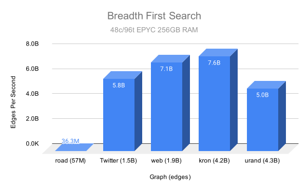
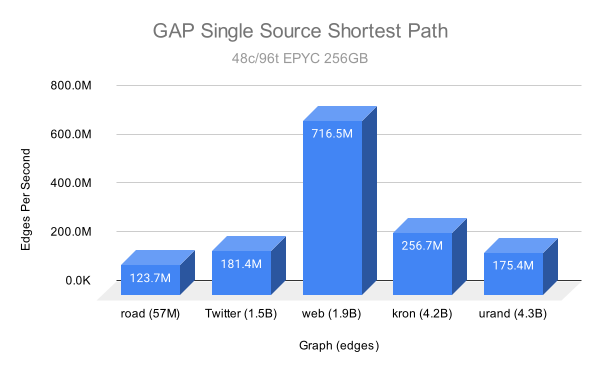
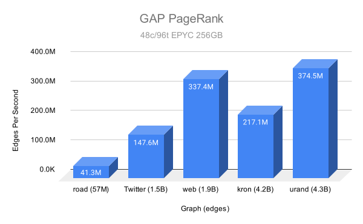
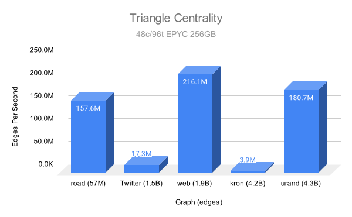
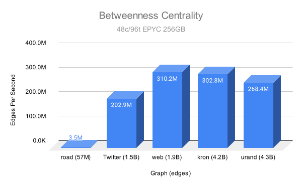

```
\pset linestyle unicode
\pset border 2
```
# Algorithms

OneSparse leverages the SuiteSparse GraphBLAS library and the
LAGraph suite of graph algorithms, integrating them seamlessly with
PostgreSQL. Using SuiteSparse's state-of-the-art Sparse Linear
Algebra Just-In-Time (JIT) compiled kernels, OneSparse can leverage
CPUs, GPUs, and future architectures without requiring you to
re-target your code.

The algorithms shown here come from the LAGraph library. They are
complete and well-tested implementations of common graph
algorithms. The algorithms shown here are just the beginning;
there are many more to come, including versions that leverage CUDA
GPUs.

## Example Graphs

To demonstrate the algorithms, we need some sample graphs. There
are multiple ways to construct graphs in OneSparse.

### From a Matrix Market file

The [SuiteSparse Matrix Collection](https://sparse.tamu.edu/)
contains many graphs of all different shapes and sizes and
publishes them in the Matrix Market format.  The "karate" graph
shown here is a common test graph for documentation purposes.
Let's load the graph into a materialized view to make its use from
SQL very easy:
```

create materialized view if not exists karate
    as select mmread('/home/postgres/onesparse/demo/karate.mtx') as graph;

```
The karate graph is now loaded into the view and looks like this,
here it's drawn with colors to indicate the "out-degree" of each
node:
```

select draw(triu(graph), reduce_cols(cast_to(graph, 'int32')), false, false, true, 0.5, 'The Karate Graph') as draw_source from karate \gset
\i sql/draw_sfdp.sql

```
### Matrix Aggregation

Graphs can be constructed by aggregating rows into an adjacency
matrix using `matrix_agg`:
```
create table edge_data (
    i bigint,
    j bigint,
    v integer
    );

insert into edge_data (i, j, v) values (1, 2, 3), (1, 3, 4), (2, 3, 1), (3, 1, 8);

create materialized view edge_data_view as
    select matrix_agg(i, j, v) as graph from edge_data;

select draw(triu(graph),
            reduce_cols(one(graph)),
            false, true, true, 0.5)
    as draw_source from edge_data_view \gset
\i sql/draw_sfdp.sql

```
### Random Graphs

Random graphs are useful for testing and demonstration purposes.
Here we create two random weighted graphs: one directed and one
undirected.
```

create materialized view rgraph as select triu(random_matrix('uint8', 8, 8, 1, 43) % 42, 1) as graph;
create materialized view urgraph as select random_matrix('uint8', 8, 8, 1, 44) % 42 as graph;

select draw(triu(graph), reduce_cols(one(graph)), true, true, true, 0.5, 'Random Weighted Directed Graph') as col_a_source from rgraph \gset
select draw(triu(graph), reduce_cols(one(graph)), true, false, true, 0.5, 'Random Weighted Undirected Graph') as col_b_source from urgraph \gset
\i sql/draw_2col.sql

```
## Level BFS

Level BFS computes the depth (or level) of each vertex starting from
a given source vertex using the breadth-first search algorithm. The
source vertex has level 0, its neighbors have level 1, and so on.
See [Breadth-first search](https://en.wikipedia.org/wiki/Breadth-first_search) for details.
```

select draw(triu(graph), (select level from bfs(graph, 1)), false, false, true, 0.5) as draw_source from karate \gset
\i sql/draw_sfdp.sql

```
## Parent BFS

Parent BFS returns the predecessor (parent) of each vertex in the
BFS tree rooted at the chosen source vertex. This is useful for
reconstructing shortest paths from any vertex back to the source.
See [Breadth-first search](https://en.wikipedia.org/wiki/Breadth-first_search) for details.
```

select draw(triu(graph), (select parent from bfs(graph, 1)), false, false, true, 0.5) as draw_source from karate \gset
\i sql/draw_sfdp.sql

```
### Benchmarks

```

```
## Single Source Shortest Path

Single Source Shortest Path (SSSP) computes the shortest path distance
from a source vertex to all other vertices in a weighted graph. The
algorithm uses edge weights to find the minimum total weight path.
See [Shortest path problem](https://en.wikipedia.org/wiki/Shortest_path_problem) for details.
```

select draw(triu(graph), sssp(cast_to(graph, 'int32'), 1::bigint, 1), false, false, true, 0.5) as draw_source from karate \gset
\i sql/draw_sfdp.sql

```
### Benchmarks

```

```
## PageRank

PageRank assigns an importance score to each vertex based on the
graph's link structure. Vertices with more incoming links from
important vertices receive higher scores. Originally developed for
ranking web pages. See [PageRank](https://en.wikipedia.org/wiki/PageRank) for details.
```

select draw(triu(graph), pagerank(graph)*100, false, false, true, 0.5) as draw_source from karate \gset
\i sql/draw_sfdp.sql

```
### Benchmarks

```

```
## Triangle Centrality

Triangle centrality counts the number of triangles incident to each
vertex. A triangle is a set of three vertices that are all connected
to each other. This measure is related to the clustering coefficient.
See [Clustering coefficient](https://en.wikipedia.org/wiki/Clustering_coefficient) for details.
```

select draw(triu(graph), triangle_centrality(graph)*10, false, false, true, 0.5) as draw_source from karate \gset
\i sql/draw_sfdp.sql

```
### Benchmarks

```

```
## Betweenness Centrality

Betweenness centrality measures how often a vertex appears on the
shortest paths between other pairs of vertices. Vertices with high
betweenness act as bridges or bottlenecks in the graph.
See [Betweenness centrality](https://en.wikipedia.org/wiki/Betweenness_centrality) for details.
```

select draw(triu(graph), betweenness(graph, ARRAY[1,32]::bigint[]), false, false, true, 0.5) as draw_source from karate \gset
\i sql/draw_sfdp.sql

```
### Benchmarks

```

```
## Square Clustering

Square clustering calculates the square clustering coefficient for
each vertex. This measures the density of squares (4-cycles) around
each vertex, providing insight into local graph structure.
See [Clustering coefficient](https://en.wikipedia.org/wiki/Clustering_coefficient) for details.
```

select draw(triu(graph), square_clustering(graph), false, false, true, 0.5) as draw_source from karate \gset
\i sql/draw_sfdp.sql

```